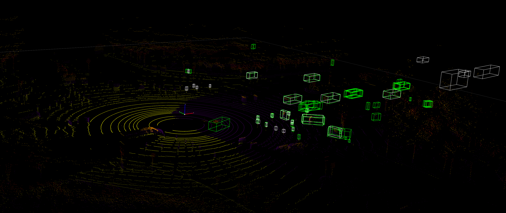

3D V2X Data
=============
DAIR-V2X Cooperative Dataset (DAIR-V2X-C) (from https://thudair.baai.ac.cn/cooptest) contains 18330 frames of infrastructure multi-modality data (point cloud & image), 20515 frames of vehicle multi-modality data (point cloud & image), 2D & 3D joint annotation files of raw data, calibration files, and timestamp files. DAIR-V2X-C can be used for Vehicle-Infrastructure Cooperative (VIC) 3D object detection to improve environmental perception performance in autonomous driving.

2D and 3D bounding boxes of the obstacle objects are provided as well as their category attributes, occlusion states, and truncated states in the annotation. There are total 10 object classes: Car, Truck, Van, Bus, Pedestrian, Cyclist, Tricyclist, Motorcyclist, Barrowlist, TrafficCone. 3D bounding box in the Lidar/Virtual Lidar coordinate system including height, width, length, x_loc, y_loc, z_loc, rotation.

DAIR-V2X Dependencies
---------------------
Use `DAIR-V2X <https://github.com/AIR-THU/DAIR-V2X/tree/main>`_ to read the Lidar pcd file in cooperative sensing dataset. Install the following required packages

.. code-block:: console

  (mypy310) lkk@Alienware-LKKi7G8:~/Developer$ git clone https://github.com/klintan/pypcd.git
  (mypy310) lkk@Alienware-LKKi7G8:~/Developer/pypcd$ python setup.py install

Create a new folder named "dairv2x" under "mydetector3d/datasets/dairv2x"

DAIR V2X Dataset Process
------------------------
DAIR V2X dataset is saved in '/data/cmpe249-fa22/DAIR-C' folder. Based on 'https://github.com/AIR-THU/DAIR-V2X/blob/main/docs/get_started.md', 
  * 'cooperative-vehicle-infrastructure' folder as the follow three sub-folders: cooperative  infrastructure-side  vehicle-side
  * 'infrastructure-side' and 'vehicle-side' has 'image', 'velodyne', 'calib', and 'label', and data_info.json as follows. 
  * 'vehicle-side' label is in **Vehicle LiDAR Coordinate System**, while 'infrastructure-side' label is in **Infrastructure Virtual LiDAR Coordinate System**

    ├── infrastructure-side             # DAIR-V2X-C-I
        ├── image		    
            ├── {id}.jpg
        ├── velodyne                
            ├── {id}.pcd           
        ├── calib                 
            ├── camera_intrinsic            
                ├── {id}.json     
            ├── virtuallidar_to_world   
                ├── {id}.json      
            ├── virtuallidar_to_camera  
                ├── {id}.json      
        ├── label	
            ├── camera                  # Labeled data in Infrastructure Virtual LiDAR Coordinate System fitting objects in image based on image frame time
                ├── {id}.json
            ├── virtuallidar            # Labeled data in Infrastructure Virtual LiDAR Coordinate System fitting objects in point cloud based on point cloud frame time
                ├── {id}.json
        ├── data_info.json              # Relevant index information of Infrastructure data

 * The 'cooperative' folder contains the following files
    ├── cooperative                     # Coopetative Files
        ├── label_world                 # Vehicle-Infrastructure Cooperative (VIC) Annotation files
            ├── {id}.json           
        ├── data_info.json              # Relevant index information combined the Infrastructure data and the Vehicle data

There are four data folders under root '/data/cmpe249-fa22/DAIR-C':
 * 'cooperative-vehicle-infrastructure-vehicle-side-image' folder contains all images (6digit_id.jpg) in vehicle side.
 * 'cooperative-vehicle-infrastructure-vehicle-side-velodyne' folder contains all lidar files (6digit_id.pcd) in vehicle side.
 * 'cooperative-vehicle-infrastructure-infrastructure-side-image' folder contains all images (6digit_id.jpg) in infrastructure side.
 * 'cooperative-vehicle-infrastructure-infrastructure-side-velodyne' folder contains all lidar files (6digit_id.pcd) in infrastructure side.
 
 
Copy the split data (json files in 'https://github.com/AIR-THU/DAIR-V2X/tree/main/data/split_datas') to the data folder ('/data/cmpe249-fa22/DAIR-C')

Use 'mydetector3d/tools/visual_utils/v2xvisualize.py' to visualize the DAIR-C dataset. The vehicle Lidar view is

.. image:: imgs/3D/vehicleview.png
  :width: 900
  :alt: colormap

The color of the points is related to the height based on the following color map

.. image:: imgs/3D/colormap.png
  :width: 400
  :alt: colormap

The top view of the Lidar from the Infrastructure is

.. image:: imgs/3D/infraview1.png
  :width: 900
  :alt: infraview1

The 3D view of the Lidar from the Infrastructure is

.. image:: imgs/3D/infraview2.png
  :width: 900
  :alt: infraview2

The fusion top view of the Lidar from the Infrastructure and Lidar from the vehicle is

.. image:: imgs/3D/fusiontop.png
  :width: 900
  :alt: fusiontop

The fusion 3D view of the Lidar from the Infrastructure and Lidar from the vehicle is

.. image:: imgs/3D/fusionview1.png
  :width: 900
  :alt: fusionview1

Convert the dataset to KITTI format 
~~~~~~~~~~~~~~~~~~~~~~~~~~~~~~~~~~~~

In 'mydetector3d/datasets/dairv2x/dair2kitti.py', convert the vehicle-side data to Kitti format, set: 
 * 'source-root=/data/cmpe249-fa22/DAIR-C/cooperative-vehicle-infrastructure/vehicle-side/'
 * 'target-root=/data/cmpe249-fa22/DAIR-C/single-vehicle-side-point-cloud-kitti'
 * 'sourcelidarfolder=/data/cmpe249-fa22/DAIR-C/cooperative-vehicle-infrastructure-vehicle-side-velodyne'
 * 'split-path=/data/cmpe249-fa22/DAIR-C/split_datas/single-vehicle-split-data.json'
 * 'sensor_view=vehicle'

The conversion process involve the following major steps:
 * First create kitti folder, then call **rawdata_copy** to copy images from source to target (kitti folder).
 * 'mykitti_pcd2bin': created new folder '/data/cmpe249-fa22/DAIR-C/single-vehicle-side-point-cloud-kitti/training/velodyne', convert pcd files in 'cooperative-vehicle-infrastructure-vehicle-side-velodyne' to bin files in Kitti 'velodyne' folder. Get xyz and intensity from pcd file, divide intensity/255, save xyz and new intensity to kitti velodyne bin file.
 * 'gen_lidar2cam', data_info=read_json(source_root/data_info.json), for each data in data_info, 
    * read 'calib/lidar_to_camera/id.json' and get Tr_velo_to_cam (3,4) 
    * read labels_path 'label/lidar/id.json', for each label in labels, 
       * get 'h, w, l, x, y, z, yaw_lidar', perform 'z = z - h / 2' get bottom_center
       * convert bottom_center to camera coordinate, get 'alpha, yaw' from **get_camera_3d_8points** 
       * use **convert_point** to get 'cam_x, cam_y, cam_z', and **set_label**
    * Write labels to 'tmp_file/label/lidar/id.json', get 'path_camera_intrinsic' and 'path_lidar_to_camera' under calib folder, call **gen_calib2kitti** get kitti calibration
 * use **json2kitti** to convert json label to kitti_label_root (/data/cmpe249-fa22/DAIR-C/single-vehicle-side-point-cloud-kitti/training/label_2/000000.txt)
    * change code in write_kitti_in_txt, save txt to '/data/cmpe249-fa22/DAIR-C/single-vehicle-side-point-cloud-kitti/training/label_2'
 * Generate calibration files, 
 * The converted kitti folder is '/data/cmpe249-fa22/DAIR-C/single-vehicle-side-point-cloud-kitti'. The 'testing folder is empty', the image folder is not available in training, need to copy the images to training folder:
 
 .. code-block:: console
 
  (mycondapy39) [010796032@coe-hpc2 training]$ ls
  calib  label_2  velodyne
  (mycondapy39) [010796032@coe-hpc2 training]$ mkdir image_2
  (mycondapy39) [010796032@coe-hpc2 training]$ cd image_2/
  (mycondapy39) [010796032@coe-hpc2 image_2]$ cp /data/cmpe249-fa22/DAIR-C/cooperative-vehicle-infrastructure-vehicle-side-image/* .

Using 'mydetector3d/tools/visual_utils/v2xvisualize.py' to visualize the converted kitti-format lidar

.. image:: imgs/3D/v2xvehiclekittitop.png
  :width: 900
  :alt: v2xvehiclekittitop

Using 'VisUtils/waymokittiallvis2.py', the visualization of the vehicle-side Lidar with 3D bounding boxes is shown here

.. image:: imgs/3D/V2XConvertedtoKittiwithboxes.png
  :width: 900
  :alt: V2XConvertedtoKittiwithboxes

The camera view and the projected Lidar to camera is shown here

.. image:: imgs/3D/V2Xkittiimage.png
  :width: 900
  :alt: V2Xkitti image

In 'mydetector3d/datasets/dairv2x/dair2kitti.py', convert the infrastructure-side data to Kitti format, set: 
 * 'source-root=/data/cmpe249-fa22/DAIR-C/cooperative-vehicle-infrastructure/infrastructure-side/'
 * 'target-root=/data/cmpe249-fa22/DAIR-C/infrastructure-side-point-cloud-kitti'
 * 'sourcelidarfolder=/data/cmpe249-fa22/DAIR-C/cooperative-vehicle-infrastructure-infrastructure-side-velodyne'
 * 'split-path=/data/cmpe249-fa22/DAIR-C/split_datas/single-infrastructure-split-data.json'
 * 'sensor_view=infrastructure'

Created kitti folder "/data/cmpe249-fa22/DAIR-C/infrastructure-side-point-cloud-kitti"

.. code-block:: console

 (mycondapy39) [010796032@coe-hpc2 DAIR-C]$ cd infrastructure-side-point-cloud-kitti/
 (mycondapy39) [010796032@coe-hpc2 infrastructure-side-point-cloud-kitti]$ ls
 ImageSets  testing  training
 (mycondapy39) [010796032@coe-hpc2 infrastructure-side-point-cloud-kitti]$ cd training/
 (mycondapy39) [010796032@coe-hpc2 training]$ ls
 calib  label_2  velodyne
 (mycondapy39) [010796032@coe-hpc2 training]$ mkdir image_2 && cd image_2
 (mycondapy39) [010796032@coe-hpc2 image_2]$ cp /data/cmpe249-fa22/DAIR-C/cooperative-vehicle-infrastructure-infrastructure-side-image/* .

.. note::
    During the **dair2kitti** conversion process, classes of ["Truck","Van","Bus","Car"] has been converted to 'Car' in **rewrite_label** function. There are 7 classes left in the converted kitti data: Car, Pedestrian, Cyclist, Tricyclist, Motorcyclist, Barrowlist, TrafficCone.
    The current mydetector3d training will only pick the classes in the class_names list, i.e., other classes are ignored.

Use **checklabelfiles** function in dairkitti_dataset to see the class names in label

.. code-block:: console

  #single vehicle side total: 15285
  {'Car': 133189, 'Motorcyclist': 18738, 'Cyclist': 11113, 'Tricyclist': 4173, 'Trafficcone': 106764, 'Pedestrian': 11434}
  #infrastructure side total: 12424
  {'Car': 160048, 'Motorcyclist': 28986, 'Trafficcone': 233529, 'Cyclist': 13228, 'Pedestrian': 24789, 'Barrowlist': 108}

Run **replacelabelnames** in dairkitti_dataset, to replace some of the class names, the final output contains four classes

.. code-block:: console

  (mycondapy39) [ 3DDepth]$ python mydetector3d/datasets/kitti/dairkitti_dataset.py
  #single vihicle side
  {'Car': 133189, 'Cyclist': 34024, 'Other': 106764, 'Pedestrian': 11434}
  #infrastructure side
  {'Car': 160048, 'Cyclist': 42214, 'Other': 233637, 'Pedestrian': 24789}

Infrastructure to Vehicle Transform 
~~~~~~~~~~~~~~~~~~~~~~~~~~~~~~~~~~~
Code 'mydetector3d/datasets/dairv2x/point_cloud_i2v.py' is used to transform the Lidar data from the Infrastructure view to the vehicle view.
  * Read data_info (size 6617 array) from cooperative/data_info.json, each data in data_info contains the vehicle-side image/Lidar data path (e.g., 000289) and infrastructure-side image/Lidar data path (e.g., 007489)
     * 'infrastructure_image_path', 'infrastructure_pointcloud_path', 'vehicle_pointcloud_path', 'cooperative_label_path', and 'system_error_offset'
  * Find the matched i_data (infrastructure, 12424) and v_data (vehicle, 15285) dict
  * data_info (6617) is a sub-set of i_data and v_data
  * Get infrastructure-side virtuallidar2world path, get vehicle-side novatel2world, and lidar2novatel path; destination file name from infrastructure (007489)
  * call **trans_pcd_i2v**, read infrastructure lidar pcd, to virtuallidar to world transform, then world to novatel transform, then do novatel to lidar transform
  * save points to bin files in '/data/cmpe249-fa22/DAIR-C/early-fusion/velodyne/lidar_i2v/'

In dairkitti_dataset, add matched infrastructure lidar points for fusion via "dataset_cfg.Early_Fusion" flag. The total number of matched vehicle and infrastructure lidar frame is less than the original lidar frames, the number of useful frames changes:
  * total lidar files: 15285
  * training sample list len, kitti_info len: 12228
  * i2vmap size: 6601
  * newkitti_infos: 5250
  * dataloader len: 1313 (batchsize=4)

The infrastructure lidar points has nan value. Modify the **mask_points_by_range** in common_utils.py, to remove 'nan' points and limit the range in Z-axis

.. code-block:: console

  mask = (points[:, 0] >= limit_range[0]) & (points[:, 0] <= limit_range[3]) & ~np.isnan(points[:, 0])\
            & (points[:, 1] >= limit_range[1]) & (points[:, 1] <= limit_range[4]) & ~np.isnan(points[:, 1])\
              & (points[:, 2] >= limit_range[2]) & (points[:, 2] <= limit_range[5]) & ~np.isnan(points[:, 2])\
              & ~np.isnan(points[:, 3])

I2V Fusion
~~~~~~~~~~~
After the Lidar from the Infrastructure is converted to the vehicle view, we can perform raw data fusion. One example of the fusion result is shown here

.. image:: imgs/3D/fusionpoints1-big.png
  :width: 600
  :alt: fusion big image

We can also check the details of the fusion

.. image:: imgs/3D/fusionpoints1.png
  :width: 600
  :alt: fusion details

Prepare the dataset 
~~~~~~~~~~~~~~~~~~~

Run dairkitti_dataset.py to generate the split files, infos, and gt_database forthe vehicle side data.
 * run **create_split** option in dairkitti_dataset.py to create the split files (trainval.txt, train.txt, and val.txt) in 'ImageSets'
 * run **create_infos** to generate 'kitti_infos_xx.pkl' and call **create_groundtruth_database** to generate the gt_database
 
.. code-block:: console
 
  $ dairkitti_dataset.py
  gt_database sample: 12228/12228
  Database Car: 106628
  Database Motorcyclist: 14916
  Database Cyclist: 8845
  Database Trafficcone: 85790
  Database Pedestrian: 9060
  Database Tricyclist: 3286
  $ dairkitti_dataset.py # after replacelabelnames
  gt_database sample: 12228/12228
  Database Car: 106628
  Database Cyclist: 27047
  Database Other: 85790
  Database Pedestrian: 9060
  ---------------Data preparation Done---------------
  $ ls /data/cmpe249-fa22/DAIR-C/single-vehicle-side-point-cloud-kitti/
  gt_database  kitti_dbinfos_train.pkl  kitti_infos_train.pkl     kitti_infos_val.pkl  training
  ImageSets    kitti_infos_test.pkl     kitti_infos_trainval.pkl  testing

Use **checkinfopklfiles** to check the pkl file

.. code-block:: console

 info['point_cloud'] = {'num_features': 4, 'lidar_idx': sample_idx}
 info['image'] = {'image_idx': sample_idx, 'image_shape': self.get_image_shape(sample_idx)}
 info['calib'] = calib_info
 info['annos'] = annotations #['name'], ['truncated'], ['occluded'], ['alpha'], ['bbox']: (N,4), ['dimensions']: lhw(camera) format (N,3), ['location']: (N,3), ['rotation_y'], ['score'], ['difficulty'], ['index'], ['gt_boxes_lidar']: (N,7), ['num_points_in_gt']

Run dairkitti_dataset.py again to generate the split file, infos, and gt_database for the infrastructure data

.. code-block:: console

  gt_database sample: 9939/9939
  Database Car: 127726
  Database Motorcyclist: 23287
  Database Cyclist: 10555
  Database Trafficcone: 187382
  Database Pedestrian: 19794
  Database Barrowlist: 81
  ---------------Data preparation Done---------------
  $ dairkitti_dataset.py # after replacelabelnames
  gt_database sample: 9939/9939
  Database Car: 127726
  Database Cyclist: 33842
  Database Other: 187463
  Database Pedestrian: 19794
  ---------------Data preparation Done---------------
  $ ls /data/cmpe249-fa22/DAIR-C/infrastructure-side-point-cloud-kitti/
  gt_database  kitti_dbinfos_train.pkl  kitti_infos_train.pkl     kitti_infos_val.pkl  training
  ImageSets    kitti_infos_test.pkl     kitti_infos_trainval.pkl  testing

Run test_dataset in dairkitti_dataset.py

.. code-block:: console

  total lidar files: 15285
  Dataset infos len: 5249
  One info keys:
    point_cloud
    image
    calib
    annos
  dataloader len: 1313
  annos keys:
    bbox
    location
    name
    truncated
    occluded
    alpha
    dimensions
    rotation_y
    score
    difficulty
    index
    gt_boxes_lidar
    num_points_in_gt
  dataloader len: 1313

In the **__getitem__** of dairkitti_dataset.py, gt_boxes_lidar is from 'location', 'dimensions', and 'rotation_y'

.. code-block:: console

  loc, dims, rots = annos['location'], annos['dimensions'], annos['rotation_y']
  gt_names = annos['name']
  #create label [n,7] in camera coordinate boxes3d_camera: (N, 7) [x, y, z, l, h, w, r] in rect camera coords
  gt_boxes_camera = np.concatenate([loc, dims, rots[..., np.newaxis]], axis=1).astype(np.float32)
  gt_boxes_lidar = box_utils.boxes3d_kitti_camera_to_lidar(gt_boxes_camera, calib)

If this frame has no object, set gt_boxes_lidar empty:

.. code-block:: console

  if len(gt_names)==0:
       gt_boxes_lidar = np.zeros((0, 7))

Training and Evaluation 
~~~~~~~~~~~~~~~~~~~~~~~
Train the vehicle side data in mydetector3d
  * cfg_dataset='mydetector3d/tools/cfgs/dairkitti_models/my3dmodel.yaml', model is saved in '/data/cmpe249-fa22/Mymodels/dairkitti_models/my3dmodel/0511/ckpt/checkpoint_epoch_120.pth'/latest_model.pth
  * Evaluation results (filter out empty frame and classes not in the kittclasses) saved in /data/cmpe249-fa22/Mymodels/eval/dairkitti_models_my3dmodel_epochmodel/txtresults

.. code-block:: console

  Car AP@0.70, 0.70, 0.70:
  bbox AP:22.9647, 20.1308, 19.5203
  bev  AP:64.3469, 65.0784, 65.2450
  3d   AP:56.6919, 52.6843, 51.5003
  aos  AP:11.50, 10.21, 9.93
  Pedestrian AP@0.50, 0.50, 0.50:
  bbox AP:13.2223, 11.7845, 11.7958
  bev  AP:53.5280, 48.6861, 47.9500
  3d   AP:50.1386, 43.0288, 42.3967
  aos  AP:11.34, 10.48, 10.48
  Cyclist AP@0.50, 0.50, 0.50:
  bbox AP:11.4549, 13.7494, 13.9884
  bev  AP:22.5282, 30.7371, 30.5679
  3d   AP:20.9868, 26.8777, 26.7182
  aos  AP:5.08, 6.16, 6.28

Run the evaluation and Lidar detection result is

.. image:: imgs/3D/dairvehiclesidepred.png
  :width: 900
  :alt: detection results

Train the infrastructure side data in mydetector3d
  * cfg_dataset='mydetector3d/tools/cfgs/dairkitti_models/my3dmodel_infra.yaml', model is saved in '/data/cmpe249-fa22/Mymodels/dairkitti_models/my3dmodel_infra/0512infra/ckpt/checkpoint_epoch_120.pth'/latest_model.pth
  * Evaluation results (filter out empty frame and classes not in the kittclasses) is 0

Train the vehicle side data in mydetector3d after **replacelabelnames**, data_tag='0513' in GPU3
  * cfg_dataset='mydetector3d/tools/cfgs/dairkitti_models/my3dmodel.yaml', model is saved in '/data/cmpe249-fa22/Mymodels/dairkitti_models/my3dmodel/0513/ckpt/checkpoint_epoch_128.pth'
  * Evaluation results (filter out empty frame and classes not in the kittclasses) result is saved to /data/cmpe249-fa22/Mymodels/eval/dairkitti_models_my3dmodel_epochmodel/txtresults

.. code-block:: console

  Average predicted number of objects(3057 samples): 140.240
  Finished detection: {'recall/roi_0.3': 0.0, 'recall/rcnn_0.3': 0.8291671061421088, 'recall/roi_0.5': 0.0, 'recall/rcnn_0.5': 0.671465738494533, 'recall/roi_0.7': 0.0, 'recall/rcnn_0.7': 0.31039271525507156, 'infer_time': 64.6671114404217, 'total_pred_objects': 428715, 'total_annos': 3057}
  Car AP@0.70, 0.70, 0.70:
  bbox AP:22.1671, 20.0946, 19.4177
  bev  AP:67.3517, 68.4604, 68.3072
  3d   AP:59.0924, 55.3433, 54.4236
  aos  AP:10.59, 9.66, 9.35
  Pedestrian AP@0.50, 0.50, 0.50:
  bbox AP:12.6278, 12.0752, 12.0567
  bev  AP:54.4139, 48.7479, 48.4298
  3d   AP:51.6765, 43.4523, 43.0454
  aos  AP:11.05, 10.60, 10.59
  Cyclist AP@0.50, 0.50, 0.50:
  bbox AP:22.8686, 22.5770, 22.6723
  bev  AP:57.5935, 58.9456, 58.0578
  3d   AP:54.5871, 53.7105, 52.8249
  aos  AP:10.90, 10.70, 10.76

Train the infrastructure side data in mydetector3d after **replacelabelnames**, data_tag='0513infra' in GPU2
  * cfg_dataset='mydetector3d/tools/cfgs/dairkitti_models/my3dmodel_infra.yaml', model is saved in '/data/cmpe249-fa22/Mymodels/dairkitti_models/my3dmodel_infra/0513infra/ckpt/checkpoint_epoch_128.pth'
  * Evaluation results (filter out empty frame and classes not in the kittclasses)

.. code-block:: console

  Average predicted number of objects(2485 samples): 85.658
  Finished detection: {'recall/roi_0.3': 0.0, 'recall/rcnn_0.3': 0.626487269085486, 'recall/roi_0.5': 0.0, 'recall/rcnn_0.5': 0.5321511381078345, 'recall/roi_0.7': 0.0, 'recall/rcnn_0.7': 0.30276607556905394, 'infer_time': 68.14103801150797, 'total_pred_objects': 212861, 'total_annos': 2485}
  Car AP@0.70, 0.70, 0.70:
  bbox AP:23.7721, 18.4526, 18.3909
  bev  AP:72.1776, 54.1334, 54.0990
  3d   AP:70.9812, 53.2164, 53.0006
  aos  AP:12.27, 9.49, 9.46
  Pedestrian AP@0.50, 0.50, 0.50:
  bbox AP:34.0897, 33.7425, 33.8436
  bev  AP:36.2813, 34.1492, 34.2634
  3d   AP:33.5470, 31.4709, 31.5814
  aos  AP:17.07, 17.10, 17.16
  Cyclist AP@0.50, 0.50, 0.50:
  bbox AP:45.7644, 40.9651, 41.1427
  bev  AP:63.7247, 52.2808, 52.0245
  3d   AP:61.5907, 51.3137, 50.9824
  aos  AP:23.37, 21.38, 21.48

Train 'mydetector3d/tools/cfgs/dairkitti_models/myvoxelnext.yaml', '0514' in GPU2
  * model is saved in "/data/cmpe249-fa22/Mymodels/dairkitti_models/myvoxelnext/0514/ckpt/latest_model.pth"
  * Evaluation result

.. code-block:: console

  Average predicted number of objects(3057 samples): 31.808
  Finished detection: {'recall/roi_0.3': 0.0, 'recall/rcnn_0.3': 0.7716661392961361, 'recall/roi_0.5': 0.0, 'recall/rcnn_0.5': 0.5561298034665823, 'recall/roi_0.7': 0.0, 'recall/rcnn_0.7': 0.2290721794466125, 'infer_time': 69.39488329918557, 'total_pred_objects': 97238, 'total_annos': 3057}
  Car AP@0.70, 0.70, 0.70:
  bbox AP:19.0752, 19.6097, 17.7932
  bev  AP:62.8174, 59.2183, 59.2639
  3d   AP:54.4923, 42.8873, 42.1973
  aos  AP:9.32, 10.69, 9.81
  Pedestrian AP@0.50, 0.50, 0.50:
  bbox AP:13.6921, 13.7351, 13.5351
  bev  AP:60.5654, 51.0911, 51.0959
  3d   AP:54.6608, 44.5123, 44.3112
  aos  AP:4.40, 4.22, 4.12
  Cyclist AP@0.50, 0.50, 0.50:
  bbox AP:25.4608, 23.8307, 23.9123
  bev  AP:68.0980, 61.8668, 61.2499
  3d   AP:63.8344, 53.5704, 53.1876
  aos  AP:12.79, 12.42, 12.43

Train 'mydetector3d/tools/cfgs/dairkitti_models/myvoxelnext_infra.yaml', '0514' in GPU2
  * model is saved in "/data/cmpe249-fa22/Mymodels/dairkitti_models/myvoxelnext_infra/0514/ckpt/checkpoint_epoch_128.pth"
  * Evaluation results (filter out empty frame and classes not in the kittclasses)

.. code-block:: console

  Average predicted number of objects(2485 samples): 32.017
  Finished detection: {'recall/roi_0.3': 0.0, 'recall/rcnn_0.3': 0.6052164636469525, 'recall/roi_0.5': 0.0, 'recall/rcnn_0.5': 0.47907209649151455, 'recall/roi_0.7': 0.0, 'recall/rcnn_0.7': 0.26994546226445904, 'infer_time': 58.342159752677105, 'total_pred_objects': 79563, 'total_annos': 2485}
  Car AP@0.70, 0.70, 0.70:
  bbox AP:17.3477, 13.8236, 13.8174
  bev  AP:72.1020, 54.0964, 54.0660
  3d   AP:70.5954, 52.9636, 52.0443
  aos  AP:9.42, 7.54, 7.53
  Pedestrian AP@0.50, 0.50, 0.50:
  bbox AP:37.3775, 32.6868, 36.6653
  bev  AP:37.0466, 32.3041, 32.3247
  3d   AP:32.7240, 30.7940, 30.7913
  aos  AP:18.55, 16.16, 18.20
  Cyclist AP@0.50, 0.50, 0.50:
  bbox AP:48.6067, 43.8676, 38.4401
  bev  AP:67.0253, 52.8233, 52.7723
  3d   AP:60.3989, 52.1308, 51.9856
  aos  AP:24.37, 22.89, 20.14

Train Fusion Models
~~~~~~~~~~~~~~~~~~~~
Config file='mydetector3d/tools/cfgs/dairkitti_models/my3dmodel.yaml'
  * fusion training result is saved in "/data/cmpe249-fa22/Mymodels/dairkitti_models/my3dmodel/0515/ckpt/checkpoint_epoch_128.pth"
  * Evaluation result is saved to /data/cmpe249-fa22/Mymodels/eval/dairkitti_models_my3dmodel_epoch128/txtresults

.. code-block:: console

  Average predicted number of objects(1351 samples): 149.688
  Finished detection: {'recall/roi_0.3': 0.0, 'recall/rcnn_0.3': 0.8347341135810227, 'recall/roi_0.5': 0.0, 'recall/rcnn_0.5': 0.6716675830649596, 'recall/roi_0.7': 0.0, 'recall/rcnn_0.7': 0.32884298169821696, 'infer_time': 90.00867711016413, 'total_pred_objects': 202228, 'total_annos': 1351}
  Car AP@0.70, 0.70, 0.70:
  bbox AP:21.5416, 20.4308, 19.6968
  bev  AP:80.9123, 77.6669, 76.0540
  3d   AP:74.1940, 64.9879, 63.3278
  aos  AP:10.27, 9.86, 9.51
  Pedestrian AP@0.50, 0.50, 0.50:
  bbox AP:5.2918, 5.4963, 5.4031
  bev  AP:51.3546, 41.8877, 41.4453
  3d   AP:47.6064, 36.4693, 35.6941
  aos  AP:2.62, 2.50, 2.50
  Cyclist AP@0.50, 0.50, 0.50:
  bbox AP:24.6030, 25.4492, 25.2234
  bev  AP:72.4071, 69.5883, 68.2706
  3d   AP:70.2918, 65.0319, 63.4337
  aos  AP:10.83, 11.74, 11.65

Config file='mydetector3d/tools/cfgs/dairkitti_models/my3dmodel.yaml', disable 'Lidar_Fusion' (use the small set of data with vehicle and infrastructure cooperation, but the Infrastructure Lidar data is not used)
  * fusion training result is saved in "/data/cmpe249-fa22/Mymodels/dairkitti_models/my3dmodel/0515nolidarfusion/ckpt/checkpoint_epoch_128.pth"

.. code-block:: console

  Average predicted number of objects(1351 samples): 207.742
  Finished detection: {'recall/roi_0.3': 0.0, 'recall/rcnn_0.3': 0.7967166758306496, 'recall/roi_0.5': 0.0, 'recall/rcnn_0.5': 0.6008561778336344, 'recall/roi_0.7': 0.0, 'recall/rcnn_0.7': 0.24161495562013982, 'infer_time': 110.38009090536445, 'total_pred_objects': 280659, 'total_annos': 1351}
  Car AP@0.70, 0.70, 0.70:
  bbox AP:10.7006, 12.1243, 11.8581
  bev  AP:38.5465, 48.0391, 48.7998
  3d   AP:29.6970, 35.0667, 34.8825
  aos  AP:5.21, 5.99, 5.87
  Pedestrian AP@0.50, 0.50, 0.50:
  bbox AP:5.0162, 5.1991, 5.0259
  bev  AP:43.5028, 39.1187, 38.8207
  3d   AP:39.1552, 33.4822, 33.0070
  aos  AP:2.56, 2.55, 2.48
  Cyclist AP@0.50, 0.50, 0.50:
  bbox AP:18.4654, 21.0681, 20.9794
  bev  AP:46.5717, 52.7549, 51.6042
  3d   AP:42.2533, 46.8303, 45.8203
  aos  AP:8.82, 10.27, 10.24
  

Config file='mydetector3d/tools/cfgs/dairkitti_models/my3dmodel2.yaml', modify the MAX_POINTS_PER_VOXEL and add more filters in VFE and MAP_TO_BEV (Num point features after VFE is 128).
  * Training results saved in "/data/cmpe249-fa22/Mymodels/dairkitti_models/my3dmodel2/0516/ckpt/checkpoint_epoch_128.pth"
  * Result is saved to /data/cmpe249-fa22/Mymodels/eval/dairkitti_models_my3dmodel2_0516/txtresults

.. code-block:: console

  Average predicted number of objects(1351 samples): 43.711
  Finished detection: {'recall/roi_0.3': 0.0, 'recall/rcnn_0.3': 0.7898436886340429, 'recall/roi_0.5': 0.0, 'recall/rcnn_0.5': 0.6265807870552196, 'recall/roi_0.7': 0.0, 'recall/rcnn_0.7': 0.3065352289686592, 'infer_time': 81.65811786990194, 'total_pred_objects': 59054, 'total_annos': 1351}
  Car AP@0.70, 0.70, 0.70:
  bbox AP:19.8701, 18.5302, 17.3661
  bev  AP:80.1939, 75.9804, 75.4748
  3d   AP:72.7171, 64.0618, 62.0966
  aos  AP:9.62, 9.11, 8.54
  Pedestrian AP@0.50, 0.50, 0.50:
  bbox AP:5.8957, 5.8491, 5.7967
  bev  AP:54.4264, 44.6858, 43.9075
  3d   AP:49.6394, 37.7629, 37.1243
  aos  AP:4.05, 3.05, 3.00
  Cyclist AP@0.50, 0.50, 0.50:
  bbox AP:23.4062, 24.6677, 24.6010
  bev  AP:69.0258, 67.8017, 66.6623
  3d   AP:67.5499, 62.6145, 61.3039
  aos  AP:10.10, 11.29, 11.28

Config file='mydetector3d/tools/cfgs/dairkitti_models/myvoxelnext.yaml'
  * Training results saved in "/data/cmpe249-fa22/Mymodels/dairkitti_models/myvoxelnext/0516/ckpt/checkpoint_epoch_128.pth"
  * Result is saved to /data/cmpe249-fa22/Mymodels/eval/dairkitti_models_myvoxelnext_0516/txtresults

.. code-block:: console

  Average predicted number of objects(1351 samples): 31.134
  Finished detection: {'recall/roi_0.3': 0.0, 'recall/rcnn_0.3': 0.80944152069751, 'recall/roi_0.5': 0.0, 'recall/rcnn_0.5': 0.6190008640326762, 'recall/roi_0.7': 0.0, 'recall/rcnn_0.7': 0.308381116958605, 'infer_time': 88.02486030307747, 'total_pred_objects': 42062, 'total_annos': 1351}
  Car AP@0.70, 0.70, 0.70:
  bbox AP:15.5940, 15.5772, 14.6006
  bev  AP:86.8837, 80.1227, 79.6426
  3d   AP:82.6152, 69.4716, 68.6104
  aos  AP:7.81, 7.63, 7.17
  Pedestrian AP@0.50, 0.50, 0.50:
  bbox AP:13.4294, 14.2041, 14.0227
  bev  AP:58.7801, 50.2011, 50.2017
  3d   AP:50.6428, 43.2261, 42.5002
  aos  AP:7.54, 7.82, 7.72
  Cyclist AP@0.50, 0.50, 0.50:
  bbox AP:15.1565, 24.4733, 24.3833
  bev  AP:82.4833, 77.6059, 76.9294
  3d   AP:76.3442, 72.5238, 68.6905
  aos  AP:6.75, 12.61, 12.57
  

Train 'mydetector3d/tools/cfgs/dairkitti_models/my3dmodelv2.yaml' in '0517'
  * Model saved in '/data/cmpe249-fa22/Mymodels/dairkitti_models/my3dmodelv2/0517/ckpt/latest_model.pth'
  * Result is saved to /data/cmpe249-fa22/Mymodels/eval/dairkitti_models_my3dmodelv2_0517/txtresults

.. code-block:: console

  Average predicted number of objects(1351 samples): 137.924
  Finished detection: {'recall/roi_0.3': 0.0, 'recall/rcnn_0.3': 0.8374440342471133, 'recall/roi_0.5': 0.0, 'recall/rcnn_0.5': 0.6819967009661456, 'recall/roi_0.7': 0.0, 'recall/rcnn_0.7': 0.3456916188830414, 'infer_time': 135.41728434478037, 'total_pred_objects': 186335, 'total_annos': 1351}
  Car AP@0.70, 0.70, 0.70:
  bbox AP:24.1560, 22.3951, 21.0895
  bev  AP:81.0365, 78.1048, 77.8612
  3d   AP:75.3015, 67.5120, 65.1881
  aos  AP:11.44, 10.69, 10.06
  Pedestrian AP@0.50, 0.50, 0.50:
  bbox AP:8.9119, 8.3005, 8.1552
  bev  AP:58.9776, 48.5291, 48.3065
  3d   AP:53.7915, 42.8447, 42.5377
  aos  AP:4.01, 3.68, 3.62
  Cyclist AP@0.50, 0.50, 0.50:
  bbox AP:20.5838, 23.2865, 23.4181
  bev  AP:72.0387, 71.0033, 70.3623
  3d   AP:69.2169, 66.7102, 65.5677
  aos  AP:9.78, 11.46, 11.55

Train 'mydetector3d/tools/cfgs/dairkitti_models/my3dmodelv2.yaml' in '0518' (set compress_raito=8)
  * Save latest model to /data/cmpe249-fa22/Mymodels/dairkitti_models/my3dmodelv2/0518/ckpt/latest_model
  * 'mydetector3d/tools/cfgs/dairkitti_models/my3dmodelv2_compressor.yaml'
  * Result is saved to /data/cmpe249-fa22/Mymodels/eval/dairkitti_models_my3dmodelv2_compressor_0518conv/txtresults

.. code-block:: console

  Average predicted number of objects(1351 samples): 140.478
  Finished detection: {'recall/roi_0.3': 0.0, 'recall/rcnn_0.3': 0.8368549210588327, 'recall/roi_0.5': 0.0, 'recall/rcnn_0.5': 0.6812897651402089, 'recall/roi_0.7': 0.0, 'recall/rcnn_0.7': 0.3413714555023172, 'infer_time': 142.1786172855535, 'total_pred_objects': 189786, 'total_annos': 1351}
  Car AP@0.70, 0.70, 0.70:
  bbox AP:25.1129, 21.7680, 20.5236
  bev  AP:80.5588, 77.6377, 77.2339
  3d   AP:75.1016, 66.9202, 64.2415
  aos  AP:11.33, 9.80, 9.22
  Pedestrian AP@0.50, 0.50, 0.50:
  bbox AP:7.7580, 7.5677, 7.2327
  bev  AP:55.1335, 45.3889, 44.7832
  3d   AP:51.8617, 40.2456, 39.6877
  aos  AP:3.80, 3.75, 3.73
  Cyclist AP@0.50, 0.50, 0.50:
  bbox AP:20.0710, 24.9068, 24.4860
  bev  AP:71.1439, 71.2478, 70.2554
  3d   AP:68.5503, 66.5361, 65.5088
  aos  AP:8.86, 11.64, 11.43

Train 'mydetector3d/tools/cfgs/dairkitti_models/my3dmodelv2.yaml' in '0518conv' (added one conv(384,64) in my3dmodelv2.py)
  * Save latest model to /data/cmpe249-fa22/Mymodels/dairkitti_models/my3dmodelv2/0518conv/ckpt/latest_model
  * Add GET_ITEM_LIST: ["points", "images"]
  * Result is saved to /data/cmpe249-fa22/Mymodels/eval/dairkitti_models_my3dmodelv2_0518conv/txtresults

.. code-block:: console

  Average predicted number of objects(1351 samples): 137.685
  Finished detection: {'recall/roi_0.3': 0.0, 'recall/rcnn_0.3': 0.8315136281517556, 'recall/roi_0.5': 0.0, 'recall/rcnn_0.5': 0.6637734663419999, 'recall/roi_0.7': 0.0, 'recall/rcnn_0.7': 0.3284502395726966, 'infer_time': 137.0744020981196, 'total_pred_objects': 186013, 'total_annos': 1351}
  Car AP@0.70, 0.70, 0.70:
  bbox AP:19.3310, 20.6579, 19.9613
  bev  AP:79.5797, 77.2212, 75.6694
  3d   AP:73.9871, 64.8375, 63.0783
  aos  AP:9.29, 10.41, 10.06
  Pedestrian AP@0.50, 0.50, 0.50:
  bbox AP:9.1300, 7.6350, 7.3503
  bev  AP:52.3427, 43.5257, 42.1801
  3d   AP:48.3685, 37.4823, 37.0189
  aos  AP:5.03, 4.23, 4.17
  Pedestrian AP@0.50, 0.50, 0.50:
  bbox AP:9.1300, 7.6350, 7.3503
  bev  AP:52.3427, 43.5257, 42.1801
  3d   AP:48.3685, 37.4823, 37.0189
  aos  AP:5.03, 4.23, 4.17

Add BEV Fusion Process
-----------------------
File "/lts/home/010796032/3DObject/3DDepth/mydetector3d/datasets/processor/data_processor.py", line 250, in image_calibrate
    img_process_infos = data_dict['img_process_infos']

File "/lts/home/010796032/3DObject/3DDepth/mydetector3d/datasets/processor/data_processor.py", line 244, in image_normalize
    data_dict["camera_imgs"] = [compose(img) for img in data_dict["camera_imgs"]]

img_bev = batch_dict['spatial_features_img']#[1, 80, 180, 180]
        lidar_bev = batch_dict['spatial_features']#[6, 128, 250, 250]
        cat_bev = torch.cat([img_bev,lidar_bev],dim=1)

MeanVFE
  * Input: voxel_features([220121, 10, 4]), voxel_num_points([220121]) = batch_dict['voxels'], batch_dict['voxel_num_points']
  * Output; batch_dict['voxel_features'] = points_mean.contiguous() #[220121, 4]

VoxelResBackBone8x
  * Input: voxel_features([220121, 4]), voxel_coords([220121, 4]) = batch_dict['voxel_features'], batch_dict['voxel_coords']
  * Output: batch_dict: 'encoded_spconv_tensor': out([1, 250, 250]), 'encoded_spconv_tensor_stride': 8, 'multi_scale_3d_features'

HeightCompression
  * Input: encoded_spconv_tensor = batch_dict['encoded_spconv_tensor'] #Sparse
  * Output: batch_dict['spatial_features'] = spatial_features #[6, 128, 250, 250], batch_dict['spatial_features_stride']=8

SwinTransformer
  * Input: x = batch_dict['camera_imgs'] #[6, 1, 3, 256, 704]
  * Out: batch_dict['image_features'] = outs #3 items: [6, 192, 32, 88], [6, 384, 16, 44], [6, 768, 8, 22]

GeneralizedLSSFPN
  * inputs = batch_dict['image_features']
  * Output: batch_dict['image_fpn'] = tuple(outs) #2 items: [6, 256, 32, 88], [6, 256, 16, 44]

DepthLSSTransform (lists images into 3D and then splats onto bev features, from https://github.com/mit-han-lab/bevfusion/)
  * x = batch_dict['image_fpn']  #img=[1, 6, 256, 32, 88]
  * Output: batch_dict['spatial_features_img'] = x #[1, 80, 180, 180]

ConvFuser
  * Input: img_bev = batch_dict['spatial_features_img']#[1, 80, 180, 180], lidar_bev = batch_dict['spatial_features']#[6, 128, 250, 250]* Output: batch_dict['spatial_features'] = mm_bev

OpenCOOD
------------------

Use `OpenCOOD <https://github.com/DerrickXuNu/OpenCOOD>`_ and ref `installation <https://opencood.readthedocs.io/en/latest/md_files/installation.html>`_ to setup the V2V cooperative 3D object detection framework (based on OpenPCDet) in Newalienware machine (with RTX3090)

.. code-block:: console

  (mycondapy39) lkk68@NEWALIENWARE C:\Users\lkk68\Documents\Developer>git clone https://github.com/DerrickXuNu/OpenCOOD.git
  (mycondapy39) lkk68@NEWALIENWARE C:\Users\lkk68\Documents\Developer\OpenCOOD>python setup.py develop
  #error: scipy 1.5.4 is installed but scipy>=1.8 is required by {'scikit-image'}
  $ pip install scipy -U
    ERROR: pip's dependency resolver does not currently take into account all the packages that are installed. This behaviour is the source of the following dependency conflicts.
  opencood 0.1.0 requires matplotlib~=3.3.3, but you have matplotlib 3.7.1 which is incompatible.
  opencood 0.1.0 requires opencv-python~=4.5.1.48, but you have opencv-python 4.7.0.72 which is incompatible.
  opencood 0.1.0 requires scipy~=1.5.4, but you have scipy 1.10.1 which is incompatible.
  Successfully installed scipy-1.10.1

opv2v dataset is downloaded in '/data/cmpe249-fa22/OpenCOOD/opv2v_data_dumping', but there are errors in the dataset: "unzip:  cannot find zipfile directory in one of train.zip"
  
