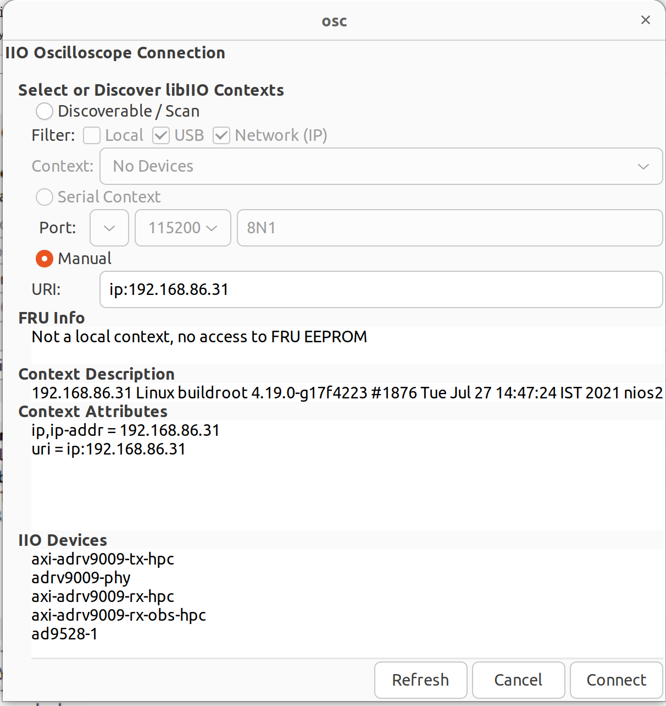
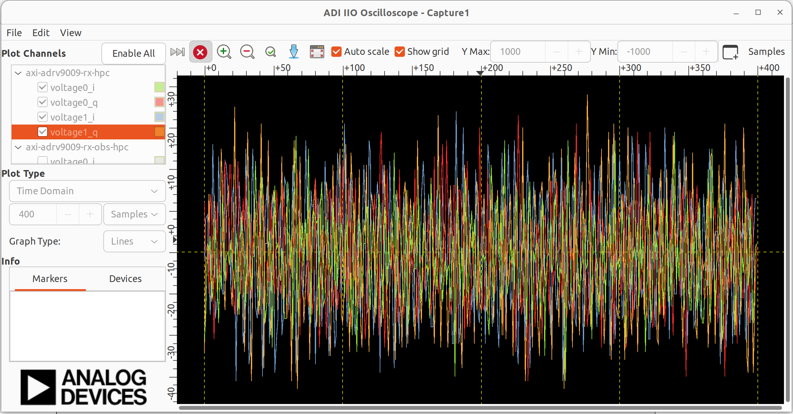
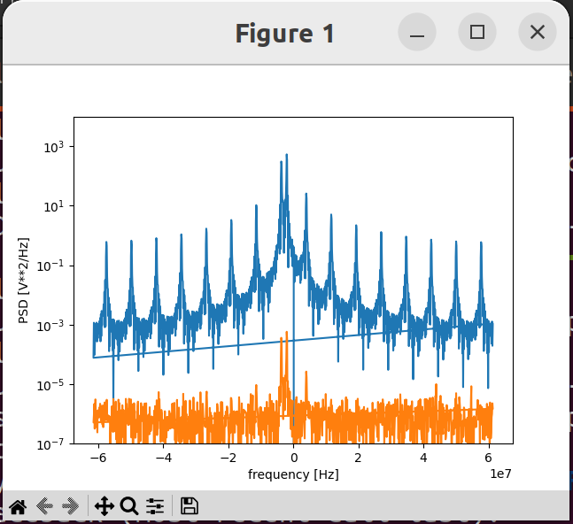

ADI
===============================

ADI HDL Design
---------------
ADI HDL related information
  * ADI HDL repo: https://github.com/analogdevicesinc/hdl
  * ADI Reference Designs HDL User Guide: https://wiki.analog.com/resources/fpga/docs/hdl
  * all the projects have no-OS (baremetal https://github.com/analogdevicesinc/no-OS) and a Linux (https://github.com/analogdevicesinc/Linux) support.

The HDL repository is divided into two seperate sections
  * projects with all the currently supported projects. There are two special folders inside the /hdl/projects: 
      * common: contains all the base designs, for all currently supported FPGA development boards
      * scripts (Tcl scripts): defined all the custom Tcl processes, which are used to create a project, define the system and generate programming files for the FPGA.
  * library with all the Analog Devices Inc. proprietary IP cores and hdl modules, which are required to build the projects. The library folder contains all the IP cores and common modules. An IP, in general, contains Verilog files, which describe the hardware logic, constraint files, to ease timing closure, and Tcl scripts, which generate all the other files required for IP integration (*_ip.tcl for Vivado and *_hw.tcl for Quartus).

Running the HDL on hardware. HDL build alone will NOT let you do anything useful. You would need a software running on the processor (Microblaze, NIOS or ARM) to make the design work. There are two software solutions: 1) Linux and 2) No-OS. Ref: https://wiki.analog.com/resources/fpga/docs/run

HDL Architecture: https://wiki.analog.com/resources/fpga/docs/arch

Using and modifying the HDL designs: https://wiki.analog.com/resources/fpga/docs/tips

adrv9009
--------
ADRV9009: https://www.analog.com/en/products/adrv9009.html
ADRV9009 hardware reference guide: https://www.analog.com/media/en/technical-documentation/user-guides/adrv9008-1-w-9008-2-w-9009-w-hardware-reference-manual-ug-1295.pdf
ADRV9009, ADRV9008 highly integrated, wideband RF transceiver Linux device driver： https://wiki.analog.com/resources/tools-software/linux-drivers/iio-transceiver/adrv9009

SDR Integrated Transceiver Design Resources: https://www.analog.com/en/design-center/landing-pages/001/integrated-rf-agile-transceiver-design-resources.html
    * Download the ADRV9008/ADRV9009 Design File Package
  

Wideband RF Transceiver Evaluation Software (TES): https://www.analog.com/en/design-center/landing-pages/001/transceiver-evaluation-software.html
    * ADRV9008/ADRV9009 Evaluation Software with GUI for Evaluation Board (ZIP)
    * ADRV9008/ADRV9009 API Source Code (ZIP)
    * ADRV9008-x and ADRV9009 Profile Configuration Tool (Filter Wizard) (ZIP)
    * ADRV9009-SDCARD

ADRV9009/ADRV9008 No-OS System Level Design Setup: https://wiki.analog.com/resources/eval/user-guides/adrv9009/no-os-setup
    * Arria 10 GX board supported
    * Demo application ADRV9009-W on ZCU102: DMA_EXAMPLE, TINYIIOD demo

iio-oscilloscope
-----------------
https://github.com/analogdevicesinc/iio-oscilloscope
https://wiki.analog.com/resources/tools-software/linux-software/iio_oscilloscope#installation

Analog Devices Kuiper Linux
https://wiki.analog.com/resources/tools-software/linux-software/kuiper-linux
User: root, password: analog; User: analog, password: analog
The SD card includes several folders in the root directory of the BOOT partition. In order to configure the SD card to work with a specific FPGA board and ADI hardware, several files must be copied onto the root directory.

Configuring the SD Card for Raspberry Pi Projects:

Intel Arria10 SOC board schematic: https://www.analog.com/media/en/technical-documentation/eval-board-schematic/a10_soc_devkit_a3.pdf

Install iio_oscilloscope
-------------------------
Install ADI iio_oscilloscope based on this link: https://wiki.analog.com/resources/tools-software/linux-software/iio_oscilloscope

.. code-block:: console 

  (base) lkk@lkk-intel12:~/intelFPGA_pro/FPGADeveloper$ sudo apt-get -y install libglib2.0-dev libgtk2.0-dev libgtkdatabox-dev libmatio-dev libfftw3-dev libxml2 libxml2-dev bison flex libavahi-common-dev libavahi-client-dev libcurl4-openssl-dev libjansson-dev cmake libaio-dev libserialport-dev

Build and install the libiio library. ref: https://wiki.analog.com/resources/tools-software/linux-software/libiio#how_to_build_it

.. code-block:: console 

  (base) lkk@lkk-intel12:~/intelFPGA_pro/FPGADeveloper$ sudo apt-get install libxml2 libxml2-dev bison flex libcdk5-dev cmake
  (base) lkk@lkk-intel12:~/intelFPGA_pro/FPGADeveloper$ sudo apt-get install libaio-dev libusb-1.0-0-dev libserialport-dev libxml2-dev libavahi-client-dev doxygen graphviz
  (base) lkk@lkk-intel12:~/intelFPGA_pro/FPGADeveloper$ git clone https://github.com/pcercuei/libini.git
  (base) lkk@lkk-intel12:~/intelFPGA_pro/FPGADeveloper$ cd libini/
  (base) lkk@lkk-intel12:~/intelFPGA_pro/FPGADeveloper/libini$ mkdir build && cd build && cmake ../ && make && sudo make install
  (base) lkk@lkk-intel12:~/intelFPGA_pro/FPGADeveloper/libini/build$ cd ../../
  (base) lkk@lkk-intel12:~/intelFPGA_pro/FPGADeveloper$ git clone https://github.com/analogdevicesinc/libiio.git
  (base) lkk@lkk-intel12:~/intelFPGA_pro/FPGADeveloper$ cd libiio/
  (base) lkk@lkk-intel12:~/intelFPGA_pro/FPGADeveloper/libiio$ mkdir build && cd build && cmake ../ && make && sudo make install
  (base) lkk@lkk-intel12:~/intelFPGA_pro/FPGADeveloper/libiio/build$ export PATH=/usr/lib/:$PATH
  (base) lkk@lkk-intel12:~/intelFPGA_pro/FPGADeveloper/libiio/build$ iio_info
  Unable to create Local IIO context : No such file or directory (2)

  (base) lkk@lkk-intel12:~/intelFPGA_pro/FPGADeveloper$ git clone https://github.com/analogdevicesinc/iio-oscilloscope.git
  (base) lkk@lkk-intel12:~/intelFPGA_pro/FPGADeveloper$ cd iio-oscilloscope/
  (base) lkk@lkk-intel12:~/intelFPGA_pro/FPGADeveloper/iio-oscilloscope$ mkdir build && cd build
  (base) lkk@lkk-intel12:~/intelFPGA_pro/FPGADeveloper/iio-oscilloscope/build$ cmake ../ && make -j 4
  (base) lkk@lkk-intel12:~/intelFPGA_pro/FPGADeveloper/iio-oscilloscope/build$ sudo make install
  (base) lkk@lkk-intel12:~/intelFPGA_pro/FPGADeveloper/iio-oscilloscope/build$ ./osc 

.. Could not get IIO Context: Function not implemented...
In the osc UI, enter the IIO context "ip:192.168.xx.xx", click "Refresh" and "Connect"

When the device is connected, you can see the IQ channel signals

pyadi-iio
----------
Install pyadi-iio

.. code-block:: console 

  (mycondapy310) lkk@lkk-intel12:~/intelFPGA_pro/FPGADeveloper$ git clone https://github.com/analogdevicesinc/pyadi-iio.git
  (mycondapy310) lkk@lkk-intel12:~/intelFPGA_pro/FPGADeveloper$ cd pyadi-iio
  (mycondapy310) lkk@lkk-intel12:~/intelFPGA_pro/FPGADeveloper/pyadi-iio$ pip install .
  Successfully built pyadi-iio
  Installing collected packages: pylibiio, numpy, pyadi-iio
  Successfully installed numpy-1.24.3 pyadi-iio-0.0.16 pylibiio-0.23.1
  $ pip install matplotlib scipy pytest

After pyadi-iio is installed, create radio via this python code:

.. code-block:: console 

  sdr = adi.adrv9009(uri="ip:192.168.86.31")

Run the adrv9009 example under the pyadi-iio examples folder:

.. code-block:: console 

  (mycondapy310) lkk@lkk-intel12:~/intelFPGA_pro/FPGADeveloper/pyadi-iio/examples$ python adrv9009.py 
  -10
  -10
  TRX LO 2000000000

https://wiki.analog.com/resources/eval/user-guides/adrv9009

Detailed driver for ADRV9009: https://wiki.analog.com/resources/tools-software/linux-drivers/iio-transceiver/adrv9009

.. MATLAB toolbox: https://wiki.analog.com/resources/tools-software/transceiver-toolbox
