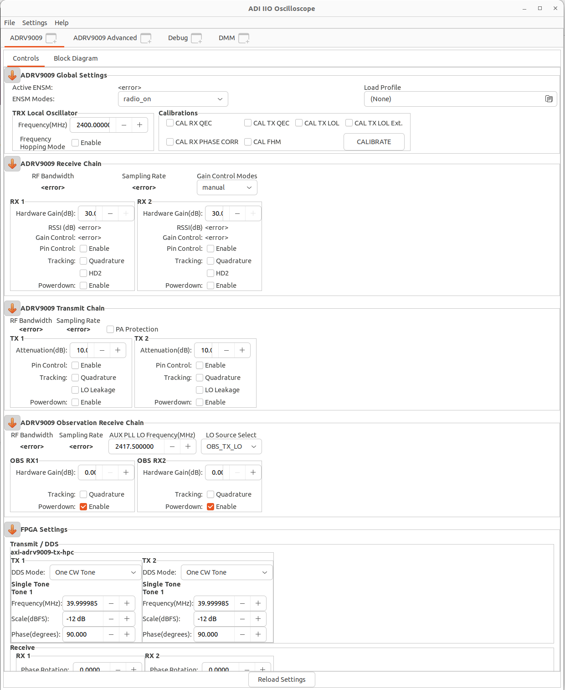
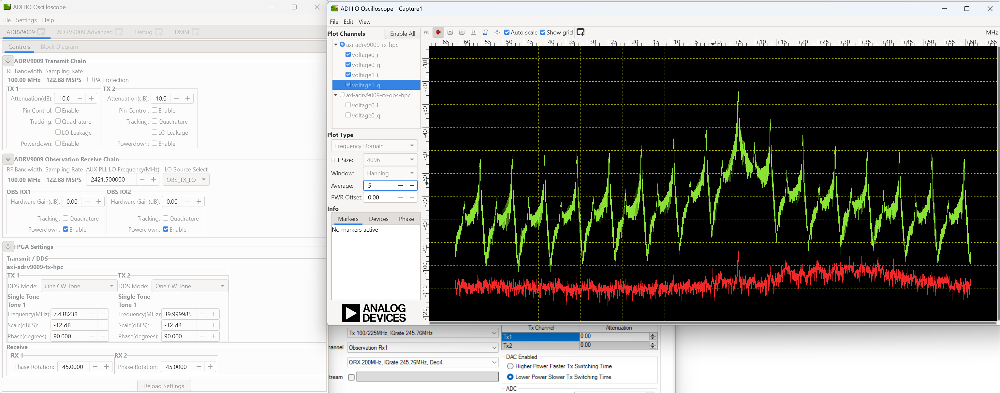
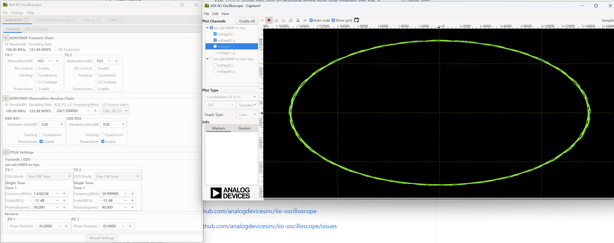

ADI
===============================

ADI HDL Design
---------------
ADI HDL related information
  * ADI HDL repo: https://github.com/analogdevicesinc/hdl
  * ADI Reference Designs HDL User Guide: https://wiki.analog.com/resources/fpga/docs/hdl
  * all the projects have no-OS (baremetal https://github.com/analogdevicesinc/no-OS) and a Linux (https://github.com/analogdevicesinc/Linux) support.

The HDL repository is divided into two seperate sections
  * projects with all the currently supported projects. There are two special folders inside the /hdl/projects: 
      * common: contains all the base designs, for all currently supported FPGA development boards
      * scripts (Tcl scripts): defined all the custom Tcl processes, which are used to create a project, define the system and generate programming files for the FPGA.
  * library with all the Analog Devices Inc. proprietary IP cores and hdl modules, which are required to build the projects. The library folder contains all the IP cores and common modules. An IP, in general, contains Verilog files, which describe the hardware logic, constraint files, to ease timing closure, and Tcl scripts, which generate all the other files required for IP integration (xxip.tcl for Vivado and xxhw.tcl for Quartus).

Running the HDL on hardware. HDL build alone will NOT let you do anything useful. You would need a software running on the processor (Microblaze, NIOS or ARM) to make the design work. There are two software solutions: 1) Linux and 2) No-OS. Ref: https://wiki.analog.com/resources/fpga/docs/run

HDL Architecture: https://wiki.analog.com/resources/fpga/docs/arch

Using and modifying the HDL designs: https://wiki.analog.com/resources/fpga/docs/tips

adrv9009
--------
ADRV9009: https://www.analog.com/en/products/adrv9009.html

ADRV9009 Hardware Reference Manual (under "/Users/kaikailiu/Documents/Hardware/ADI/Talise Design package/User Guide")
  * The ADRV9009 is a dual-channel RF transmitter and receiver with an observation receiver. 
  * Frequency range of 75 MHz to 6 GHz, supports up to 450 MHz of synthesis bandwidth on its transmitters
  * The receiver portion of the device can operate either as a dual-channel receiver that supports bandwidths up to 200 MHz or as a single-channel observation receiver that supports bandwidths up to 450 MHz. 
  * The receiver portion is switched between single-channel and dual-channel mode in time division duplex (TDD) operation, utilizing the dual-channel receiver mode during receiver slots and utilizing the single-channel observation receiver in transceiver slots. The single-channel observation receiver can select either of the "ORX1_IN+/ORX1_IN−" or "ORX2_IN+/ORX2_IN−" RF inputs. 
  * Data transfer is accomplished through eight JESD204B dedicated, high speed interface lanes (four for transmitter, and four for main receiver/observation). 
  * All software control is communicated via the SPI. The devices include a control interface that utilizes GPIO lines to provide hardware control to and from the devices.
  * The devices also include a set of four low speed auxiliary ADCs that can be used to monitor external voltages of interest to system operation
  * AD9528 two-stage PLL with multiple outputs

"/Users/kaikailiu/Documents/Hardware/ADI/adrv9009-api-source-code/API/src/app" folder contains a simple example application layer program. 
  * The headless.c file has the top level main function that demonstrates the sequence of the API function calls to initialize the device. 
  * The talise_config.c file holds the initialization and run-time data structures used by the API. The TTES can generate the initialization and run-time data structures for the API. 
  * The /src/devices folder includes the main API code for the transmitter (/src/devices/talise) - do not modify this code
  * The /adi_hal folder provides the means for a developer to insert custom platform hardware driver code for system integration with the API.
  * In the example code provided in the adi_hal.c file, the functions are generic wrappers that call hardware layer functions, devices, and resources for the Xilinx® Zynq®-7000 SoC ZC706 platform.
  * The device employs the JESD204B Subclass 1 standard to transfer ADC and digital-to-analog (DAC) samples between the device and a BBP. The interface supports high speed serial lane rates of up to 12,288 Mbps. An external clock distribution solution provides a device clock and the SYSREF signal to the device and the BBP. Configuration of the JESD204B circuitry is handled by the TALISE_initialize() API function. 
  * The transport layer and link layer for JESD204B are performed in the device framers. The device has two JESD204B framers that multiplex into four serial lanes. 

ADRV9009 hardware reference guide: https://www.analog.com/media/en/technical-documentation/user-guides/adrv9008-1-w-9008-2-w-9009-w-hardware-reference-manual-ug-1295.pdf
ADRV9009, ADRV9008 highly integrated, wideband RF transceiver Linux device driver： https://wiki.analog.com/resources/tools-software/linux-drivers/iio-transceiver/adrv9009

SDR Integrated Transceiver Design Resources: https://www.analog.com/en/design-center/landing-pages/001/integrated-rf-agile-transceiver-design-resources.html
    * Download the ADRV9008/ADRV9009 Design File Package
  

Wideband RF Transceiver Evaluation Software (TES): https://www.analog.com/en/design-center/landing-pages/001/transceiver-evaluation-software.html
    * ADRV9008/ADRV9009 Evaluation Software with GUI for Evaluation Board (ZIP)
    * ADRV9008/ADRV9009 API Source Code (ZIP)
    * ADRV9008-x and ADRV9009 Profile Configuration Tool (Filter Wizard) (ZIP)
    * ADRV9009-SDCARD

ADRV9009/ADRV9008 No-OS System Level Design Setup: https://wiki.analog.com/resources/eval/user-guides/adrv9009/no-os-setup
    * Arria 10 GX board supported
    * Demo application ADRV9009-W on ZCU102: DMA_EXAMPLE, TINYIIOD demo

iio-oscilloscope
-----------------
https://github.com/analogdevicesinc/iio-oscilloscope
https://wiki.analog.com/resources/tools-software/linux-software/iio_oscilloscope#installation

Analog Devices Kuiper Linux
https://wiki.analog.com/resources/tools-software/linux-software/kuiper-linux
User: root, password: analog; User: analog, password: analog
The SD card includes several folders in the root directory of the BOOT partition. In order to configure the SD card to work with a specific FPGA board and ADI hardware, several files must be copied onto the root directory.

Configuring the SD Card for Raspberry Pi Projects:

Intel Arria10 SOC board schematic: https://www.analog.com/media/en/technical-documentation/eval-board-schematic/a10_soc_devkit_a3.pdf

Install iio_oscilloscope
-------------------------
Install ADI iio_oscilloscope based on this link: https://wiki.analog.com/resources/tools-software/linux-software/iio_oscilloscope

.. code-block:: console 

  (base) lkk@lkk-intel12:~/intelFPGA_pro/FPGADeveloper$ sudo apt-get -y install libglib2.0-dev libgtk2.0-dev libgtkdatabox-dev libmatio-dev libfftw3-dev libxml2 libxml2-dev bison flex libavahi-common-dev libavahi-client-dev libcurl4-openssl-dev libjansson-dev cmake libaio-dev libserialport-dev

Build and install the libiio library. ref: https://wiki.analog.com/resources/tools-software/linux-software/libiio#how_to_build_it

.. code-block:: console 

  (base) lkk@lkk-intel12:~/intelFPGA_pro/FPGADeveloper$ sudo apt-get install libxml2 libxml2-dev bison flex libcdk5-dev cmake
  (base) lkk@lkk-intel12:~/intelFPGA_pro/FPGADeveloper$ sudo apt-get install libaio-dev libusb-1.0-0-dev libserialport-dev libxml2-dev libavahi-client-dev doxygen graphviz
  (base) lkk@lkk-intel12:~/intelFPGA_pro/FPGADeveloper$ git clone https://github.com/pcercuei/libini.git
  (base) lkk@lkk-intel12:~/intelFPGA_pro/FPGADeveloper$ cd libini/
  (base) lkk@lkk-intel12:~/intelFPGA_pro/FPGADeveloper/libini$ mkdir build && cd build && cmake ../ && make && sudo make install
  (base) lkk@lkk-intel12:~/intelFPGA_pro/FPGADeveloper/libini/build$ cd ../../
  (base) lkk@lkk-intel12:~/intelFPGA_pro/FPGADeveloper$ git clone https://github.com/analogdevicesinc/libiio.git
  (base) lkk@lkk-intel12:~/intelFPGA_pro/FPGADeveloper$ cd libiio/
  (base) lkk@lkk-intel12:~/intelFPGA_pro/FPGADeveloper/libiio$ mkdir build && cd build && cmake ../ && make && sudo make install
  (base) lkk@lkk-intel12:~/intelFPGA_pro/FPGADeveloper/libiio/build$ export PATH=/usr/lib/:$PATH
  (base) lkk@lkk-intel12:~/intelFPGA_pro/FPGADeveloper/libiio/build$ iio_info
  Unable to create Local IIO context : No such file or directory (2)

  (base) lkk@lkk-intel12:~/intelFPGA_pro/FPGADeveloper$ git clone https://github.com/analogdevicesinc/iio-oscilloscope.git
  (base) lkk@lkk-intel12:~/intelFPGA_pro/FPGADeveloper$ cd iio-oscilloscope/
  (base) lkk@lkk-intel12:~/intelFPGA_pro/FPGADeveloper/iio-oscilloscope$ mkdir build && cd build
  (base) lkk@lkk-intel12:~/intelFPGA_pro/FPGADeveloper/iio-oscilloscope/build$ cmake ../ && make -j 4
  (base) lkk@lkk-intel12:~/intelFPGA_pro/FPGADeveloper/iio-oscilloscope/build$ sudo make install
  (base) lkk@lkk-intel12:~/intelFPGA_pro/FPGADeveloper/iio-oscilloscope/build$ ./osc 

.. Could not get IIO Context: Function not implemented...

In the osc UI, enter the IIO context "ip:192.168.xx.xx", click "Refresh" and "Connect":

When the device is connected, you can see all the settings of the device

You can create a new plot and see the IQ channel signals

Setup the TX signal, connect the TX0 SMA port and TX0 SMA port via one SMA cable, you can see the received signal in channel 0

You can also see the Constellation figure:

PySDR and pyadi-iio
-------------------

Install pyadi-iio
~~~~~~~~~~~~~~~~~

.. code-block:: console 

  (mycondapy310) lkk@lkk-intel12:~/intelFPGA_pro/FPGADeveloper$ git clone https://github.com/analogdevicesinc/pyadi-iio.git
  (mycondapy310) lkk@lkk-intel12:~/intelFPGA_pro/FPGADeveloper$ cd pyadi-iio
  (mycondapy310) lkk@lkk-intel12:~/intelFPGA_pro/FPGADeveloper/pyadi-iio$ pip install .
  Successfully built pyadi-iio
  Installing collected packages: pylibiio, numpy, pyadi-iio
  Successfully installed numpy-1.24.3 pyadi-iio-0.0.16 pylibiio-0.23.1
  $ pip install matplotlib scipy pytest

After pyadi-iio is installed, create radio via this python code:

.. code-block:: console 

  sdr = adi.adrv9009(uri="ip:192.168.86.31")

Run the adrv9009 example under the pyadi-iio examples folder:

.. code-block:: console 

  (mycondapy310) lkk@lkk-intel12:~/intelFPGA_pro/FPGADeveloper/pyadi-iio/examples$ python adrv9009.py 
  -10
  -10
  TRX LO 2000000000

Pyadi-iio examples: https://analogdevicesinc.github.io/pyadi-iio/guides/examples.html
Direct Digital Synthesizers: https://analogdevicesinc.github.io/pyadi-iio/fpga/index.html
For each individual DAC channel there are two DDSs which can have a unique phase, frequency, and phase.

Detailed driver for ADRV9009: https://wiki.analog.com/resources/tools-software/linux-drivers/iio-transceiver/adrv9009
ADRV9009 hardware reference manual: https://www.analog.com/media/en/technical-documentation/user-guides/adrv9008-1-w-9008-2-w-9009-w-hardware-reference-manual-ug-1295.pdf
.. MATLAB toolbox: https://wiki.analog.com/resources/tools-software/transceiver-toolbox
