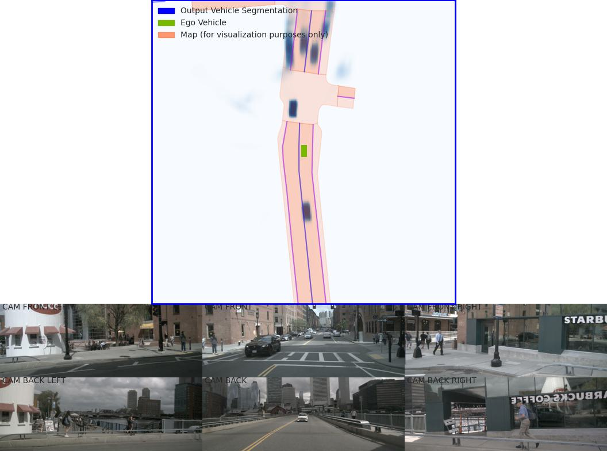

BEV
=============

LSS
---------------------

LSS Bird's-eye-view Conversion
--------------------------
added new folder (mydetector3d/datasets/nuscenes/lss) to test the Bird's-eye-view Conversion based on lss model (https://github.com/nv-tlabs/lift-splat-shoot/tree/master).

.. code-block:: console

    pip install nuscenes-devkit tensorboardX efficientnet_pytorch==0.7.0

Perform LSS training based on "nuScenesv1.0-mini/": 

.. code-block:: console

    mydetector3d/datasets/nuscenes/lss/lssmain.py
    train('mini', dataroot='/data/cmpe249-fa22/nuScenes/nuScenesv1.0-mini/',nepochs=100,gpuid=0,logdir='./output/lss')

Pretrained model is saved in "/data/cmpe249-fa22/Mymodels/lss_model525000.pt", use **eval_model_iou** "mydetector3d/datasets/nuscenes/lss/lssexplore.py" for inference, get results

.. code-block:: console

    {'loss': 0.09620507466204373, 'iou': 0.35671476137624863}

Run **viz_model_preds** need map, it shows: No such file or directory: '/data/cmpe249-fa22/nuScenes/nuScenesv1.0-mini/maps/maps/expansion/singapore-hollandvillage.json'. 

.. code-block:: console

    (mycondapy39) [010796032@cs001 nuScenes]$ unzip nuScenes-map-expansion-v1.3.zip
    Archive:  nuScenes-map-expansion-v1.3.zip
    creating: basemap/
    inflating: basemap/boston-seaport.png
    inflating: basemap/singapore-hollandvillage.png
    inflating: basemap/singapore-queenstown.png
    inflating: basemap/singapore-onenorth.png
    creating: expansion/
    inflating: expansion/boston-seaport.json
    inflating: expansion/singapore-onenorth.json
    inflating: expansion/singapore-queenstown.json
    inflating: expansion/singapore-hollandvillage.json
    creating: prediction/
    inflating: prediction/prediction_scenes.json
    (mycondapy39) [010796032@cs001 nuScenes]$ cp -r expansion/ nuScenesv1.0-mini/maps/

After fixing the map issue, the evaluation figures of **viz_model_preds** is saved via "plt.savefig" as "eval000000_000.jpg" (f'eval{batchi:06}_{si:03}.jpg') in the root folder

Imgs: [4, 6, 3, 128, 352]

.. image:: imgs/3D/eval000008_001.jpg
  :width: 600
  :alt: viz_model_preds1

.. image:: imgs/3D/eval000006_001.jpg
  :width: 600
  :alt: viz_model_preds2

The **lidar_check** is used to run a visual check to make sure extrinsics/intrinsics are being parsed correctly. 
    * Left: input images with LiDAR scans projected using the extrinsics and intrinsics. 
    * Middle: the LiDAR scan that is projected. 
    * Right: X-Y projection of the point cloud generated by the lift-splat model. 

.. image:: imgs/3D/lcheck000_00023_00.jpg
  :width: 600
  :alt: lidar_check1

.. image:: imgs/3D/lcheck000_00027_00.jpg
  :width: 600
  :alt: lidar_check2

Finished training on the "/data/cmpe249-fa22/nuScenes/nuScenesv1.0-mini/" data via "mydetector3d/datasets/nuscenes/lss/lssmain.py", the model is saved in the output folder: "model1000.pt model8000.pt". Use model8000.pt for inference

.. code-block:: console

    {'loss': 0.23870943376311549, 'iou': 0.11804760577248166}
  

BEVFusion
----------
Add bevfusion code to the mydetector3d folder

BEVFusion Training
~~~~~~~~~~~~~~~~~~~

New:1021
cfg_file: mydetector3d/tools/cfgs/nuscenes_models/bevfusion.yaml
batch_size: 4
epochs: 128
extra_tag: 0522
ckpt: /data/cmpe249-fa22/Mymodels/nuscenes_models/bevfusion/0522/ckpt/latest_model.pth
outputfolder: /data/cmpe249-fa22/Mymodels/

.. code-block:: console

  (mycondapy310) [010796032@cs001 3DDepth]$ ls /data/cmpe249-fa22/Mymodels/nuscenes_models/
  bevfusion  cbgs_pp_multihead
  /data/cmpe249-fa22/Mymodels/nuscenes_models/cbgs_pp_multihead/0522/ckpt/checkpoint_epoch_128.pth
  /data/cmpe249-fa22/Mymodels/nuscenes_models/bevfusion/0522/ckpt/checkpoint_epoch_56.pth  latest_model.pth

  (mycondapy310) [010796032@cs001 3DDepth]$ python ./mydetector3d/tools/mytrain.py --cfg_file='mydetector3d/tools/cfgs/nuscenes_models/bevfusion.yaml' --batch_size=4 --epochs=128 --extra_tag='0522' --ckpt='/data/cmpe249-fa22/Mymodels/nuscenes_models/bevfusion/0522/ckpt/latest_model.pth' --outputfolder='/data/cmpe249-fa22/Mymodels/'
  023-10-21 17:09:07,965   INFO  Train:   59/128 ( 46%) [4534/30895 ( 15%)]  Loss: 0.4369 (0.437)  LR: 5.738e-05  Time cost: 00:47/346:12:13 [00:47/28342:55:05]  Acc_iter 1796445     Data time: 10.99(10.99)  Forward time: 36.29(36.29)  Batch time: 47.28(47.28)

BEVFusion Evaluation
~~~~~~~~~~~~~~~~~~~~

.. code-block:: console

  (mycondapy310) [010796032@cs002 3DDepth]$ python mydetector3d/tools/myevaluatev2_nuscenes.py --cfg_file='mydetector3d/tools/cfgs/nuscenes_models/bevfusion.yaml' --ckpt='/data/cmpe249-fa22/Mymodels/nuscenes_models/bevfusion/0522/ckpt/checkpoint_epoch_56.pth' --tag='1021' --outputpath='/data/cmpe249-fa22/Mymodels/'
  Loaded ground truth annotations for 6019 samples.
  Filtering predictions
  => Original number of boxes: 1203800
  => After distance based filtering: 807685
  => After LIDAR and RADAR points based filtering: 807685
  => After bike rack filtering: 807498
  Filtering ground truth annotations
  => Original number of boxes: 187528
  => After distance based filtering: 134565
  => After LIDAR and RADAR points based filtering: 121871
  => After bike rack filtering: 121861
  Accumulating metric data...
  Calculating metrics...
  Saving metrics to: /data/cmpe249-fa22/Mymodels/eval/nuscenes_models_bevfusion_1021/txtresults
  mAP: 0.6215
  mATE: 0.2811
  mASE: 0.2565
  mAOE: 0.3630
  mAVE: 0.2630
  mAAE: 0.1964
  NDS: 0.6747
  Eval time: 123.9s

  Per-class results:
  Object Class            AP      ATE     ASE     AOE     AVE     AAE   
  car                     0.867   0.182   0.155   0.064   0.242   0.187 
  truck                   0.517   0.356   0.210   0.077   0.273   0.215 
  bus                     0.704   0.339   0.185   0.076   0.505   0.267 
  trailer                 0.427   0.482   0.213   0.775   0.208   0.181 
  construction_vehicle    0.257   0.630   0.439   0.877   0.146   0.350 
  pedestrian              0.856   0.128   0.286   0.351   0.209   0.089 
  motorcycle              0.678   0.206   0.235   0.382   0.333   0.268 
  bicycle                 0.493   0.172   0.261   0.613   0.187   0.013 
  traffic_cone            0.755   0.122   0.316   nan     nan     nan   
  barrier                 0.660   0.195   0.265   0.051   nan     nan   
  Result is saved to /data/cmpe249-fa22/Mymodels/eval/nuscenes_models_bevfusion_1021/txtresults
  ****************Evaluation done.*****************
  ----------------Nuscene detection_cvpr_2019 results-----------------
  ***car error@trans, scale, orient, vel, attr | AP@0.5, 1.0, 2.0, 4.0
  0.18, 0.15, 0.06, 0.24, 0.19 | 77.49, 87.38, 90.35, 91.62 | mean AP: 0.8670862370078164
  ***truck error@trans, scale, orient, vel, attr | AP@0.5, 1.0, 2.0, 4.0
  0.36, 0.21, 0.08, 0.27, 0.21 | 32.90, 49.80, 59.84, 64.19 | mean AP: 0.5168137338806774
  ***construction_vehicle error@trans, scale, orient, vel, attr | AP@0.5, 1.0, 2.0, 4.0
  0.63, 0.44, 0.88, 0.15, 0.35 | 4.58, 22.34, 33.82, 42.25 | mean AP: 0.25749293589163863
  ***bus error@trans, scale, orient, vel, attr | AP@0.5, 1.0, 2.0, 4.0
  0.34, 0.19, 0.08, 0.51, 0.27 | 47.13, 69.62, 80.76, 84.28 | mean AP: 0.7044599723101372
  ***trailer error@trans, scale, orient, vel, attr | AP@0.5, 1.0, 2.0, 4.0
  0.48, 0.21, 0.78, 0.21, 0.18 | 14.24, 37.64, 55.30, 63.68 | mean AP: 0.42713761557123203
  ***barrier error@trans, scale, orient, vel, attr | AP@0.5, 1.0, 2.0, 4.0
  0.19, 0.27, 0.05, nan, nan | 55.69, 65.84, 70.44, 71.98 | mean AP: 0.6598819992701259
  ***motorcycle error@trans, scale, orient, vel, attr | AP@0.5, 1.0, 2.0, 4.0
  0.21, 0.24, 0.38, 0.33, 0.27 | 57.04, 69.52, 71.85, 72.99 | mean AP: 0.6784940887044636
  ***bicycle error@trans, scale, orient, vel, attr | AP@0.5, 1.0, 2.0, 4.0
  0.17, 0.26, 0.61, 0.19, 0.01 | 46.32, 49.47, 50.17, 51.14 | mean AP: 0.4927485844592563
  ***pedestrian error@trans, scale, orient, vel, attr | AP@0.5, 1.0, 2.0, 4.0
  0.13, 0.29, 0.35, 0.21, 0.09 | 83.93, 85.02, 86.11, 87.32 | mean AP: 0.8559630597671958
  ***traffic_cone error@trans, scale, orient, vel, attr | AP@0.5, 1.0, 2.0, 4.0
  0.12, 0.32, nan, nan, nan | 72.77, 74.03, 76.10, 78.95 | mean AP: 0.754652052870545
  --------------average performance-------------
  trans_err:       0.2811
  scale_err:       0.2565
  orient_err:      0.3630
  vel_err:         0.2630
  attr_err:        0.1964
  mAP:     0.6215
  NDS:     0.6747

  (mycondapy310) [010796032@cs002 3DDepth]$ python mydetector3d/tools/myevaluatev2_nuscenes.py --cfg_file='mydetector3d/tools/cfgs/nuscenes_models/bevfusion.yaml' --ckpt='/data/cmpe249-fa23/modelzoo/cbgs_bevfusion.pth' --tag='1022' --outputpath='/data/cmpe249-fa22/Mymodels/'
  ==> Loading parameters from checkpoint /data/cmpe249-fa23/modelzoo/cbgs_bevfusion.pth to cuda:0
  Not updated weight backbone_3d.conv1.0.conv1.bias: torch.Size([16])
  Not updated weight backbone_3d.conv1.0.conv2.bias: torch.Size([16])
  Not updated weight backbone_3d.conv1.1.conv1.bias: torch.Size([16])
  Not updated weight backbone_3d.conv1.1.conv2.bias: torch.Size([16])
  Not updated weight backbone_3d.conv2.1.conv1.bias: torch.Size([32])
  Not updated weight backbone_3d.conv2.1.conv2.bias: torch.Size([32])
  Not updated weight backbone_3d.conv2.2.conv1.bias: torch.Size([32])
  Not updated weight backbone_3d.conv2.2.conv2.bias: torch.Size([32])
  Not updated weight backbone_3d.conv3.1.conv1.bias: torch.Size([64])
  Not updated weight backbone_3d.conv3.1.conv2.bias: torch.Size([64])
  Not updated weight backbone_3d.conv3.2.conv1.bias: torch.Size([64])
  Not updated weight backbone_3d.conv3.2.conv2.bias: torch.Size([64])
  Not updated weight backbone_3d.conv4.1.conv1.bias: torch.Size([128])
  Not updated weight backbone_3d.conv4.1.conv2.bias: torch.Size([128])
  Not updated weight backbone_3d.conv4.2.conv1.bias: torch.Size([128])
  Not updated weight backbone_3d.conv4.2.conv2.bias: torch.Size([128])
  Not updated weight backbone_2d.deblocks.0.0.weight: torch.Size([128, 256, 1, 1])
  ==> Done (loaded 582/599)
  Saving metrics to: /data/cmpe249-fa22/Mymodels/eval/_bevfusion_1022/txtresults
  mAP: 0.2364
  mATE: 0.7516
  mASE: 0.6989
  mAOE: 0.6777
  mAVE: 0.6240
  mAAE: 0.4523
  NDS: 0.2977
  Eval time: 100.4s

  Per-class results:
  Object Class            AP      ATE     ASE     AOE     AVE     AAE   
  car                     0.627   0.288   0.319   0.195   0.884   0.142 
  truck                   0.526   0.396   0.451   0.176   0.584   0.227 
  bus                     0.727   0.351   0.507   0.107   0.656   0.319 
  trailer                 0.359   0.667   0.492   0.448   0.225   0.168 
  construction_vehicle    0.124   0.821   0.641   0.808   0.142   0.273 
  pedestrian              0.000   0.993   0.578   1.365   0.501   0.489 
  motorcycle              0.000   1.000   1.000   1.000   1.000   1.000 
  bicycle                 0.000   1.000   1.000   1.000   1.000   1.000 
  traffic_cone            0.000   1.000   1.000   nan     nan     nan   
  barrier                 0.000   1.000   1.000   1.000   nan     nan   
  Result is saved to /data/cmpe249-fa22/Mymodels/eval/_bevfusion_1022/txtresults
  ****************Evaluation done.*****************
  ----------------Nuscene detection_cvpr_2019 results-----------------
  ***car error@trans, scale, orient, vel, attr | AP@0.5, 1.0, 2.0, 4.0
  0.29, 0.32, 0.20, 0.88, 0.14 | 49.86, 64.59, 67.02, 69.45 | mean AP: 0.6273165702716551
  ***truck error@trans, scale, orient, vel, attr | AP@0.5, 1.0, 2.0, 4.0
  0.40, 0.45, 0.18, 0.58, 0.23 | 30.90, 53.75, 61.03, 64.87 | mean AP: 0.5263882028876202
  ***construction_vehicle error@trans, scale, orient, vel, attr | AP@0.5, 1.0, 2.0, 4.0
  0.82, 0.64, 0.81, 0.14, 0.27 | 0.32, 5.11, 16.79, 27.31 | mean AP: 0.1238384410850906
  ***bus error@trans, scale, orient, vel, attr | AP@0.5, 1.0, 2.0, 4.0
  0.35, 0.51, 0.11, 0.66, 0.32 | 47.55, 73.25, 83.07, 86.91 | mean AP: 0.7269430522576199
  ***trailer error@trans, scale, orient, vel, attr | AP@0.5, 1.0, 2.0, 4.0
  0.67, 0.49, 0.45, 0.22, 0.17 | 5.68, 29.28, 50.09, 58.72 | mean AP: 0.3594160235825944
  ***barrier error@trans, scale, orient, vel, attr | AP@0.5, 1.0, 2.0, 4.0
  1.00, 1.00, 1.00, nan, nan | 0.00, 0.00, 0.00, 0.00 | mean AP: 0.0
  ***motorcycle error@trans, scale, orient, vel, attr | AP@0.5, 1.0, 2.0, 4.0
  1.00, 1.00, 1.00, 1.00, 1.00 | 0.00, 0.00, 0.00, 0.00 | mean AP: 0.0
  ***bicycle error@trans, scale, orient, vel, attr | AP@0.5, 1.0, 2.0, 4.0
  1.00, 1.00, 1.00, 1.00, 1.00 | 0.00, 0.00, 0.00, 0.00 | mean AP: 0.0
  ***pedestrian error@trans, scale, orient, vel, attr | AP@0.5, 1.0, 2.0, 4.0
  0.99, 0.58, 1.37, 0.50, 0.49 | 0.00, 0.00, 0.00, 0.02 | mean AP: 3.946978392018936e-05
  ***traffic_cone error@trans, scale, orient, vel, attr | AP@0.5, 1.0, 2.0, 4.0
  1.00, 1.00, nan, nan, nan | 0.00, 0.00, 0.00, 0.00 | mean AP: 0.0
  --------------average performance-------------
  trans_err:       0.7516
  scale_err:       0.6989
  orient_err:      0.6777
  vel_err:         0.6240
  attr_err:        0.4523
  mAP:     0.2364
  NDS:     0.2977

Model forward process includes the following major parts

MeanVFE(vfe)
  * Input: voxel_features([600911, 10, 5]), voxel_num_points([600911]) = batch_dict['voxels'], batch_dict['voxel_num_points']
  * Output; batch_dict['voxel_features'] = points_mean.contiguous() #[600911, 5]

VoxelResBackBone8x(backbone_3d)
  * Input: voxel_features([600911, 5]), voxel_coords([600911, 4]) = batch_dict['voxel_features'], batch_dict['voxel_coords']
  * Output: batch_dict: 'encoded_spconv_tensor': out([2, 180, 180]), 'encoded_spconv_tensor_stride': 8, 'multi_scale_3d_features'

HeightCompression(map_to_bev_module)
  * Input: encoded_spconv_tensor = batch_dict['encoded_spconv_tensor'] #Sparse [2, 180, 180]
  * Output: batch_dict['spatial_features'] = spatial_features #[6, 256, 180, 180], batch_dict['spatial_features_stride']=8

SwinTransformer(image_backbone)
  * Input: x = batch_dict['camera_imgs'] #[6, 6, 3, 256, 704]
  * Out: batch_dict['image_features'] = outs #3 items: [36, 192, 32, 88], [36, 384, 16, 44], [36, 768, 8, 22] 

GeneralizedLSSFPN(neck)
  * inputs = batch_dict['image_features']
  * Output: batch_dict['image_fpn'] = tuple(outs) #2 items: [36, 256, 32, 88], [36, 256, 16, 44]

DepthLSSTransform(vtransform) (lists images into 3D and then splats onto bev features, from https://github.com/mit-han-lab/bevfusion/)
  * x = batch_dict['image_fpn']  #img=[6, 6, 256, 32, 88] 
  * points = batch_dict['points'] # [1456967, 6]
  * Output: batch_dict['spatial_features_img'] = x #[6, 80, 180, 180]
  (dtransform)
  (depthnet)
  (downsample)

ConvFuser(fuser)
  * Input: img_bev = batch_dict['spatial_features_img']#[6, 80, 180, 180], lidar_bev = batch_dict['spatial_features']#[6, 256, 180, 180]
  * cat_bev = torch.cat([img_bev,lidar_bev],dim=1)
  * Output: batch_dict['spatial_features'] = mm_bev #[6, 256, 180, 180]

BaseBEVBackbone(backbone_2d)
  * Input: spatial_features = data_dict['spatial_features'] #[6, 256, 180, 180]
  * data_dict['spatial_features_2d'] = x #[6, 512, 180, 180]

TransFusionHead(dense_head)
  * (loss_cls): SigmoidFocalClassificationLoss(); (loss_bbox): L1Loss(); (loss_heatmap): GaussianFocalLoss()
  * Input: feats = batch_dict['spatial_features_2d'] #[6, 512, 180, 180]
  * res = self.predict(feats) #'center' [6, 2, 200]; 'height' [6, 1, 200]; 'dim' [6, 3, 200]; 'rot' [6, 2, 200]; 'vel' [6, 2, 200]; 'heatmap' [6, 10, 200]; 'query_heatmap_score' [6, 10, 200]; 'dense_heatmap' [6, 10, 180, 180]
  * loss, tb_dict = self.loss(gt_bboxes_3d [6, 51, 9], gt_labels_3d [6, 51], res)

MMdetection3D
-------------
Ref: https://mmdetection3d.readthedocs.io/en/latest/get_started.html#installation

.. code-block:: console

  (mycondapy310) [010796032@coe-hpc2 3DDepth]$ pip install -U openmim
  (mycondapy310) [010796032@coe-hpc2 3DDepth]$ mim install mmengine
  Looking in links: https://download.openmmlab.com/mmcv/dist/cu118/torch2.0.0/index.html
  ....
  Successfully installed addict-2.4.0 mmengine-0.9.0 opencv-python-4.8.1.78 platformdirs-3.11.0 yapf-0.40.2
  (mycondapy310) [010796032@coe-hpc2 3DDepth]$ mim install 'mmcv>=2.0.0rc4'
  Looking in links: https://download.openmmlab.com/mmcv/dist/cu118/torch2.0.0/index.html
  Collecting mmcv>=2.0.0rc4
    Downloading https://download.openmmlab.com/mmcv/dist/cu118/torch2.0.0/mmcv-2.1.0-cp310-cp310-manylinux1_x86_64.whl (98.6 MB)
  Successfully installed mmcv-2.1.0
  (mycondapy310) [010796032@coe-hpc2 3DDepth]$ mim install 'mmdet>=3.0.0'
  Looking in links: https://download.openmmlab.com/mmcv/dist/cu118/torch2.0.0/index.html
  Collecting mmdet>=3.0.0
    Downloading mmdet-3.2.0-py3-none-any.whl (2.1 MB)
  Successfully installed mmdet-3.2.0 terminaltables-3.1.10
  (mycondapy310) [010796032@coe-hpc2 3DObject]$ git clone https://github.com/open-mmlab/mmdetection3d.git -b dev-1.x
  ERROR: Could not find a version that satisfies the requirement open3d (from mmdet3d) (from versions: none)
  (mycondapy310) [010796032@coe-hpc2 mmdetection3d]$ pip install -v -e .
  ERROR: No matching distribution found for open3d
  (mycondapy310) [010796032@coe-hpc2 mmdetection3d]$ nano requirements/runtime.txt #comment out open3d
  (mycondapy310) [010796032@coe-hpc2 mmdetection3d]$ pip install -v -e .
  Successfully installed black-23.10.0 flake8-6.1.0 iniconfig-2.0.0 lyft_dataset_sdk-0.0.8 matplotlib-3.5.3 mccabe-0.7.0 mmdet3d-1.2.0 mypy-extensions-1.0.0 pathspec-0.11.2 plotly-5.17.0 pluggy-1.3.0 plyfile-1.0.1 pycodestyle-2.11.1 pyflakes-3.1.0 pytest-7.4.2 tenacity-8.2.3 trimesh-4.0.0
  (mycondapy310) [010796032@coe-hpc2 mmdetection3d]$ mim download mmdet3d --config pointpillars_hv_secfpn_8xb6-160e_kitti-3d-car --dest .
  processing pointpillars_hv_secfpn_8xb6-160e_kitti-3d-car...
  downloading ━━━━━━━━━━━━━━━━━━━━━━━━━━━━━━━━━━━━━━━━ 18.4/18.4 MiB 117.4 MB/s eta 0:00:00
  Successfully downloaded hv_pointpillars_secfpn_6x8_160e_kitti-3d-car_20220331_134606-d42d15ed.pth to /lts/home/010796032/3DObject/mmdetection3d
  Successfully dumped pointpillars_hv_secfpn_8xb6-160e_kitti-3d-car.py to /lts/home/010796032/3DObject/mmdetection3d
  (mycondapy310) [010796032@cs001 mmdetection3d]$ python demo/pcd_demo.py demo/data/kitti/000008.bin pointpillars_hv_secfpn_8xb6-160e_kitti-3d-car.py hv_pointpillars_secfpn_6x8_160e_kitti-3d-car_20220331_134606-d42d15ed.pth --no-save-vis
  (mycondapy310) [010796032@cs001 mmdetection3d]$ cat outputs/preds/000008.json 
  {"labels_3d": [0, 0, 0, 0, 0, 0, 0, 0, 0, 0], "scores_3d": [0.9750590920448303, 0.9682098627090454, 0.9457541108131409, 0.8904030919075012, 0.8890073299407959, 0.7703604698181152, 0.7550405859947205, 0.7058141827583313, 0.5811426639556885, 0.44102343916893005], "bboxes_3d": [[14.75867748260498, -1.0537946224212646, -1.5589320659637451, 3.7562406063079834, 1.6059986352920532, 1.558688998222351, -0.31321752071380615], [6.438138961791992, -3.8679745197296143, -1.7354645729064941, 3.147707223892212, 1.4599915742874146, 1.4284530878067017, -0.2998310327529907], [8.112329483032227, 1.216971516609192, -1.6341216564178467, 3.6662495136260986, 1.573140025138855, 1.5916767120361328, 2.8161733150482178], [20.169925689697266, -8.43094253540039, -1.6689856052398682, 2.381495237350464, 1.51751708984375, 1.5693042278289795, -0.3255223035812378], [33.455665588378906, -7.035743236541748, -1.3376567363739014, 4.213741302490234, 1.744563102722168, 1.6697136163711548, 2.828497886657715], [55.621891021728516, -20.328449249267578, -1.3771171569824219, 4.370689392089844, 1.7358696460723877, 1.7066415548324585, 2.8504137992858887], [3.637699842453003, 2.7381889820098877, -1.6892050504684448, 3.7212045192718506, 1.5820955038070679, 1.51765775680542, -0.2304447889328003], [25.04075050354004, -10.156379699707031, -1.6326467990875244, 3.739389181137085, 1.6084976196289062, 1.4840202331542969, -0.32967936992645264], [28.72532081604004, -1.552423357963562, -1.202379822731018, 3.69446063041687, 1.5429767370224, 1.5610381364822388, 1.2416549921035767], [40.87098693847656, -9.748966217041016, -1.3669469356536865, 3.8333828449249268, 1.6528679132461548, 1.5699278116226196, -0.28837358951568604]], "box_type_3d": "LiDAR"}

