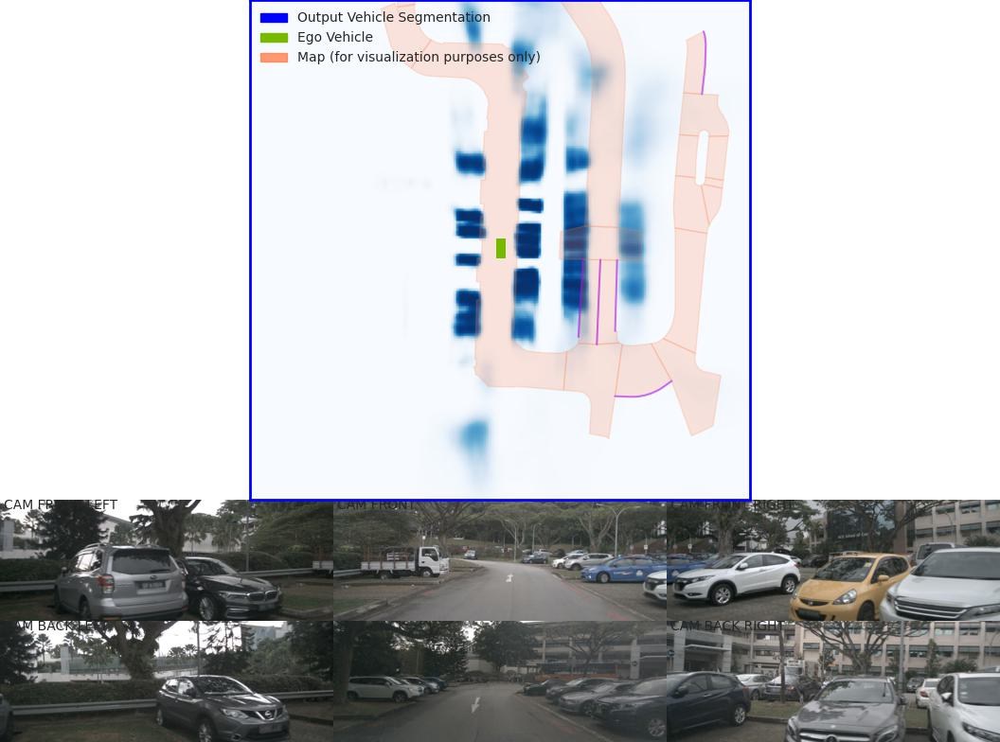
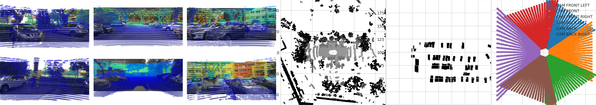
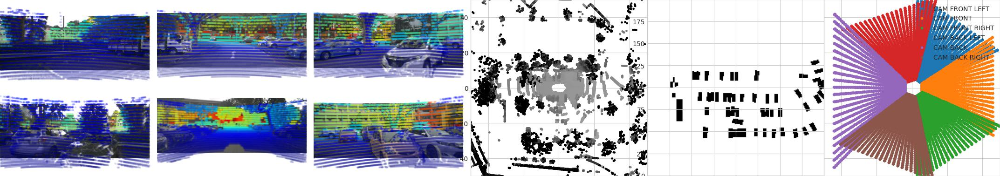

BEV
=============

LSS
---------------------

LSS Bird's-eye-view Conversion
--------------------------
added new folder (mydetector3d/datasets/nuscenes/lss) to test the Bird's-eye-view Conversion based on lss model (https://github.com/nv-tlabs/lift-splat-shoot/tree/master).

.. code-block:: console

    pip install nuscenes-devkit tensorboardX efficientnet_pytorch==0.7.0

Perform LSS training based on "nuScenesv1.0-mini/": 

.. code-block:: console

    mydetector3d/datasets/nuscenes/lss/lssmain.py
    train('mini', dataroot='/data/cmpe249-fa22/nuScenes/nuScenesv1.0-mini/',nepochs=100,gpuid=0,logdir='./output/lss')

Pretrained model is saved in "/data/cmpe249-fa22/Mymodels/lss_model525000.pt", use **eval_model_iou** "mydetector3d/datasets/nuscenes/lss/lssexplore.py" for inference, get results

.. code-block:: console

    {'loss': 0.09620507466204373, 'iou': 0.35671476137624863}

Run **viz_model_preds** need map, it shows: No such file or directory: '/data/cmpe249-fa22/nuScenes/nuScenesv1.0-mini/maps/maps/expansion/singapore-hollandvillage.json'. 

.. code-block:: console

    (mycondapy39) [010796032@cs001 nuScenes]$ unzip nuScenes-map-expansion-v1.3.zip
    Archive:  nuScenes-map-expansion-v1.3.zip
    creating: basemap/
    inflating: basemap/boston-seaport.png
    inflating: basemap/singapore-hollandvillage.png
    inflating: basemap/singapore-queenstown.png
    inflating: basemap/singapore-onenorth.png
    creating: expansion/
    inflating: expansion/boston-seaport.json
    inflating: expansion/singapore-onenorth.json
    inflating: expansion/singapore-queenstown.json
    inflating: expansion/singapore-hollandvillage.json
    creating: prediction/
    inflating: prediction/prediction_scenes.json
    (mycondapy39) [010796032@cs001 nuScenes]$ cp -r expansion/ nuScenesv1.0-mini/maps/

After fixing the map issue, the evaluation figures of **viz_model_preds** is saved via "plt.savefig" as "eval000000_000.jpg" (f'eval{batchi:06}_{si:03}.jpg') in the root folder

Imgs: [4, 6, 3, 128, 352]

.. image:: imgs/3D/eval000008_001.jpg
  :width: 600
  :alt: viz_model_preds1

.. image:: imgs/3D/eval000011_001.jpg
  :width: 600
  :alt: viz_model_preds3

The **lidar_check** is used to run a visual check to make sure extrinsics/intrinsics are being parsed correctly. 
    * Left: input images with LiDAR scans projected using the extrinsics and intrinsics. 
    * Middle: the LiDAR scan that is projected. 
    * Right: X-Y projection of the point cloud generated by the lift-splat model. 

Finished training on the "/data/cmpe249-fa22/nuScenes/nuScenesv1.0-mini/" data via "mydetector3d/datasets/nuscenes/lss/lssmain.py", the model is saved in the output folder: "model1000.pt model8000.pt". Use model8000.pt for inference

.. code-block:: console

    {'loss': 0.23870943376311549, 'iou': 0.11804760577248166}