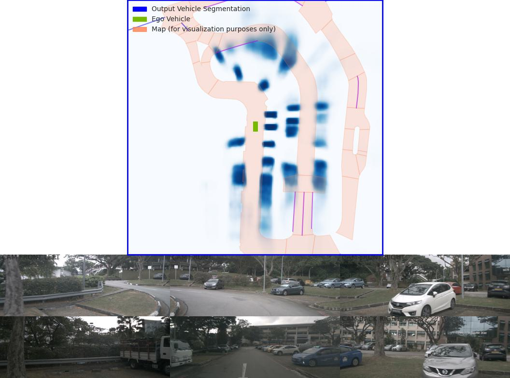

BEV
=============

LSS
---------------------

LSS Bird's-eye-view Conversion
--------------------------
added new folder (mydetector3d/datasets/nuscenes/lss) to test the Bird's-eye-view Conversion based on lss model (https://github.com/nv-tlabs/lift-splat-shoot/tree/master).

.. code-block:: console

    pip install nuscenes-devkit tensorboardX efficientnet_pytorch==0.7.0

Perform LSS training based on "nuScenesv1.0-mini/": 

.. code-block:: console

    mydetector3d/datasets/nuscenes/lss/lssmain.py
    train('mini', dataroot='/data/cmpe249-fa22/nuScenes/nuScenesv1.0-mini/',nepochs=100,gpuid=0,logdir='./output/lss')

Pretrained model is saved in "/data/cmpe249-fa22/Mymodels/lss_model525000.pt", use **eval_model_iou** "mydetector3d/datasets/nuscenes/lss/lssexplore.py" for inference, get results

.. code-block:: console

    {'loss': 0.09620507466204373, 'iou': 0.35671476137624863}

Run **viz_model_preds** need map, it shows: No such file or directory: '/data/cmpe249-fa22/nuScenes/nuScenesv1.0-mini/maps/maps/expansion/singapore-hollandvillage.json'. 

.. code-block:: console

    (mycondapy39) [010796032@cs001 nuScenes]$ unzip nuScenes-map-expansion-v1.3.zip
    Archive:  nuScenes-map-expansion-v1.3.zip
    creating: basemap/
    inflating: basemap/boston-seaport.png
    inflating: basemap/singapore-hollandvillage.png
    inflating: basemap/singapore-queenstown.png
    inflating: basemap/singapore-onenorth.png
    creating: expansion/
    inflating: expansion/boston-seaport.json
    inflating: expansion/singapore-onenorth.json
    inflating: expansion/singapore-queenstown.json
    inflating: expansion/singapore-hollandvillage.json
    creating: prediction/
    inflating: prediction/prediction_scenes.json
    (mycondapy39) [010796032@cs001 nuScenes]$ cp -r expansion/ nuScenesv1.0-mini/maps/

After fixing the map issue, the evaluation figures of **viz_model_preds** is saved via "plt.savefig" as "eval000000_000.jpg" (f'eval{batchi:06}_{si:03}.jpg') in the root folder

Imgs: [4, 6, 3, 128, 352]

.. image:: imgs/3D/eval000006_001.jpg
  :width: 600
  :alt: viz_model_preds2

.. image:: imgs/3D/eval000011_001.jpg
  :width: 600
  :alt: viz_model_preds3

The **lidar_check** is used to run a visual check to make sure extrinsics/intrinsics are being parsed correctly. 
    * Left: input images with LiDAR scans projected using the extrinsics and intrinsics. 
    * Middle: the LiDAR scan that is projected. 
    * Right: X-Y projection of the point cloud generated by the lift-splat model. 

.. image:: imgs/3D/lcheck000_00023_00.jpg
  :width: 600
  :alt: lidar_check1

.. image:: imgs/3D/lcheck000_00027_00.jpg
  :width: 600
  :alt: lidar_check2

Finished training on the "/data/cmpe249-fa22/nuScenes/nuScenesv1.0-mini/" data via "mydetector3d/datasets/nuscenes/lss/lssmain.py", the model is saved in the output folder: "model1000.pt model8000.pt". Use model8000.pt for inference

.. code-block:: console

    {'loss': 0.23870943376311549, 'iou': 0.11804760577248166}
  

BEVFusion
----------
Add bevfusion code to the mydetector3d folder

Model forward process includes the following major parts

MeanVFE(vfe)
  * Input: voxel_features([600911, 10, 5]), voxel_num_points([600911]) = batch_dict['voxels'], batch_dict['voxel_num_points']
  * Output; batch_dict['voxel_features'] = points_mean.contiguous() #[600911, 5]

VoxelResBackBone8x(backbone_3d)
  * Input: voxel_features([600911, 5]), voxel_coords([600911, 4]) = batch_dict['voxel_features'], batch_dict['voxel_coords']
  * Output: batch_dict: 'encoded_spconv_tensor': out([2, 180, 180]), 'encoded_spconv_tensor_stride': 8, 'multi_scale_3d_features'

HeightCompression(map_to_bev_module)
  * Input: encoded_spconv_tensor = batch_dict['encoded_spconv_tensor'] #Sparse [2, 180, 180]
  * Output: batch_dict['spatial_features'] = spatial_features #[6, 256, 180, 180], batch_dict['spatial_features_stride']=8

SwinTransformer(image_backbone)
  * Input: x = batch_dict['camera_imgs'] #[6, 6, 3, 256, 704]
  * Out: batch_dict['image_features'] = outs #3 items: [36, 192, 32, 88], [36, 384, 16, 44], [36, 768, 8, 22] 

GeneralizedLSSFPN(neck)
  * inputs = batch_dict['image_features']
  * Output: batch_dict['image_fpn'] = tuple(outs) #2 items: [36, 256, 32, 88], [36, 256, 16, 44]

DepthLSSTransform(vtransform) (lists images into 3D and then splats onto bev features, from https://github.com/mit-han-lab/bevfusion/)
  * x = batch_dict['image_fpn']  #img=[6, 6, 256, 32, 88] 
  * points = batch_dict['points'] # [1456967, 6]
  * Output: batch_dict['spatial_features_img'] = x #[6, 80, 180, 180]
  (dtransform)
  (depthnet)
  (downsample)

ConvFuser(fuser)
  * Input: img_bev = batch_dict['spatial_features_img']#[6, 80, 180, 180], lidar_bev = batch_dict['spatial_features']#[6, 256, 180, 180]
  * cat_bev = torch.cat([img_bev,lidar_bev],dim=1)
  * Output: batch_dict['spatial_features'] = mm_bev #[6, 256, 180, 180]

BaseBEVBackbone(backbone_2d)
  * Input: spatial_features = data_dict['spatial_features'] #[6, 256, 180, 180]
  * data_dict['spatial_features_2d'] = x #[6, 512, 180, 180]

TransFusionHead(dense_head)
  * (loss_cls): SigmoidFocalClassificationLoss(); (loss_bbox): L1Loss(); (loss_heatmap): GaussianFocalLoss()
  * Input: feats = batch_dict['spatial_features_2d'] #[6, 512, 180, 180]
  * res = self.predict(feats) #'center' [6, 2, 200]; 'height' [6, 1, 200]; 'dim' [6, 3, 200]; 'rot' [6, 2, 200]; 'vel' [6, 2, 200]; 'heatmap' [6, 10, 200]; 'query_heatmap_score' [6, 10, 200]; 'dense_heatmap' [6, 10, 180, 180]
  * loss, tb_dict = self.loss(gt_bboxes_3d [6, 51, 9], gt_labels_3d [6, 51], res)
