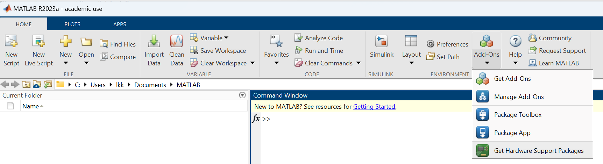
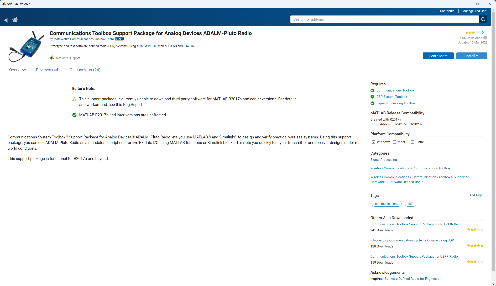

MATLAB
=================

MATLAB with Analog Device
---------------------------
Analog Devices Transceiver Toolbox For MATLAB and Simulink: https://wiki.analog.com/resources/tools-software/transceiver-toolbox
    * Download and install Transceiver toolbox (AnalogDevicesTransceiverToolbox_v21.2.1.mltbx) from: https://github.com/analogdevicesinc/TransceiverToolbox/releases, double click the mltbx file will open MATLAB and install the toolbox.
    * Install libiio
    * Install either: Communications Toolbox Support Package for Xilinx Zynq-Based Radio or Communications Toolbox Support Package for Analog Devices ADALM-Pluto Radio

API Doc: https://analogdevicesinc.github.io/TransceiverToolbox/master/
In https://analogdevicesinc.github.io/TransceiverToolbox/master/install/, Download libiio MATLAB Binding Standalone Installer (R2021b+), which requires Signal Processing Toolbox.

TransceiverToolbox examples:
https://github.com/analogdevicesinc/TransceiverToolbox/tree/master/trx_examples/targeting
https://github.com/analogdevicesinc/TransceiverToolbox/tree/master/trx_examples/streaming

Communications Toolbox Support Package for Analog Devices ADALM-Pluto Radio: https://www.mathworks.com/help/supportpkg/plutoradio/index.html?s_tid=CRUX_lftnav

Install Support Package for Analog Devices ADALM-PLUTO Radio: https://www.mathworks.com/help/supportpkg/plutoradio/ug/install-support-package-for-pluto-radio.html

n the MATLAB Home tab, in the Environment section, click Add-Ons, select Get Hardware Support Packages.

Install Support Package for Analog Devices ADALM-PLUTO Radio

.. note::

    The IIS System Object interfaces are deprecated. The IIO System Object is based on the MATLAB System Objects™ specification. It is designed to exchange data over Ethernet with an ADI hardware system connected to a FPGA/SoC platform running the ADI Linux distribution. ref: https://wiki.analog.com/resources/tools-software/linux-software/libiio/clients/matlab_simulink

The IIO System Object is built upon the libiio library and enables a MATLAB or Simulink model to 
    * Stream data to and from a target
    * Control the settings of a target, and
    * Monitor different target parameters. Please use the Transceiver Toolbox, 

Connect device in MATLAB
------------------------

.. code-block:: console 

    rx = adi.ADRV9009.Rx;
    rx.uri = 'ip:192.168.86.21';
    data = rx();
    Warning: System Object 'adi.ADRV9009.Rx' is inherited from mixin class 'matlab.system.mixin.SampleTime' that will no longer be supported. Remove
    'matlab.system.mixin.SampleTime' and define corresponding System object methods instead. 
    Warning: System Object 'adi.ADRV9009.Rx' is inherited from mixin class 'matlab.system.mixin.CustomIcon' that will no longer be supported. Remove
    'matlab.system.mixin.CustomIcon' and define corresponding System object methods instead. 
    Error using matlabshared.libiio.base/cstatusid
    Failed to write attribute: calibrate_frm_en to device.

    Error in matlabshared.libiio.device/iio_device_attr_write

    Error in adi.common.Attribute/setDeviceAttributeRAW (line 133)
                bytes = iio_device_attr_write(obj,phydev,attr,value);

    Error in adi.ADRV9009.Rx/setupInit (line 219)
                obj.setDeviceAttributeRAW('calibrate_frm_en',num2str(obj.EnableFrequencyHoppingModeCalibration));

    Error in adi.common.RxTx/configureChanBuffers (line 219)
                setupInit(obj);

    Error in matlabshared.libiio.base/setupImpl

    Error in adi.common.RxTx/setupImpl (line 117)
                setupImpl@matlabshared.libiio.base(obj);

The code below will show the same error:

.. code-block:: console 

    rx = adi.ADRV9009.Rx('uri','ip:192.168.86.21');
    rx.EnabledChannels = 1;
    rx.kernelBuffersCount = 1;
    for k=1:20
        valid = false;
        while ~valid
            [y, valid] = rx();
        end
    end

Try to use AD9361 to connect:

.. code-block:: console 

    rx = adi.AD9361.Rx;
    rx.uri = 'ip:192.168.86.21';
    data = rx();
    Warning: System Object 'adi.AD9361.Rx' is inherited from mixin class 'matlab.system.mixin.SampleTime' that will no longer be supported. Remove
    'matlab.system.mixin.SampleTime' and define corresponding System object methods instead. 
    Warning: System Object 'adi.AD9361.Rx' is inherited from mixin class 'matlab.system.mixin.CustomIcon' that will no longer be supported. Remove
    'matlab.system.mixin.CustomIcon' and define corresponding System object methods instead. 
    Error using matlabshared.libiio.base/cstatusid
    Failed to find device: cf-ad9361-lpc.

    Error in matlabshared.libiio.base/getDev

    Error in matlabshared.libiio.base/setupImpl

    Error in adi.common.RxTx/setupImpl (line 117)
                setupImpl@matlabshared.libiio.base(obj);

Design Examples in MATLAB
-------------------------

QPSK Modem Design Workflow: https://wiki.analog.com/resources/eval/user-guides/ad-fmcomms2-ebz/software/matlab_bsp_modem
Frequency Hopping Example Design: https://wiki.analog.com/resources/eval/user-guides/adrv936x_rfsom/tutorials/frequency_hopping
Loopback Delay Estimation Design: https://wiki.analog.com/resources/eval/user-guides/adrv936x_rfsom/tutorials/loopback_delay_estimation
LTE eNB Transmitter Conformance Tests Using ADALM-PLUTO: https://wiki.analog.com/resources/tools-software/transceiver-toolbox/examples/pluto_lte_app
