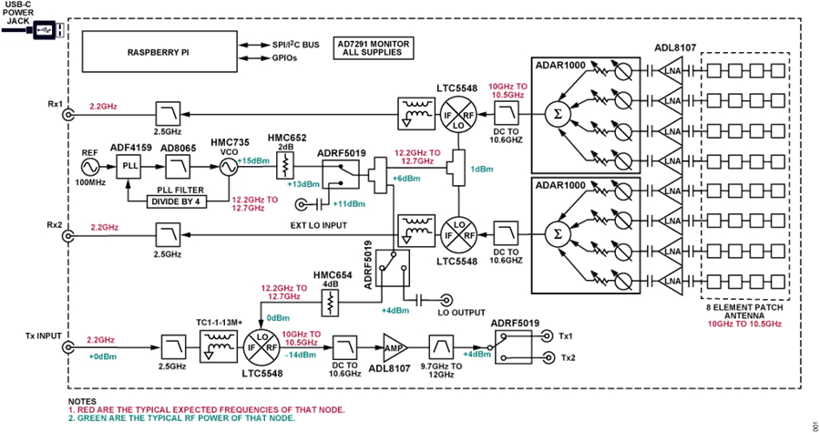

PhasedArray
=============

References
---------------
Phased Array (Phaser) Development Platform: https://www.analog.com/en/design-center/reference-designs/circuits-from-the-lab/cn0566.html

The CN0566 main board implements an 8-element phased array, downconverting mixers, local oscillator (LO), and digital control circuitry. The CN0566 outputs are two IF signals at a nominal frequency of 2.2 GHz, that are digitized by a PlutoSDR module.

ADAR1000 (https://www.analog.com/en/products/ADAR1000.html): 8 GHz to 16 GHz, 4-Channel, X Band and Ku Band Beamformer, 4-wire SPI interface

ADL8107 (https://www.analog.com/en/products/ADL8107.html): Low Noise Amplifier, 6 GHz to 18 GHz

LTC5548 (https://www.analog.com/en/products/ltc5548.html) 2GHz to 14GHz Microwave Mixer with Wideband DC-6GHz IF, Upconversion or Downconversion

ADRF5019 (https://www.analog.com/en/products/ADRF5019.html) Silicon, SPDT Switch, Nonreflective, 100 MHz to 13 GHz

ADF4159 (https://www.analog.com/en/products/adf4159.html) Direct Modulation/Fast Waveform Generating, 13 GHz, Fractional-N Frequency Synthesizer

ADF4159 Linux Device Driver: https://wiki.analog.com/resources/tools-software/linux-drivers/iio-pll/adf4159
ADAR1000 Linux Device Driver: https://wiki.analog.com/resources/tools-software/linux-drivers/iio-transceiver/adar1000

Download Design FIles: CN0566 BOM.csv, allergo.brd, schematic.pdf
CN0566 Phased Array User Guide: https://wiki.analog.com/resources/eval/user-guides/circuits-from-the-lab/cn0566

https://wiki.analog.com/resources/eval/user-guides/circuits-from-the-lab/cn0566/quickstart

HB100 microwave source
HB100 with Arduino: https://techmaze.romman.store/product/99187053

SD Card Image:
https://wiki.analog.com/resources/tools-software/linux-software/kuiper-linux
https://www.raspberrypi.com/news/raspberry-pi-imager-imaging-utility/

https://wiki.analog.com/_media/resources/eval/user-guides/circuits-from-the-lab/cn0566/phaser_lab_instructions_june14_2022_no_title.pdf

https://github.com/analogdevicesinc/pyadi-iio
https://github.com/analogdevicesinc/pyadi-iio/blob/master/adi/cn0566.py
https://github.com/analogdevicesinc/pyadi-iio/blob/master/examples/adrv9009.py
https://github.com/analogdevicesinc/pyadi-iio/blob/master/examples/phaser/phaser_gui.py