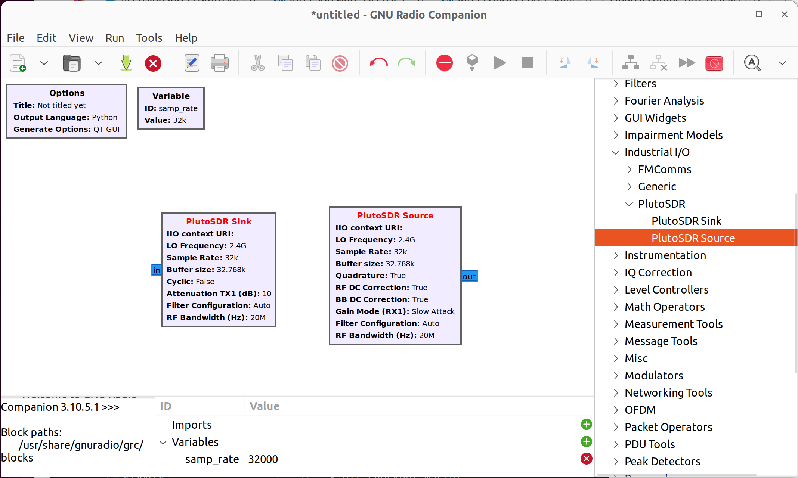
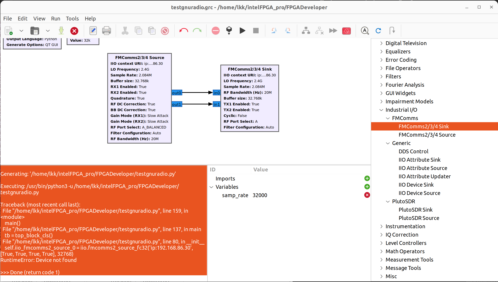
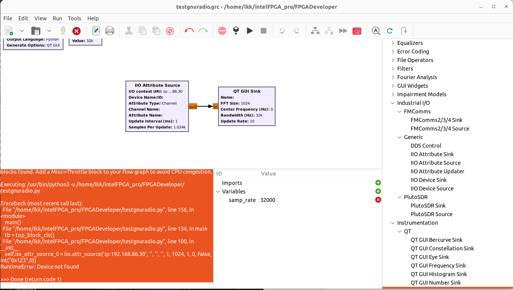

SDR
=================

USRP
-----
USRP UHD Driver: https://github.com/EttusResearch/uhd, and build guide: https://files.ettus.com/manual/page_build_guide.html

$ sudo apt-get install libuhd-dev uhd-host
$ dpkg -s libboost-dev | grep 'Version'
Version: 1.74.0.3ubuntu7
$ gcc --version
gcc (Ubuntu 9.5.0-1ubuntu1~22.04) 9.5.0
$ sudo apt-get install -y libusb-1.0-0
(mycondapy310) lkk@lkk-intel12:~$ pip3 install mako
$ sudo apt-get install autoconf automake build-essential ccache cmake cpufrequtils doxygen ethtool \
g++ git inetutils-tools libboost-all-dev libncurses5 libncurses5-dev libusb-1.0-0 libusb-1.0-0-dev \
libusb-dev python3-dev python3-mako python3-numpy python3-requests python3-scipy python3-setuptools \
python3-ruamel.yaml 
(mycondapy310) lkk@lkk-intel12:~/Developer$ git clone https://github.com/EttusResearch/uhd.git
(mycondapy310) lkk@lkk-intel12:~/Developer$ cd uhd/
(mycondapy310) lkk@lkk-intel12:~/Developer/uhd$ ls
CHANGELOG  CONTRIBUTING.md  fpga  images      mpm        tools
CODING.md  firmware         host  LICENSE.md  README.md
(mycondapy310) lkk@lkk-intel12:~/Developer/uhd$ cd host/
(mycondapy310) lkk@lkk-intel12:~/Developer/uhd/host$ ls
cmake           docs      include  LICENSE  README.md  uhd.pc.in
CMakeLists.txt  examples  lib      python   tests      utils
(mycondapy310) lkk@lkk-intel12:~/Developer/uhd/host$ mkdir build
(mycondapy310) lkk@lkk-intel12:~/Developer/uhd/host$ cd build/
(mycondapy310) lkk@lkk-intel12:~/Developer/uhd/host/build$ cmake -DCMAKE_INSTALL_PREFIX=/opt/uhd ../
make
make test # This step is optional
sudo make install
(mycondapy310) lkk@lkk-intel12:~/Developer/uhd/host/build$ ls /opt/uhd/
bin  include  lib  share

PySDR
------
PySDR: A Guide to SDR and DSP using Python: https://pysdr.org/index.html
PlutoSDR in Python: https://pysdr.org/content/pluto.html
  * Requires libiio, libad9361-iio, pyadi-iio

Pyadi-iio examples: https://analogdevicesinc.github.io/pyadi-iio/guides/examples.html
Direct Digital Synthesizers: https://analogdevicesinc.github.io/pyadi-iio/fpga/index.html
  * For each individual DAC channel there are two DDSs which can have a unique phase, frequency, and phase.

https://wiki.analog.com/resources/eval/user-guides/adrv9009

GNU radio new try 
------------------
pip install sphinx-rtd-theme

git clone https://github.com/analogdevicesinc/libad9361-iio.git
cd libad9361-iio
mkdir build
cd build
cmake .. -DPYTHON_BINDINGS=ON
make 
Theme error:
no theme named 'furo' found (missing theme.conf?)

pip install sphinx-rtd-theme
nano ../bindings/python/doc/conf.py
html_theme = "classic"

build succeeded, 11 warnings.

The HTML pages are in html/v0.2/python.
[100%] Built target libad9361-py-py

sudo make install
cd ../..

git clone https://github.com/analogdevicesinc/gr-iio.git
cd gr-iio
cmake .
make 

/home/lkk/intelFPGA_pro/FPGADeveloper/gr-iio/lib/iio_math_impl.cc:30:10: fatal error: gnuradio/analog/sig_source_f.h: No such file or directory
   30 | #include <gnuradio/analog/sig_source_f.h>

(mycondapy310) lkk@lkk-intel12:~/intelFPGA_pro/FPGADeveloper/gr-iio$ git checkout upgrade-3.8
Switched to branch 'upgrade-3.8'
Your branch is up to date with 'origin/upgrade-3.8'.
(mycondapy310) lkk@lkk-intel12:~/intelFPGA_pro/FPGADeveloper/gr-iio$ cmake .

/home/lkk/intelFPGA_pro/FPGADeveloper/gr-iio/lib/attr_sink_impl.cc:92:92: error: ‘_1’ was not declared in this scope

in home/lkk/intelFPGA_pro/FPGADeveloper/gr-iio/lib/attr_sink_impl.cc:, add "#include <boost/bind.hpp>"

another solution: https://github.com/analogdevicesinc/gr-iio/commit/c35a071cb006d5bf1a0416422113b9a45ec96daa

(mycondapy310) lkk@lkk-intel12:~/intelFPGA_pro/FPGADeveloper/gr-iio$ make
[100%] Linking CXX shared module _iio_pluto_sink_swig.so
[100%] Built target iio_pluto_sink_swig

(mycondapy310) lkk@lkk-intel12:~/intelFPGA_pro/FPGADeveloper/gr-iio$ sudo make install

-- Installing: /usr/local/share/gnuradio/grc/blocks/iio.tree.yml
-- Installing: /usr/local/share/gnuradio/grc/blocks/iio_attr_sink.block.yml
-- Installing: /usr/local/share/gnuradio/grc/blocks/iio_attr_source.block.yml
-- Installing: /usr/local/share/gnuradio/grc/blocks/iio_attr_updater.block.yml
-- Installing: /usr/local/share/gnuradio/grc/blocks/iio_device_sink.block.yml
-- Installing: /usr/local/share/gnuradio/grc/blocks/iio_device_source.block.yml
-- Installing: /usr/local/share/gnuradio/grc/blocks/iio_fmcomms2_sink.block.yml
-- Installing: /usr/local/share/gnuradio/grc/blocks/iio_fmcomms2_source.block.yml
-- Installing: /usr/local/share/gnuradio/grc/blocks/iio_fmcomms5_sink.block.yml
-- Installing: /usr/local/share/gnuradio/grc/blocks/iio_fmcomms5_source.block.yml
-- Installing: /usr/local/share/gnuradio/grc/blocks/iio_pluto_sink.block.yml
-- Installing: /usr/local/share/gnuradio/grc/blocks/iio_pluto_source.block.yml

(mycondapy310) lkk@lkk-intel12:~/intelFPGA_pro/FPGADeveloper/gr-iio$ cd ..
(mycondapy310) lkk@lkk-intel12:~/intelFPGA_pro/FPGADeveloper$ sudo ldconfig

GNU radio 3.10 installation
---------------------------
In Ubuntu22.04, install the latest version of 3.10 via apt install, ref: https://wiki.gnuradio.org/index.php/LinuxInstall

.. code-block:: console 

  $ sudo add-apt-repository ppa:gnuradio/gnuradio-releases
  $ sudo apt install gnuradio
  $ gnuradio-config-info -v
  3.10.5.1
  $ gnuradio-companion

.. note:: 
  As described in Analog's document: https://wiki.analog.com/resources/tools-software/linux-software/gnuradio, gnuradio 3.10 already included the gr-iio moudule (you can find the industry io module under Core of GNU Radio), you do not need to install gr-iio.

When the gnuradio-companion is started, add device blocks and setup the device parameters.

Add the PlutoSDR Sink, the device is not found

Add the FMComms2/3/4 Source, the device is also not found

    
Add IIO Attribute Source, still the same problem

GNU radio tutorial
--------------------
First flowgraph: https://wiki.gnuradio.org/index.php?title=Your_First_Flowgraph
GNU Radio Companion (GRC) is a visual editor for creating and running flowgraphs. GRC uses .grc files which are then translated into Python .py flowgraphs.

GNU radio with gr-iio tutorial
------------------------------
Ref: https://wiki.analog.com/resources/tools-software/linux-software/gnuradio. Although the GNU Radio block is called “FMCOMMS-2”, it will work with the any of the AD-FMCOMMS[234], ADRV9361, ADRV9364, ADRV9363 or ARRADIO boards. The FMCOMMS-2 IIO blocks can run over the IP network or USB. By setting the “IIO context URI” parameter to the IP address of the target board, you can stream samples from/to the remote board.
  * IIO context URI: Set to “local:” if using GNU Radio locally on the target. If using GNU Radio remote on a PC, set the target IP address using ip:192.168.XXX.XXX.
  * Buffer size: Size of the internal buffer in samples. The IIO blocks will only input/output one buffer of samples at a time.
  * RF Bandwidth(MHz): Configures RX analog filters
  * Sample Rate(MSPS): Frequency at which the hardware will input/output samples
  * LO Frequency(MHz): Selects the RX local oscillator frequency. Range 70MHz to 6GHz with 1Hz tuning granularity.
  * Gain Mode (RX1, RX2): Selects one of the available modes: manual, slow_attack, hybrid and fast_attack.

The example of PlutoSDR source is: https://wiki.gnuradio.org/index.php/PlutoSDR_Source
grcon2019 demos: https://github.com/analogdevicesinc/gr-iio/tree/grcon2019/demos/adrv9009zu11eg

.. pyadi-iio
.. ----------
.. https://analogdevicesinc.github.io/pyadi-iio/guides/quick.html
.. https://github.com/analogdevicesinc/pyadi-iio/blob/master/examples/adrv9009.py

GNU radio installation (not working!)
--------------------------------------
Install GNU radio 3.8 and gr-iio by following Analog's document: https://wiki.analog.com/resources/tools-software/linux-software/gnuradio

After gnuradio 3.10 installation: 

.. code-block:: console 

  $ gnuradio-config-info -v
  3.10.1.1
  $ sudo apt install bison flex cmake git libgmp-dev
  $ sudo apt install swig
  $ sudo apt install liborc-dev
  (base) lkk@lkk-intel12:~/intelFPGA_pro/FPGADeveloper$ git clone -b upgrade-3.8 https://github.com/analogdevicesinc/gr-iio.git
  $ git checkout master
  $ sudo apt-get install libboost-all-dev
  $ sudo apt-get install gnuradio
  (base) lkk@lkk-intel12:~/intelFPGA_pro/FPGADeveloper/gr-iio$ cmake .
  CMake Error at cmake/Modules/UseSWIG.cmake:199

Install GNU radio 3.8

.. code-block:: console 

  https://wiki.gnuradio.org/index.php?title=LinuxInstall#For_GNU_Radio_3.8_or_Earlier
  (base) lkk@lkk-intel12:~/intelFPGA_pro/FPGADeveloper$ git clone https://github.com/gnuradio/gnuradio.git
  (base) lkk@lkk-intel12:~/intelFPGA_pro/FPGADeveloper$ cd gnuradio/
  (base) lkk@lkk-intel12:~/intelFPGA_pro/FPGADeveloper/gnuradio$ git checkout maint-3.8
  Branch 'maint-3.8' set up to track remote branch 'maint-3.8' from 'origin'.
  Switched to a new branch 'maint-3.8'
  (base) lkk@lkk-intel12:~/intelFPGA_pro/FPGADeveloper/gnuradio$ git submodule update --init --recursive
  (mycondapy310) lkk@lkk-intel12:~/intelFPGA_pro/FPGADeveloper/gnuradio/build$ cmake -DCMAKE_BUILD_TYPE=Release -DPYTHON_EXECUTABLE=/home/lkk/miniconda3/envs/mycondapy310/bin/python3 ../
  Error: CMake Error at volk/CMakeLists.txt:93 (message):
    Mako templates required to build VOLK

  pip install Mako

  (mycondapy310) lkk@lkk-intel12:~/intelFPGA_pro/FPGADeveloper/gnuradio/build$ sudo apt install python3-aiohttp-mako

  Could NOT find LOG4CPP library

  #Ref: https://wiki.gnuradio.org/index.php/LinuxInstall
  (mycondapy310) lkk@lkk-intel12:~/intelFPGA_pro/FPGADeveloper/gnuradio/build$ sudo add-apt-repository ppa:gnuradio/gnuradio-releases-3.8
  E: The repository 'https://ppa.launchpadcontent.net/gnuradio/gnuradio-releases-3.8/ubuntu jammy Release' does not have a Release file.
  (mycondapy310) lkk@lkk-intel12:~/intelFPGA_pro/FPGADeveloper/gnuradio/build$ sudo rm /etc/apt/sources.list.d/gnuradio-ubuntu-gnuradio-releases-3_8-jammy.list 

Using Conda to install gnu radio 3.8: https://wiki.gnuradio.org/index.php/CondaInstall

.. code-block:: console 

  $ conda create -n gnuradio
  $ conda activate gnuradio
  $ conda config --env --add channels conda-forge
  $ conda config --env --set channel_priority strict 
  $ conda install gnuradio=3.8.2
  (gnuradio) lkk@lkk-intel12:~/intelFPGA_pro/FPGADeveloper/gnuradio$ gnuradio-config-info -v
  3.8.2.0 
  $ gnuradio-companion

  (gnuradio) lkk@lkk-intel12:~/intelFPGA_pro/FPGADeveloper/gr-iio/build$ cmake -DCMAKE_INSTALL_PREFIX=$CONDA_PREFIX -DCMAKE_PREFIX_PATH=$CONDA_PREFIX -DLIB_SUFFIX="" ..
  -- Build type not specified: defaulting to release.

  Gnuradio could not be found because dependency LOG4CPP could not be found.

  (gnuradio) lkk@lkk-intel12:~/intelFPGA_pro/FPGADeveloper/libiio/build$ cmake .. -DPYTHON_BINDINGS=ON -DCMAKE_INSTALL_PREFIX=$CONDA_PREFIX -DCMAKE_PREFIX_PATH=$CONDA_PREFIX -DLIB_SUFFIX=""
  (gnuradio) lkk@lkk-intel12:~/intelFPGA_pro/FPGADeveloper/libiio/build$ make
  (gnuradio) lkk@lkk-intel12:~/intelFPGA_pro/FPGADeveloper/libiio/build$ sudo make install
  Copying pylibiio.egg-info to /home/lkk/miniconda3/envs/gnuradio/lib/python3.10/site-packages/pylibiio-0.24-py3.10.egg-info
  running install_scripts
  -- Installing: /home/lkk/miniconda3/envs/gnuradio/sbin/iiod
  -- Set runtime path of "/home/lkk/miniconda3/envs/gnuradio/sbin/iiod" to ""
  >>> import iiod

  (gnuradio) lkk@lkk-intel12:~/intelFPGA_pro/FPGADeveloper$ cd libad9361-iio/
  (gnuradio) lkk@lkk-intel12:~/intelFPGA_pro/FPGADeveloper/libad9361-iio$ cd build/
  (gnuradio) lkk@lkk-intel12:~/intelFPGA_pro/FPGADeveloper/libad9361-iio/build$ cmake .. -DPYTHON_BINDINGS=ON -DCMAKE_INSTALL_PREFIX=$CONDA_PREFIX -DCMAKE_PREFIX_PATH=$CONDA_PREFIX
  -- Found Python: Building bindings