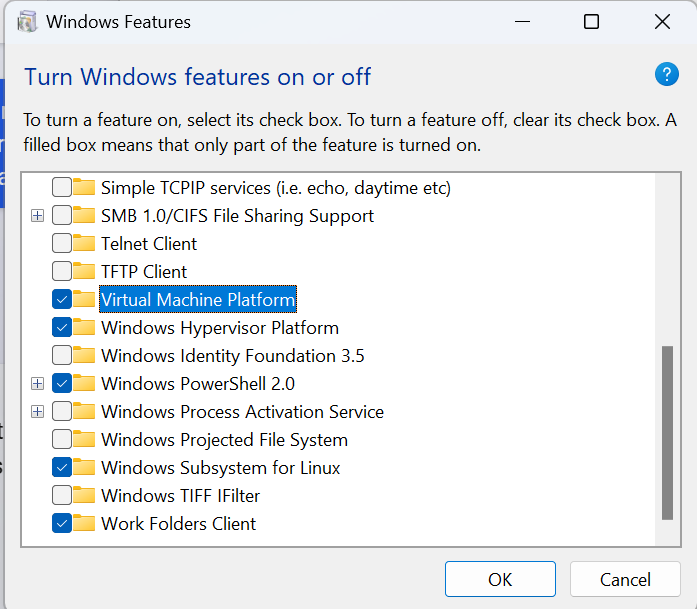

WSL2
=====

.. _WSL2:

Windows WSL2 Linux Setup Tutorial
----------------------------------

Install WSL2
~~~~~~~~~~~~

Ref `WSL2 install <https://learn.microsoft.com/en-us/windows/wsl/install>`_

.. code-block:: console

    wsl --version
    wsl --update
    wsl --list
    wsl.exe --list --online

Select one distribution, and install

.. code-block:: console

    C:\Users\lkk>wsl.exe --install Ubuntu-22.04

.. note::
    If you see this error: "WslRegisterDistribution failed with error: 0x80370114 Error: 0x80370114 The operation could not be started because a required feature is not installed. " This error message indicates that a required feature is not installed on your system. You can try the following steps to resolve this issue:
        * Open Control Panel -> Programs and Features -> Turn Windows Feature on or off -> Check Virtual Machine Platform and Windows Subsystem for Linux.
        * Restart your computer.

Turn on these Windows features:

When your wsl2 installation is finished, you can use this command to enter into the wsl linux:

.. code-block:: console

    wsl #enter default wsl distribution
    wsl --distribution Ubuntu-22.04 --user lkk #enter a specific distribution

You can check the version of WSL and perform conversion from WSL2 to WSL1 if needed

.. code-block:: console

    C:\Users\lkk>wsl --list --verbose
    NAME            STATE           VERSION
    * Ubuntu-22.04    Running         2
    Ubuntu-20.04    Running         2

    C:\Users\lkk>wsl --set-version Ubuntu-20.04 1
    Conversion in progress, this may take a few minutes.
    The operation completed successfully.

    C:\Users\lkk>wsl --setdefault Ubuntu20.04
    The operation completed successfully.

Export WSL
~~~~~~~~~~~~
You can export the WSL distribution to a local file

.. code-block:: console

    H:\WSL>wsl --export Ubuntu-20.04 ./Ubuntu2004_export.tar
    Export in progress, this may take a few minutes.
    The operation completed successfully.

After the export process is finished, you can unregister the distribution (the used disk space will become available)

.. code-block:: console

    H:\WSL>wsl --unregister Ubuntu-20.04

You can import the distribution again in a new driver (e.g., in H: drive)

.. code-block:: console

    H:\WSL>wsl --import Ubuntu20.04 ./Ubuntu20 ./Ubuntu2004_export.tar
    Import in progress, this may take a few minutes.
    The operation completed successfully.

Install CUDA inside WSL Linux
~~~~~~~~~~~~~~~~~~~~~~~~~~~~~~
Verify CUDA-capable GPU, check environment, and install gcc

.. code-block:: console

    lspci | grep -i nvidia # Did not show anything in WSL Linux
    uname -m && cat /etc/*release
    gcc --version # install gcc if not available
    sudo apt-get update
    sudo apt install gcc
    uname -r #check kernel version
        5.15.90.1-microsoft-standard-WSL2

Download CUDA11.8 Linux WSL2 (the download path is the same to Ubuntu22.04 cuda11.8):

.. code-block:: console

    wget https://developer.download.nvidia.com/compute/cuda/11.8.0/local_installers/cuda_11.8.0_520.61.05_linux.run
    sudo sh cuda_11.8.0_520.61.05_linux.run