Intel FPGA
===================

.. _arria10gx:

#:ref:`Arria10GX <_arria10gx>`

Intel Arria 10 GX Kit
---------------------

Device Information
~~~~~~~~~~~~~~~~~~
Go to the `Intel Arria 10 GX Kit <https://www.intel.com/content/www/us/en/products/details/fpga/development-kits/arria/10-gx.html>`_ official website, download the ** Intel® Arria® 10 GX FPGA Package ** in the downloads section. Unzip it and install the Board Test System.
 * Intel Arria 10 GX Kit features a 10AX115S2F45I1SG device
 * Two FMC loopback cards supporting transceiver, LVDS and single-ended I/Os
 * Two FMC low-pin count (LPC + 15 transceivers) connector.
 * PCIe x8 edge connector.

Boot the device
~~~~~~~~~~~~~~~~
Follow **Arria 10 FPGA Development Kit User Guide**, setup the SW6.4 to the ON position (factory default) and SW5 to default setting (MSEL0~2=100 position, OFF for 1, ON for 0), attach the Ethernet cable, then power on the FPGA board via J13 and set the SW1 to on.  When the board powers up, the parallel flash loader (PFL) on the MAX V reads a design from flash memory and configures the FPGA. When the configuration is complete, green LEDs illuminate signaling the device configured successfully. If the configuration fails, the red LED illuminates. The LCD will first display "Connecting", then show IP address "192.168.1.68". 

In the host computer, connect to this IP address to open the web page for the ** Board Update Portal ** . There are two files required:
  * The hardware file is the SRAM Object File (.sof) containing the FPGA image; 
  * The software file is Executable and Linkable Format File (.elf) containing the software application (required only if the design includes a software application)

These two files need to convert to Flash format (the format required to program the Flash) via Nios II EDS, in Nios II Command Shell

.. code-block:: console 

  $ sof2flash --input=yourfile_hw.sof --output=yourfile_hw.flash --pfl --optionbit=0x00180000 --programmingmode=PS --offset=0x02D00000
  $ elf2flash --base=0x0 --end=0x0FFFFFFF --reset=0x09300000 --input=yourfile_sw.elf --output=yourfile_sw.flash --boot=$SOPC_KIT_NIOS2/components/altera_nios2/boot_loader_cfi.srec/strong>
  
When the upload is complete, Press button PGM_SEL (S5) until PGM_LED 1 is lit then press button PGM_CONFIG (S6) to configure the FPGA with the new image.
Or move the dipsw factory_load(SW6.4) to user position, then power cyle the board to configure FPGA from user portion of the flash.

The development board includes integrated USB-Blaster circuitry for FPGA programming. We need to install the On-Board USB-Blaster II driver on the host computer.

Install Quartus
~~~~~~~~~~~~~~~~

Download Quartus from `Intel FPGA Software Download Center <https://www.intel.com/content/www/us/en/collections/products/fpga/software/downloads.html>`_, select '23.1 for Windows'-> Multiple Download->Select Quartus-pro-23.1xxx-windows.tar (38.8GB device support not included) and Intel Arria 10 device support.

.. code-block:: console 

  C:\Users\lkk\Downloads>tar xvf Quartus-pro-23.1.0.115-windows.tar
  C:\Users\lkk\Downloads>tar xvf Quartus-pro-23.1.0.115-devices-1.tar

"components" folder is created after tar command, run the 'QuartusProSetup-23.1.0.115-windows' file inside the components. Select "H:\intelFPGA\quartus23.1" as the installation directory, select componets want to install (arria10 device is selected), skip MATLAB setup (only version R2013b and above)

Installation guide: https://cdrdv2-public.intel.com/666293/quartus_install-683472-666293.pdf
https://www.intel.com/content/www/us/en/docs/programmable/683472/23-1/setting-environment-variables.html

To setup the License for Quartus II, visit Intel license center. To add one computer, use "ipconfig /all" to get the physical address as the NIC ID (ref: https://www.intel.com/content/www/us/en/docs/programmable/683472/21-3/creating-a-computer-profile.html). After the computer NIC ID is assigned, click to generate license. Get the license file over email and save to "H:\intelFPGA"

Nios® II EDS on Windows requires Ubuntu 18.04 LTS on Windows Subsystem for Linux (WSL). Nios® II EDS requires you to install an Eclipse IDE manually.
Nios II EDS need WSL1 not WSL2
https://www.intel.com/content/www/us/en/docs/programmable/683472/23-1/installing-windows-subsystem-for-linux.html
https://cdrdv2-public.intel.com/666293/quartus_install-683472-666293.pdf

BoardTestSystem
~~~~~~~~~~~~~~~~
Connect the board J3 USB port to host PC, set factory_load(SW6.4) to user position (OFF mode), turn on the board. Open BoardTestSystem application inside the "examples" folder of the download board package. Remember to disable the Windows Realtime Projection, otherwise the BoardTestSystem will be blocked and deleted. Select "Restore -> Factory Restore".

Perform configuration of different parts in BoardTestSystem
 * Click Configure->Configure with Flash/GPIO design. After configuration, the GPIO tab will be enabled. You can change the LCD display, GPIO, LEDs, and Switches.
 
You can use the Quartus Programmer to configure the FPGA with your SRAM Object File (.sof)

Start the Quartus Programmer, open Programmer inside Tools
 * Select hardware setup select: USB-BlasterII
 * Click Auto Detect and select the devices "10AX115S2" in the list. It will show three device in the JTAG chain.
 * Click Change File and select the path to the desired .sof.

Quartus installation is required to run BoardTestSystem, otherwise it will show error when you open the BoardTestSystem, :
  Current bitMode value is 64
  Current $QUARTUS_ROOTDIR = null

Create a Quartus Project
~~~~~~~~~~~~~~~~~~~~~~~~
Click file > new project wizard… to begin the new project wizard, setup the directory for this project: "click file > new project wizard… to begin the new project wizard", and select the "Arria10 GX" in the Board section. 

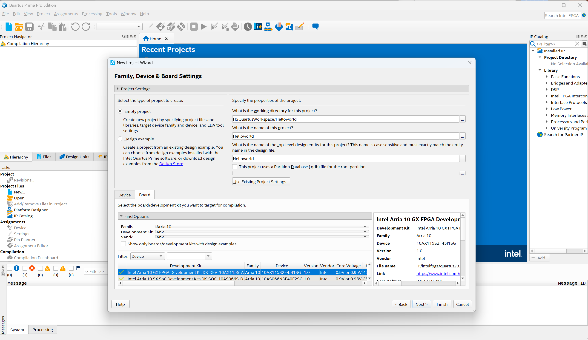

Go back to the "device" tab, it will show "10AX115S2F45I1SG" in the list, select the device, then click Next. 

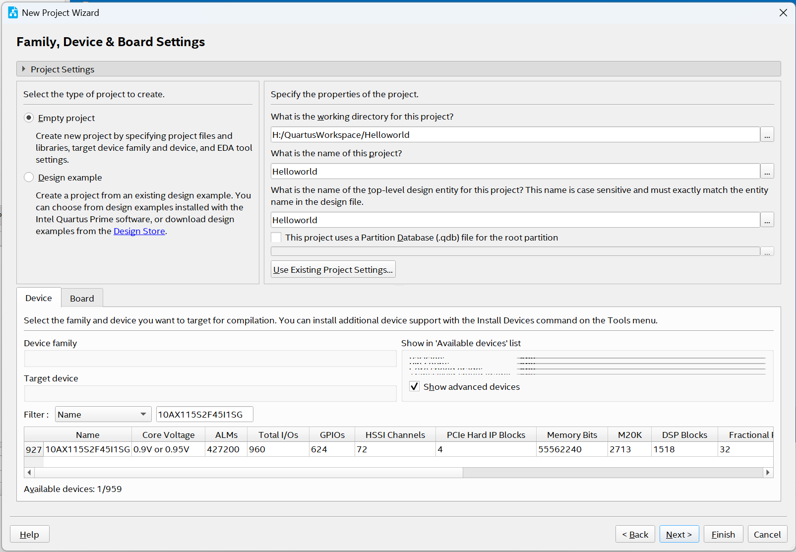

Next page shows add files. For this project we do not need to add any files, click Next. For this introduction to Quartus we will not be writing any code, therefore we do not need to use any EDA tools for this project. Just leave everything set to the default and click next. It will show a Summary page with project directory and selected device. Click Finish.

Go ahead and click file > new… to open the new file dialog box. We are going to create our first block diagram/schematic file, simply select it from the list and click ok. Save the file, click file > save as… and then give your file a name, choose the current path and click save. It will save as a '.bdf' file.

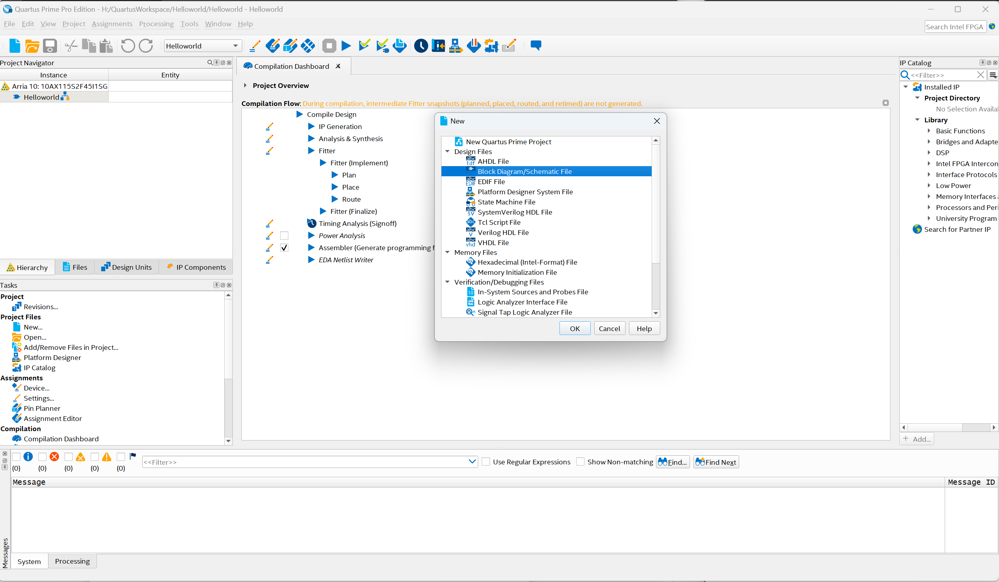

Click the symbol tool from the tool bar, this will open the symbol browser where you will notice three categories listed in the libraries box. Drop down primitives > logic to access basic logic functions. Select **and2** and then click ok to add the gate to the design. Once done you can press the esc key to exit the symbol tool.

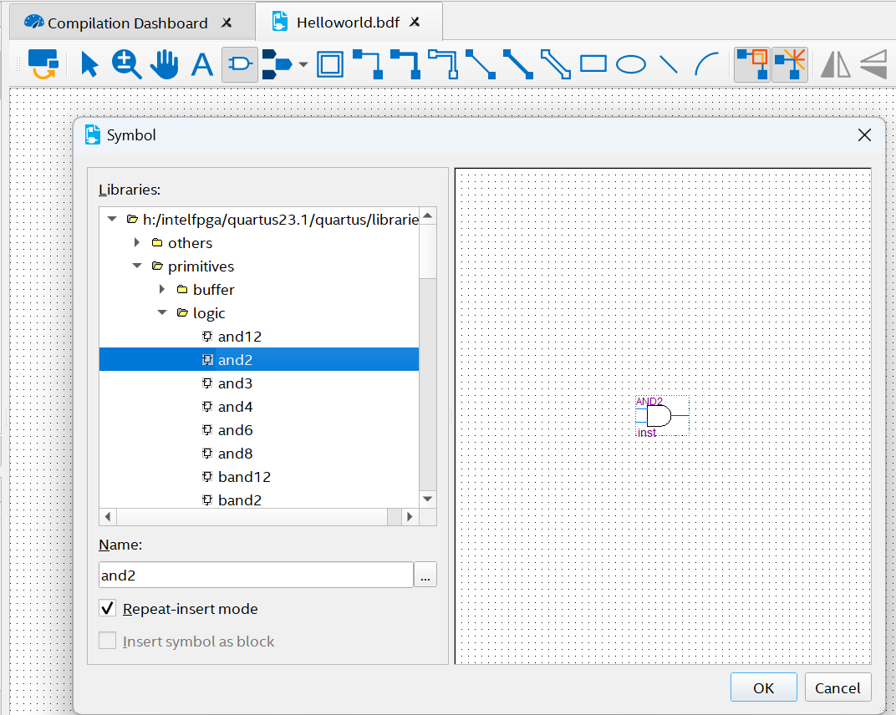

Click the Pins dropdown button in the toolbar, and select output pin. Place to the diagram and connect to the **and2** output. Place two input pins and connect them to both inputs on the AND gate. In order to change the name of the pin you can either double click the pin name in the editor or right click the pin and choose properties. Go ahead and run analysis and elaboration using the tool found in the menu bar at the top of the screen.

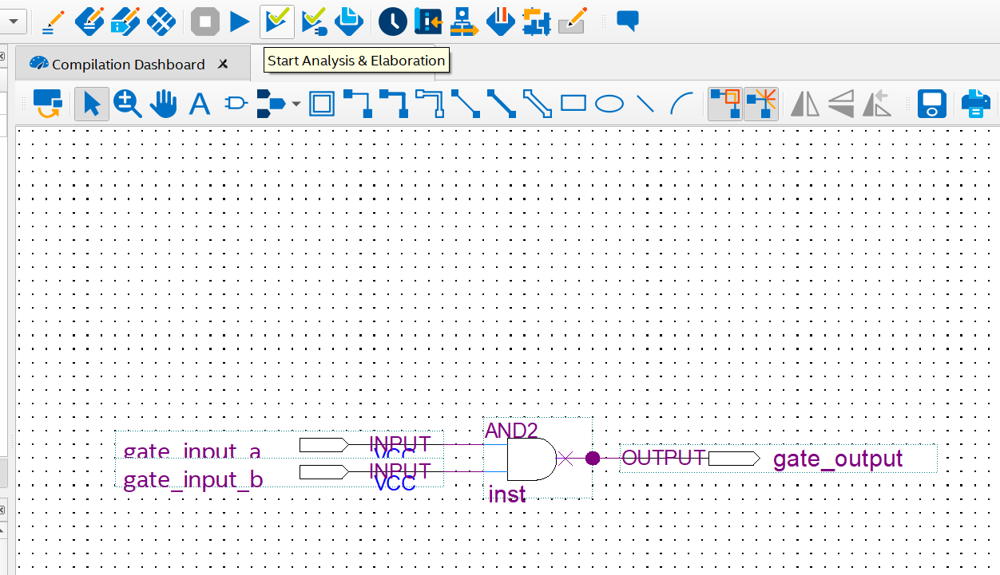

There are different stages of processing required to convert our design into something that can be loaded on to the FPGA.
  * Analysis: in this part of the process Quartus checks the design for any errors such as syntax or semantic error.
  * Elaboration: in the first stage of compilation, Quartus maps out the design in RTL blocks. These are the building blocks within the FPGA that perform basic functions such as memory storage, logic gates and registers.
  * Synthesis: in the final stage of compilation, Quartus synthesizes a design at the logic level, converting the RTL design into a gate level design.

Once the process has completed you will have a compilation report and the analysis and elaboration process in the left-hand menu will have a green tick next to it. Now we can open the pin planner by clicking assignments > pin planner from the menu at the top of the screen (In order to get our pins to appear in the pin planner we could run a full compilation)

We can open the pin planner by clicking assignments > pin planner from the menu at the top of the screen. The input pins should correspond to the physical pins you have connected to the push buttons and the output pin should correspond to the output pin with the LED connected. Check the schematic of the Arria10 GX board. You can find following pin assignments
  * S3 PB0 switch->Net 'USER_PB0'->'T12' pin, in IO BANK-3E
  * S2 PB1 switch->Net 'USER_PB1'->'U12' pin, in IO BANK-3E
  * D10 LED_GR contains Green and Red Leds, voltage low to lit the LED 
    * Green -> Net 'USER_LED_G0'->'L28' pin, in IO BANK-3H
    * Red -> Net 'USER_LED_R0'->'L27' pin, in IO BANK-3H
  
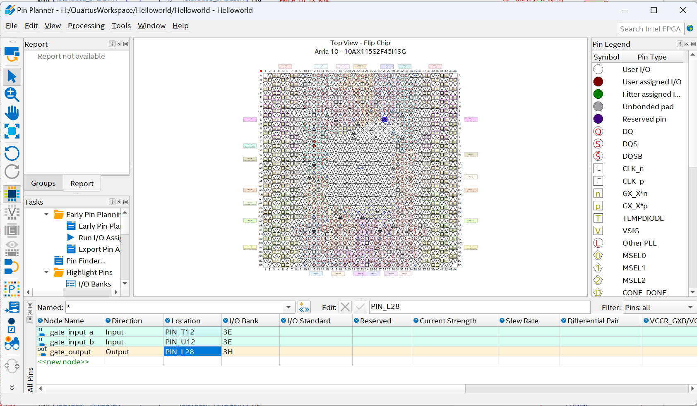

Once you are done you can close the pin planner. You should notice that Quartus has labelled the pins with the physical outputs that we have just assigned. To load the design on to the FPGA, we must first run a complete compilation, which will synthesize the design and then create a binary .sof file that can be loaded on to the FPGA.

Once the compilation has complete we can open the programming tool in order to load our design on to the FPGA. You can either use the button on the top toolbar or click tools > programmer from the menu bar. On the programming menu you should see your programmer (e.g. the USB-Blaster) appearing at the top of the screen if your device is connected and configured correctly. If you see "no device" then you may need to select it by clicking "hardware setup…". You should also see the .sof file appearing in the list. Click "Start" to program the FPGA.

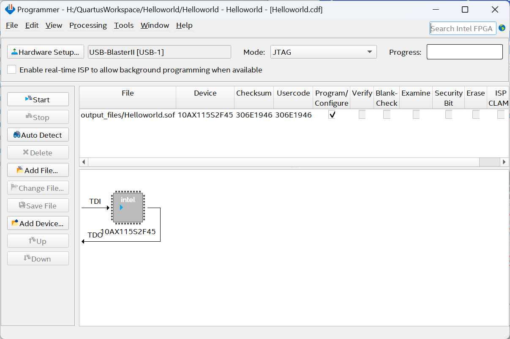

.. note::
      If you see the Progress failed. You can reboot the FPGA and change the SW4.2 dip switch from OFF to ON to disable MAX V in the JTAG chain and only leave Arria 10 in the JTAG. 

After the download is successfully, you can press any of the PB0 and PB1 switch to turn on the Green LED.

Add Verilog file to Quartus Project
~~~~~~~~~~~~~~~~~~~~~~~~~~~~~~~~~~~~

Create a new verilog file: clock_divider.v and save it under the current workspace.

.. code-block:: console 

  module clock_divider (clk, out);

  input wire clk;
  output reg [0:25] out = 0; //26bits 50M/67108863=1.34s

  //specify the action between the begin and end statement following the always
  always @ (posedge clk)
  begin
    out <= out + 1; //incoming clock to increment by 1, maximum value reached return to 0
  end

  endmodule

In the previous example, we used one top level schematic file to connect components (i.e., .bdf file). In the standard version of Quartus, you can create a symbol from the verilog file (via File->Create/Update) and add into the bdf file for top level connection. However, this feature is not available in Pro version of the Quartus. Thus, we need to write a top-level verilog file that connect different verilog modules.

Create a new verilog file named top.v, and write the following code to connect the clock_divider module

.. code-block:: console 

  module top(clkin,ledout);

	input clkin;
	output ledout;
	wire [0:25] out;
	
	clock_divider(.clk(clkin), .out(out));
	assign ledout=out[0];//get the MSB bit
  endmodule

.. note::
  In clock_divider, out is defined as 'reg [0:25]', that's why the MSB bit is out[0]

The Arria10 GX board has X4 50MHz clock to Net 'CLK_50' and 'MV_CLK_50', 'CLK_50' connect to pin 'AU33' in BANK-2I. Assign these pins in pin planner (need to start analysis & Synthesis first)

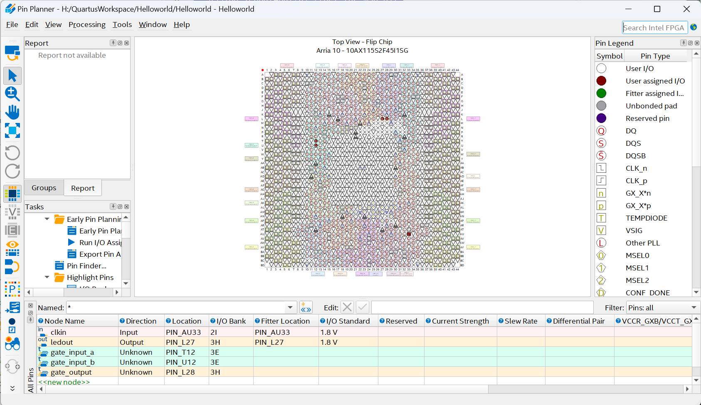

You can then start the compile and download to FPGA. You will see the red LED blink around 1Hz. You can open the RTL viewer to see the current design

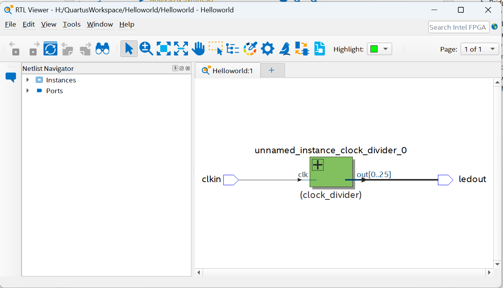

TCL Script
~~~~~~~~~~
In Quartus, open the previous Helloworld project. Open 'Project->Generate TCL file for Project', select "Include default assignments" and name as shown in the following figure. It will generate one tcl file 'Helloworld.tcl' and save to local folder.

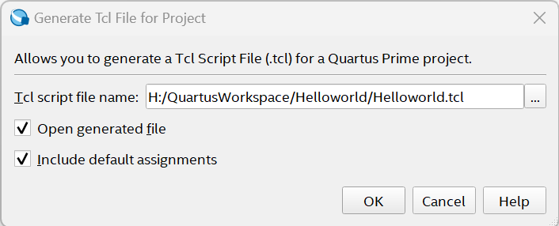

This is only the project settings. We can do the following changes to turn it into a compile script

Step1: add the following code at the begining of the tcl file

.. code-block:: console 

  # Load Quartus II Tcl Project package
  package require ::quartus::project

Step2: add the compile code "execute_flow -compile" at the end of the tcl file, before project close. Save the tcl file as "Hellowworld_compile.tcl"

.. code-block:: console 
  
  execute_flow -compile
  # Close project
  if {$need_to_close_project} {

To run tcl script in Windows command line, need to add the quartus bin64 folder to the system environment

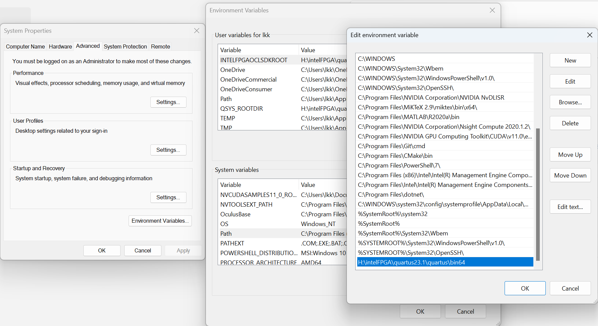

Open the windows terminal, go to the project project, run the following command to build the project in command line

.. code-block:: console 

  H:\QuartusWorkspace\Helloworld>quartus_sh -t Helloworld_compile.tcl

Compile ADI Example
~~~~~~~~~~~~~~~~~~~~
We can also build the ADRV9009 example from `ADI HDL <https://github.com/analogdevicesinc/hdl.git>`_ 

.. note::
  Compile the ADI HDL example in Linux is not successful. It will show "Error: Unknown device part". If we try to build the 'Helloworld_compile.tcl' in Linux, it will show the license for Arria10 is not available.

Download the ADI HDL repository and run the tcl in the following directory

.. code-block:: console 

  H:\FPGADeveloper\adi\hdl\projects\adrv9009\a10soc>set ADI_IGNORE_VERSION_CHECK=1
  H:\FPGADeveloper\adi\hdl\projects\adrv9009\a10soc>quartus_sh -t system_project.tcl

The following figure shows the compilation is successful, sof file is generated.

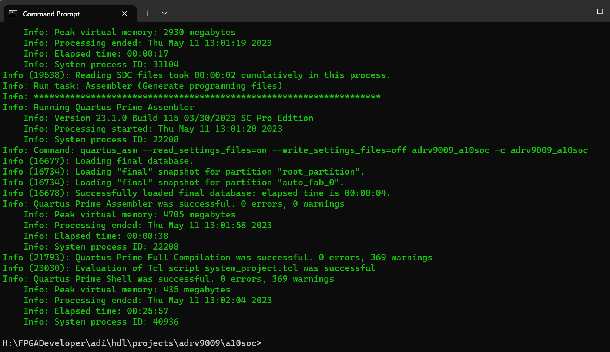

ADI's example uses Make to build the example: `ADI HDL build Guide <https://wiki.analog.com/resources/fpga/docs/build>`_

JESD204B
~~~~~~~~
Check the Intel JESD204B page: `JESD204B Intel® FPGA IP <https://www.intel.com/content/www/us/en/products/details/fpga/intellectual-property/interface-protocols/jesd204b.html>`_ 

General procedure on how to generate the JESD204B design example in `User Guide <https://www.intel.com/content/www/us/en/docs/programmable/683094/22-1/procedure-55160.html>`_ 

Create a new project named "myjesd204b" in Quartus II

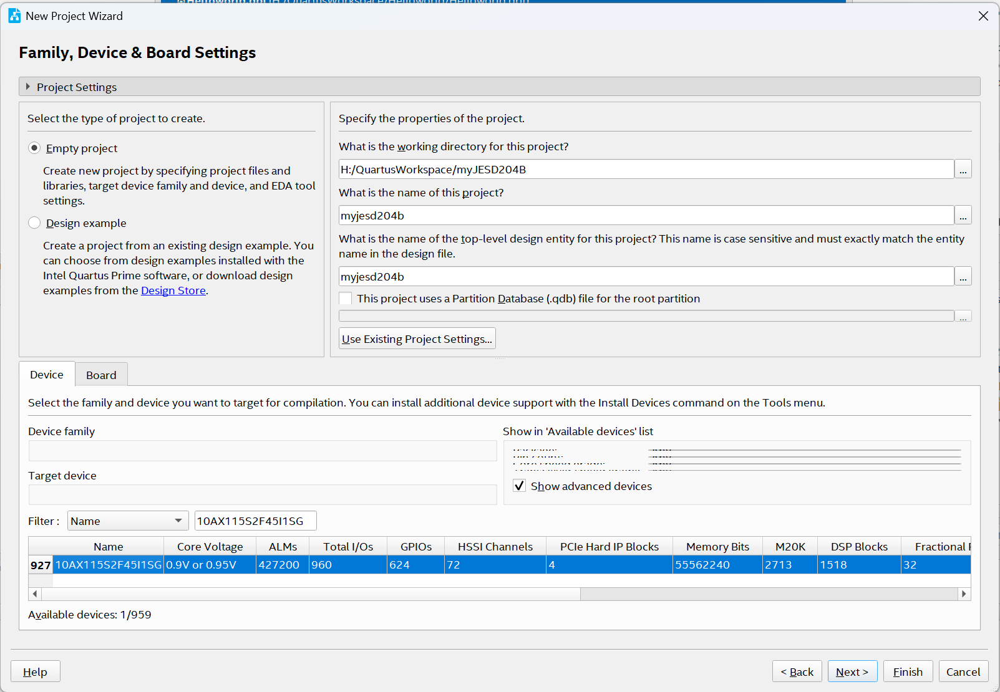

To generate the design example from the IP parameter editor, In the IP Catalog (Tools > IP Catalog), locate and select JESD204B. 

.. image:: imgs/FPGA/ipcatalog.png
  :width: 600
  :alt: ipcatalog

Click "add", and specify the name of the new ip variant, click "Create"

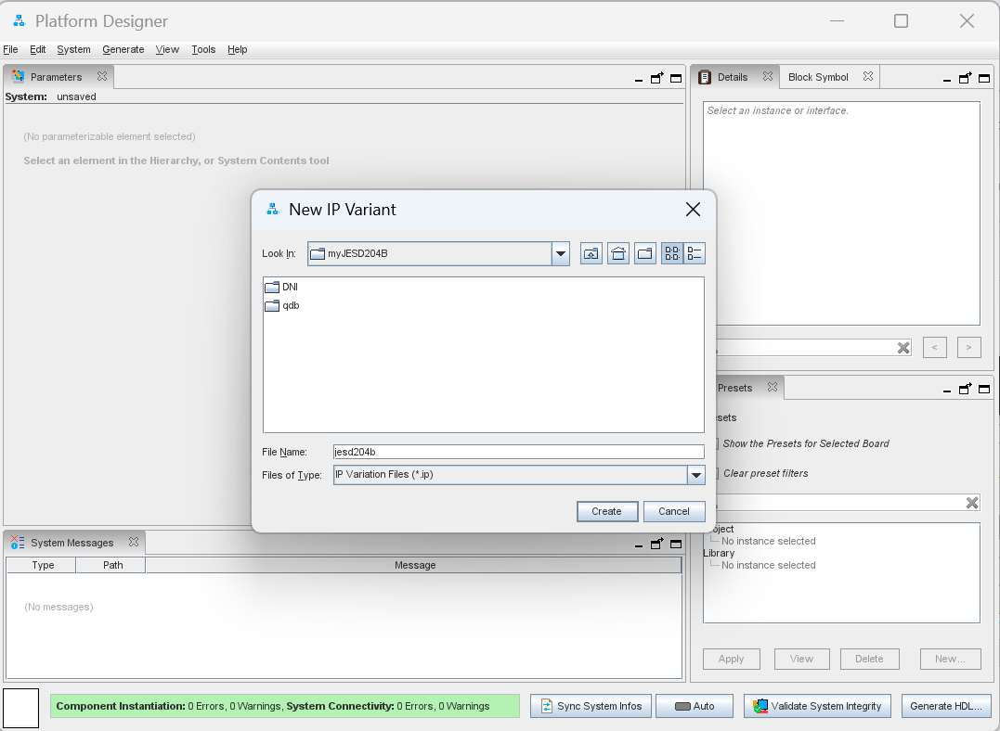

The system automatically populates the IP parameters window for the design

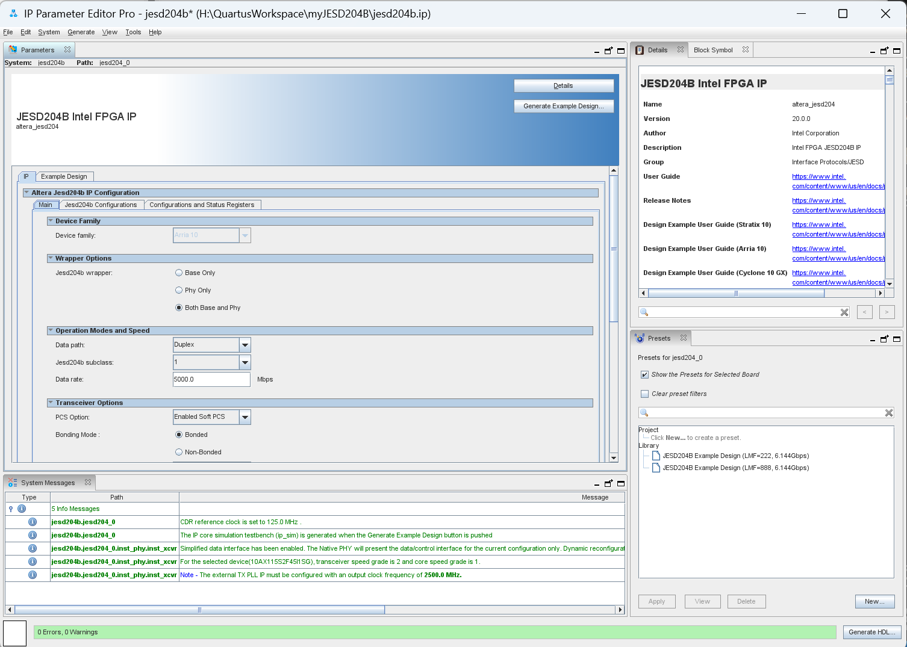

In the parameter editor, click on the Example Design tab.

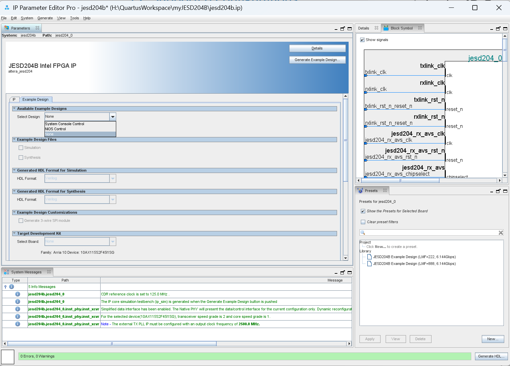

Under the Available Example Designs section, select the available designs. 
  * None: No design example available that matches the IP parameters selected.
  * RTL State Machine Control: Design example has RTL state machine as control unit.
  * Nios II Control: Design example has Nios II processor as control unit. This option is available for Arria 10 devices only.

Select "Nios Control" in "Select Design" and click other options

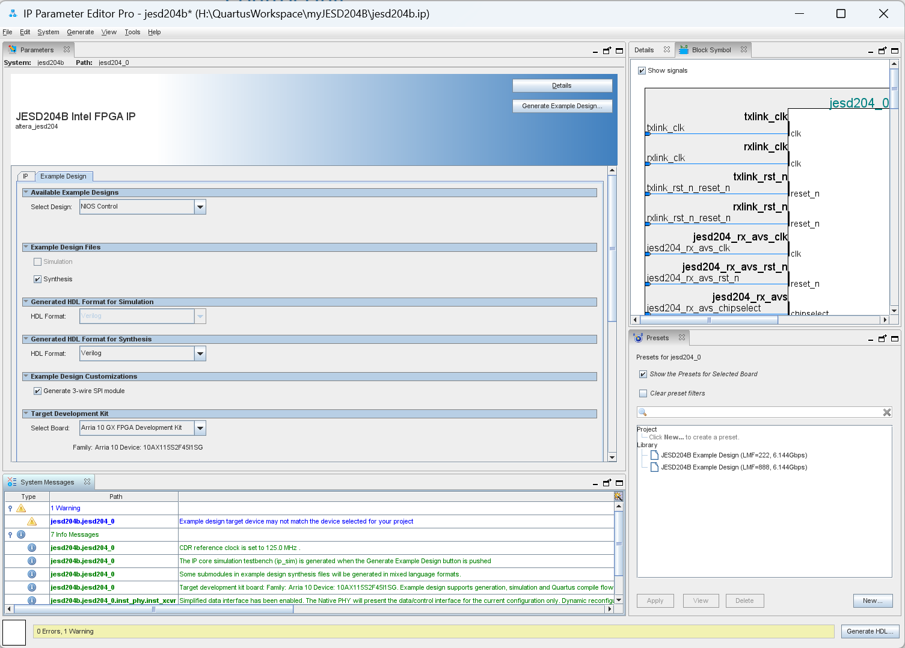

Click the Generate Example Design button on the top right corner to generate the design example based on your settings. Select the default directory "H:/QuartusWorkspace/myJESD204B/jesd204_0_example_design". After the generation is finished, one "jesd204_0_example_design" folder is created and it contains two sub-folders "ed_synth" and "ip_sim". There is one quartus project file "altera_jesd204_ed_RX_TX.qpf" inside the "ed_synth". Open this project file

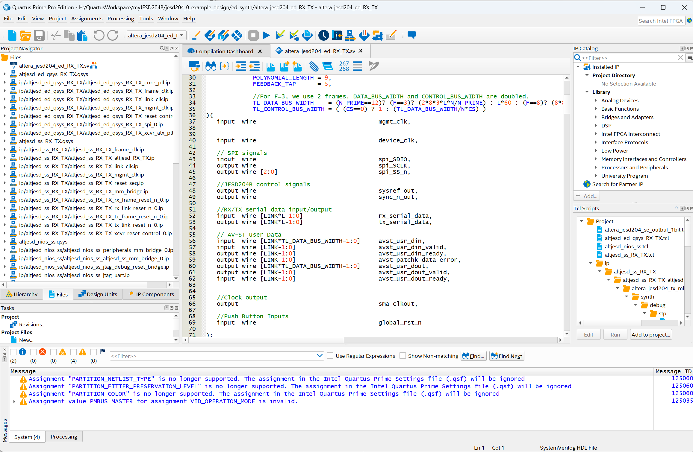

The design diagram can be accessed in `JESD204B Design Example <https://www.intel.com/content/www/us/en/docs/programmable/683094/22-1/design-example-with-nios-control-unit.html>`_

The JESD204B serial data, control, and configuration signal pins are assigned to FMC port A connector. The global reset pin (global_rst_n) connects to the user PB0 push-button on the board. The control plane clock (mgmt_clk) is sourced from the on-board Si570 programmable oscillator. The Si570 clock output routes through a Si53301 clock buffer that allows you to select between the Si570 clock output and SMA input. The example design is configured in internal serial loopback mode. Therefore, the JESD204B data path reference clock (device_clk) is sourced from an on-board clock source, the Si5338 programmable oscillator. In general, when interoperating with an external converter, the device_clk is sourced from the converter through the FMC connector.

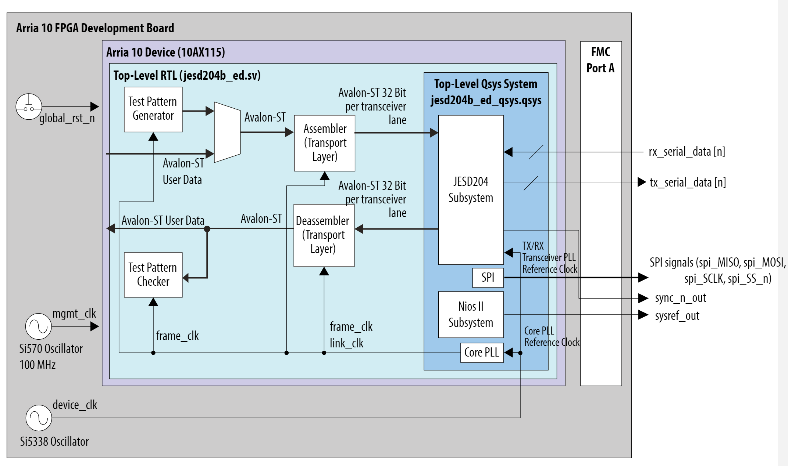

The IP parameter editor appears.
  * Specify a top-level name and the folder for your custom IP variation, and the target device. Click OK.
  * Select a design from the Presets library. When you select a design, the system automatically populates the IP parameters for the design.
  * Click the Generate Example Design button.

AN 729: Implementing JESD204B IP Core System Reference Design with Nios II Processor: https://www.intel.com/content/www/us/en/docs/programmable/683844/current/custom-peripheral-access-macros-in-macros.html

JESD204 Interface Framework: https://wiki.analog.com/resources/fpga/peripherals/jesd204
https://www.analog.com/en/design-center/evaluation-hardware-and-software/jesd204-interface-framework.html
https://wiki.analog.com/resources/fpga/peripherals/jesd204

NIOS v:https://www.intel.com/content/www/us/en/docs/programmable/726952/23-1/about-the-embedded-processor.html

Mercury Arria 10 SOC Board
--------------------------
Mercury+ PE1 300 baseboard (https://www.enclustra.com/en/products/base-boards/mercury-pe1-200-300-400/#) and Mercury+ AA1 Arria 10 SOC module (https://www.enclustra.com/en/products/system-on-chip-modules/mercury-aa1/)
  * The Arria 10 SOC module contains one 10AS027E4F29E3SG
  * The baseboard can be powered via 12V connector or USB (need high-power 5V usb not the port in PC), if using power over USB, the "DIP Switch CFG A 2" should be in ON position. 
  * Mercury PE1-300 board has one lattice FPGA onboard, which serves as the system controller (Enclustra Module Configuration Tool (MCT)). The system controller includes built-in Xilinx JTAG programmer functionality, making it possible to use a USB connection for JTAG debugging. It is fully supported by the Xilinx tools. The built-in Altera JTAG functionality is not supported by the system controller.
  * It has one FMC HPC (5*80pin): J1200-A, J1200-B, J1200-C, J1200-D, J1200-E in schematic

To program the Mercury board via Quartus II, we leverage an external USB-Blaster II debugger and connect it to the mercury board via standard JTAG interface. Open the programmer in Quartus II to detect the device. If you see the error of "Attempted to access JTAG server --internal error code 82 occurred", Open the "Control Panel", Select "Adminstrative Tools", Select "Services", Highlight "Altera JTAG Server" then select Restart.

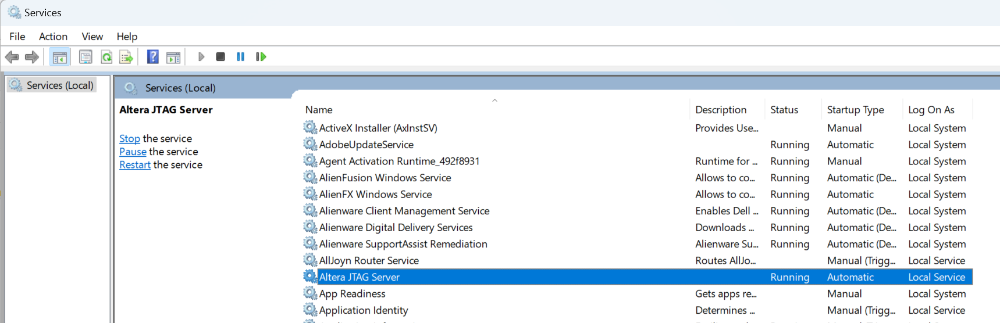

There are four user LEDs (yellow) (0~3), not connected to the FPGA module
  * User LED 0: D1104, IOE_D0_LED0#, connect to J201 B3 (IO_P)
  * User LED 1: D1105, IOE_D0_LED1#, connect to J201 B5 (IO_N)
  * User LED 2: D1106, IOE_D0_LED2#, connect to J201 B7 (IO_P) connect to T8 IO3B_L2P
  * User LED 3: D1107, IOE_D0_LED3#, connect to J201 B9 (IO_N)

There are four user buttons (0~3) Shared with the system controller, module connector and Anios I/O connector B
  * 0: S1104 IOB_D20_SC4_BTN0#
  * 1: S1107 IOB_D21_SC5_BTN1#
  * 2: S1105 IOB_D22_SC6_BTN2#
  * 3: S1108 IOB_D23_SC7_BTN3#

ADRV9009 Example
-----------------
Follow the ADRV9009+Arria10 GX example: https://wiki.analog.com/resources/eval/user-guides/adrv9009/quickstart/a10gx

Open Nios II command shell in windows, it will automatically open the default WSL Linux. The PATH is automatically setup by the Nios II shell.

.. code-block:: console 

  root@Alienware-LKKi7G8:/mnt/h/intelFPGA/quartus23.1/quartus/bin64# jtagconfig.exe
  1) USB-BlasterII [USB-1]
    02E660DD   10AX115H(1|2|3|4|4E3)/..
    020A40DD   5M(1270ZF324|2210Z)/EPM2210

  2) Remote server arria10: Unable to connect

.. code-block:: console 

 (base) lkk@Alienware-LKKi7G8:/mnt/h/intelFPGA/quartus23.1/nios2eds$ export PATH=/mnt/h/intelFPGA/quartus23.1/nios2eds/bin:$PATH
 (base) lkk@Alienware-LKKi7G8:/mnt/h/FPGADeveloper/adrv9009_a10gx/adrv9009_a10gx$ nios2-configure-sof adrv9009_a10gx.sof
 Searching for SOF file:
 in .
   adrv9009_a10gx.sof

 Info: *******************************************************************
 Info: Running Quartus Prime Programmer
 Info: Command: quartus_pgm --no_banner --mode=jtag -o p;./adrv9009_a10gx.sof
 Info (213045): Using programming cable "USB-BlasterII [USB-1]"
 Info (213011): Using programming file ./adrv9009_a10gx.sof with checksum 0x30E72CA2 for device 10AX115S2F45@1
 Info (209060): Started Programmer operation at Mon May  8 23:34:35 2023
 Info (209016): Configuring device index 1
 Info (209017): Device 1 contains JTAG ID code 0x02E660DD
 Info (209007): Configuration succeeded -- 1 device(s) configured
 Info (209011): Successfully performed operation(s)
 Info (209061): Ended Programmer operation at Mon May  8 23:34:50 2023
 Info: Quartus Prime Programmer was successful. 0 errors, 0 warnings
     Info: Peak virtual memory: 1936 megabytes
     Info: Processing ended: Mon May  8 23:34:50 2023
     Info: Elapsed time: 00:00:23
     Info: System process ID: 34076
 (base) lkk@Alienware-LKKi7G8:/mnt/h/FPGADeveloper/adrv9009_a10gx/adrv9009_a10gx$ export PATH=/mnt/h/intelFPGA/quartus23.1/nios2eds/bin/gnu/H-x86_64-mingw32/bin/:$PATH
 (base) lkk@Alienware-LKKi7G8:/mnt/h/FPGADeveloper/adrv9009_a10gx/adrv9009_a10gx$ nios2-download -g zImage
 Using cable "USB-BlasterII [USB-1]", device 1, instance 0x00
 Processor is already paused
 Initializing CPU cache (if present)
 OK
 Downloaded 5471KB in 0.5s (10942.0KB/s)
 Verified OK
 Starting processor at address 0xC4000000
 (base) lkk@Alienware-LKKi7G8:/mnt/h/FPGADeveloper/adrv9009_a10gx/adrv9009_a10gx$ nios2-terminal.exe
 nios2-terminal: connected to hardware target using JTAG UART on cable
 nios2-terminal: "USB-BlasterII [USB-1]", device 1, instance 0
 nios2-terminal: (Use the IDE stop button or Ctrl-C to terminate)

nios2-terminal has no response, switch to WSL1 for testing. As stated in  Quartus install instruction, Nios II EDS only works with WSL1, in section 2.3.1 of: https://cdrdv2-public.intel.com/666293/quartus_install-683472-666293.pdf

Install a new distribution (Ubuntu20.04), set the wsl version from 2 to 1, ref: https://learn.microsoft.com/en-us/windows/wsl/basic-commands

.. code-block:: console 

 C:\Users\lkk>wsl --list --online
 C:\Users\lkk>wsl --install -d Ubuntu-20.04
 C:\Users\lkk>wsl --list --verbose
   NAME            STATE           VERSION
 * Ubuntu-22.04    Running         2
   Ubuntu-20.04    Running         2

 C:\Users\lkk>wsl --set-version Ubuntu-20.04 1
 Conversion in progress, this may take a few minutes.
 The operation completed successfully.

 C:\Users\lkk>wsl --list --verbose
   NAME            STATE           VERSION
 * Ubuntu-22.04    Running         2
   Ubuntu-20.04    Stopped         1
  C:\Users\lkk>wsl --setdefault Ubuntu20.04
  C:\Users\lkk>wsl --distribution Ubuntu-20.04 --user lkk #start the linux
 >wsl -t Ubuntu-20.04 #shut down the linux
 
.. code-block:: console 

 lkk@Alienware-LKKi7G8:~$ ls
 QuartusProSetup-23.1.0.115-linux.run  QuartusProSetup-part2-23.1.0.115-linux.qdz  quartus  ubuntu20
 lkk@Alienware-LKKi7G8:~$ ./QuartusProSetup-23.1.0.115-linux.run --mode text --installdir ./quartus
 lkk@Alienware-LKKi7G8:~/adi$ export PATH=~/quartus/quartus/bin/:$PATH
 lkk@Alienware-LKKi7G8:~/adi$ git clone https://github.com/analogdevicesinc/hdl.git
 lkk@Alienware-LKKi7G8:~/adi/hdl/projects/adrv9009/a10soc$ sudo apt update
 lkk@Alienware-LKKi7G8:~/adi/hdl/projects/adrv9009/a10soc$ sudo apt install make
 lkk@Alienware-LKKi7G8:~/adi/hdl/projects/adrv9009/a10soc$ sudo apt install build-essential
 lkk@Alienware-LKKi7G8:~/adi/hdl/projects/adrv9009/a10soc$ sudo apt install dos2unix
 lkk@Alienware-LKKi7G8:~/adi/hdl/projects/adrv9009/a10soc$ sudo apt-get install libncurses5

 export PATH=/home/lkk/quartus/quartus/bin/:$PATH
 export PATH=/home/lkk/quartus/nios2eds/bin/gnu/H-x86_64-pc-linux-gnu/bin/:$PATH
 export PATH=/home/lkk/quartus/nios2eds/bin/:$PATH
 quartus_sh -t system_project.tcl

Follow the ADI Building HDL instruction: https://wiki.analog.com/resources/fpga/docs/build, build the adrv9009/a10soc project:

.. code-block:: console 

 lkk@Alienware-LKKi7G8:~/adi/hdl/projects/adrv9009/a10soc$ export ADI_IGNORE_VERSION_CHECK=1
 lkk@Alienware-LKKi7G8:~/adi/hdl/projects/adrv9009/a10soc$ make
 Building adrv9009_a10soc [/home/lkk/adi/hdl/projects/adrv9009/a10soc/adrv9009_a10soc_quartus.log] .

 2023.05.10.00:23:53 Error: Unknown device part 10AS066N3F40E2SG
 CRITICAL WARNING: Quartus version mismatch; expected 22.4.0, got 23.1.0.

 lkk@Alienware-LKKi7G8:~/adi/hdl/projects/adrv9009/a10soc$ cat adrv9009_a10soc.qsf
 set_global_assignment -name DEVICE 10AS066N3F40E2SG
 set_global_assignment -name QSYS_FILE system_bd.qsys

Show build error of "Unknown device part 10AS066N3F40E2SG". The device setup code is in "projects/scripts/adi_project_intel.tcl" and based on the project name:

.. code-block:: console 
 
  if [regexp "_a10gx" $project_name] {
     set family "Arria 10"
     set device 10AX115S2F45I1SG
   }

   if [regexp "_a10soc" $project_name] {
     set family "Arria 10"
     set device 10AS066N3F40E2SG
   }

Change the project name in Makefile and system_project.tcl to "adrv9009_a10gx", it still show "Error: Unknown device part 10AX115S2F45I1SG". Setup some paths and run quartus_sh in command line (similar to make) and show progress in terminal.

.. code-block:: console 

  export ADI_IGNORE_VERSION_CHECK=1
  export ALTERA_ROOT="/home/lkk/quartus/"		# Change this to the path you've installed Altera Quartus at
  export QUARTUS_ROOTDIR_OVERRIDE="$ALTERA_ROOT/quartus"
  export QSYS_ROOTDIR="$QUARTUS_ROOTDIR_OVERRIDE/sopc_builder/bin"
  export QUARTUS_LIBRARY_PATHS="$QUARTUS_ROOTDIR_OVERRIDE/linux64/:/lib/x86_64-linux-gnu/"
  export SOPC_KIT_NIOS2="$ALTERA_ROOT/nios2eds"
  export LD_LIBRARY_PATH="$LD_LIBRARY_PATH:$QUARTUS_LIBRARY_PATHS"
  export PATH="$PATH:$ALTERA_ROOT/quartus/bin"
  lkk@Alienware-LKKi7G8:~/adi/hdl/projects/adrv9009/a10soc$ quartus_sh --64bit -t system_project.tcl
  2023.05.10.10:26:44 Error: Unknown device part 10AX115S2F45I1SG
  child process exited abnormally
      while executing
  "exec -ignorestderr $quartus(quartus_rootpath)/sopc_builder/bin/qsys-generate  system_bd.qsys --synthesis=VERILOG --family=$family --part=$device  --qu..."
      (procedure "adi_project" line 161)
      invoked from within
  "adi_project adrv9009_a10gx"
      (file "system_project.tcl" line 4)

.. note::

    The ADI HDL project build in WSL1 Ubuntu and WSL2 Ubuntu are all failed. The "unknown device" error maybe caused by the Arria10 device license setup in the WSL linux. Tried to setup the device license in command line, but it still shows the same error. The HDL project build in Windows is successful due to the correct setting of the device license. 

Build nios2 Linux Image
------------------------
Ref nios2 linux build: https://wiki.analog.com/resources/tools-software/linux-build/generic/nios2 or https://wiki.analog.com/resources/tools-software/linux-drivers/platforms/nios2?s[]=nios2. Using the repo of https://github.com/analogdevicesinc/linux. Build linux success.

 .. code-block:: console 

  wget https://raw.githubusercontent.com/analogdevicesinc/wiki-scripts/master/linux/build_nios2_kernel_image.sh && chmod +x build_nios2_kernel_image.sh && ./build_nios2_kernel_image.sh /home/lkk/quartus/nios2eds/bin/gnu/H-x86_64-pc-linux-gnu/bin/nios2-elf-
  Kernel: arch/nios2/boot/zImage is ready
  Exported files: zImage

This script performs the following four steps
  * clone the ADI kernel tree (git clone https://github.com/analogdevicesinc/linux.git)
  * Get root filesystem (wget https://swdownloads.analog.com/cse/nios2/rootfs/rootfs.cpio.gz -P arch/nios2/boot/rootfs.cpio.gz)
  * download the Linaro GCC toolchain (export CROSS_COMPILE=~/nios2/tools/bin/nios2-linux-gnu-)
  * configure Kernel for Nios2 platforms (export ARCH=nios2 & make adi_nios2_defconfig)
  * build the ADI kernel tree (make zImage)
  * export/copy the Image file and device tree file out of the kernel build folder

Download the sof file to FPGA, and download images to nios2, launch nios2-terminal, did not show Linux boot.

 .. code-block:: console 

  root@Alienware-LKKi7G8:/mnt/h/FPGADeveloper/adrv9009_a10gx/adrv9009_a10gx# nios2-configure-sof adrv9009_a10gx.sof
  root@Alienware-LKKi7G8:/home/lkk# nios2-download -g zImage
  nios2-terminal.exe

.. note::

    We can build the nios2 linux image, and directly download the sof file and image file to the FPGA, the problem is that 'nios2-terminal' did not show the boot of Linux. If a development board has more than one JTAG port, the nios2-terminal command cannot work unless the correct JTAG cable is identified. In order to identify the correct JTAG cable, you must first run the **jtagconfig** command. For example, if the output states that USB-Blaster is port 2, then you can run the command using the correct JTAG port nios2-terminal -c 2. Ref: https://www.intel.com/content/www/us/en/docs/programmable/683525/21-3/nios2-terminal-64-bit-support.html. 

Build Linux FPGA SoC Image
----------------------------
Build Linux image for Intel SOC FPGA via this: https://wiki.analog.com/resources/tools-software/linux-build/generic/socfpga

 .. code-block:: console 

  root@Alienware-LKKi7G8:/home/lkk/linux# ARCH=arm CROSS_COMPILE=arm-linux-gnueabihf-
  root@Alienware-LKKi7G8:/home/lkk/linux# make socfpga_adi_defconfig
  root@Alienware-LKKi7G8:/home/lkk/linux# sudo apt-get install gcc-arm-linux-gnueabihf
  root@Alienware-LKKi7G8:/home/lkk/linux# CC=arm-linux-gnueabihf-gcc
  root@Alienware-LKKi7G8:/home/lkk/linux# make zImage -j4
    OBJCOPY arch/arm/boot/zImage
    Kernel: arch/arm/boot/zImage is ready

  root@Alienware-LKKi7G8:/home/lkk/linux# make arch/arm/boot/dts/socfpga_arria10_socdk_adrv9009.dts
  make: Nothing to be done for 'arch/arm/boot/dts/socfpga_arria10_socdk_adrv9009.dts'.

Image build success, not sure of the result when make devicetree, the devicetree may already there?
Refer the nios2 linux build, your_setup.dts is a generic file name - it should be replaced by the desired devicetree file name: 

 .. code-block:: console 

  user@pc:~/nios2/linux$ cp arch/nios2/boot/dts/your_setup.dts arch/nios2/boot/devicetree.dts

Copy the generated files to your SD Card

 .. code-block:: console 

  /linux$ cp arch/arm/boot/zImage /media/BOOT/zImage
  linux$ cp arch/arm/boot/dts/socfpga_arria10_socdk_adin1300_dual-mii.dtb  /media/BOOT/socfpga_arria10_socdk_sdmmc.dtb

You can download prebuild images from: https://wiki.analog.com/resources/tools-software/linux-software/altera_soc_images (same to Kuiper Linux).
Using Windows host to flash SD cards: https://wiki.analog.com/resources/tools-software/linux-software/zynq_images/windows_hosts

ADI Kuiper Linux
-----------------
Analog Devices Kuiper Linux is a distribution based on Raspberry Pi OS for the Raspberry Pi. Ref: https://wiki.analog.com/resources/tools-software/linux-software/kuiper-linux.

Download the Linux Image, unzip the folder. Use balenaEtcher or Win32Disk writer to flash the image to the SD card. The default user is the “analog” user, the password for this user is “analog”. The password for the “root” account is “analog” as well.

Configuring the SD Card for FPGA Projects
~~~~~~~~~~~~~~~~~~~~~~~~~~~~~~~~~~~~~~~~~
The SD card includes several folders in the root directory of the BOOT partition. In order to configure the SD card to work with a specific FPGA board and ADI hardware, several files must be copied onto the root directory. Using the host PC, drag and drop the required files onto the BOOT partition, and use the EJECT function when removing the SD card from the reader.

For Arria10 SOC projects:        
  - copy <target>/fit_spl_fpga.itb, <target>/socfpga_arria10_socdk_sdmmc.dtb,        
    <target>/u-boot.img and socfpga_arria10_common/zImage to the root        
    of the BOOT FAT32 partition, where target is the folder "socfpga_arria10_socdk_adrv9009"   
  - copy <target>/extlinux.conf to the root of BOOT FAT32, in folder 'extlinux';        
  - write preloader file - <target>/u-boot-splx4.sfp - to the corresponding SD        
    card partition (usually third partition). You can use 'dd' linux command in        
    terminal, for example: "dd if=u-boot-splx4.sfp of=/dev/mmcblk0p3"

On the platform board, insert the SD card, plug in the console UART cable, power the system, and see the boot process in console

.. code-block:: console 

  $ kermit -l /dev/ttyACM0 -b 115200  -c

When the platform running Kuiper Linux is powered up, any IIO devices present and enabled in the configuration file, will be displayed in the terminal window by running the iio_info command

https://siytek.com/verilog-quartus/
https://people.ece.cornell.edu/land/courses/ece5760/
https://www.intel.com/content/www/us/en/support/programmable/support-resources/design-guidance/arria-10.html#tab-blade-1-0
Intel® FPGA AI Suite: https://www.intel.com/content/www/us/en/docs/programmable/768970/2023-1/about-the.html
Intel® High Level Synthesis Compiler Pro Edition: Getting Started Guide: https://www.intel.com/content/www/us/en/docs/programmable/683680/23-1/pro-edition-getting-started-guide.html
Quartus II Scripting Reference Manual: https://www.intel.com/programmable/technical-pdfs/654662.pdf
https://www.intel.com/content/www/us/en/support/programmable/support-resources/design-software/fpga-development-tools-support.html?f:guidetm83741EA404664A899395C861EDA3D38B=%5BIntel%C2%AE%20Arria%C2%AE%3BIntel%C2%AE%20Arria%C2%AE%2010%20FPGAs%20and%20SoC%20FPGAs%5D
https://www.doulos.com/knowhow/fpga/create-a-simple-tcl-script-for-altera-quartus-ii/

Nios2 Linux on the Altera FPGA Development Boards: https://wiki.analog.com/resources/tools-software/linux-drivers/platforms/nios2
https://github.com/analogdevicesinc/linux
sudo apt-get install make build-essential libncurses-dev bison flex libssl-dev libelf-dev

Intel® Arria® 10 FPGA Developer Center: https://www.intel.com/content/www/us/en/support/programmable/support-resources/design-guidance/arria-10.html
JESD204B Intel® FPGA IP Design Example User Guide

Nios® V Embedded Processor Design Handbook: https://www.intel.com/content/www/us/en/docs/programmable/726952/22-1-21-2-0/introduction-71358.html

ADI References
----------------
https://www.analog.com/en/products/adrv9009.html#product-overview
https://www.analog.com/en/design-center/evaluation-hardware-and-software/evaluation-boards-kits/EVAL-ADRV9008-9009.html#eb-overview
https://wiki.analog.com/resources/eval/user-guides/adrv9009
https://wiki.analog.com/resources/eval/user-guides/adrv9009/no-os-setup
https://www.analog.com/en/design-center/landing-pages/001/transceiver-evaluation-software.html
https://github.com/analogdevicesinc/no-OS
https://wiki.analog.com/resources/eval/user-guides/adrv9009/quickstart/a10gx

ADRV9009 Arria 10 GX Quick Start Guide: https://wiki.analog.com/resources/eval/user-guides/adrv9009/quickstart/a10gx
ADRV9009 HDL Reference Design: https://wiki.analog.com/resources/eval/user-guides/adrv9009/reference_hdl
https://github.com/analogdevicesinc/hdl/tree/master/projects/adrv9009
https://github.com/analogdevicesinc/hdl/tree/master
ADI™ Reference Designs HDL User Guide: https://wiki.analog.com/resources/fpga/docs/hdl
Building HDL: https://wiki.analog.com/resources/fpga/docs/build#windows_environment_setup
https://wiki.analog.com/resources/fpga/peripherals/jesd204/tutorial/hdl_altera
IIO Oscilloscope: https://wiki.analog.com/resources/tools-software/linux-software/iio_oscilloscope
https://wiki.analog.com/resources/fpga/docs/hdl/porting_project_quick_start_guide
https://www.intel.com/content/www/us/en/products/details/fpga/intellectual-property/interface-protocols/jesd204b.html
Linux Drivers: https://wiki.analog.com/resources/tools-software/linux-drivers-all
ADRV9009 Linux Driver: https://wiki.analog.com/resources/tools-software/linux-drivers/iio-transceiver/adrv9009
https://www.analog.com/en/design-center/landing-pages/001/transceiver-evaluation-software.html

https://wiki.analog.com/resources/eval/user-guides/adrv9009

https://wiki.analog.com/resources/eval/user-guides/adrv9009/reference_hdl
for a10gx: https://github.com/analogdevicesinc/hdl/tree/master/library/jesd204/ad_ip_jesd204_tpl_adc
Other branches contain a10gx: https://github.com/analogdevicesinc/hdl/tree/a10gx_modify_interconnect_architecture/projects/adrv9009/a10gx

https://wiki.analog.com/resources/fpga/docs/hdl/porting_project_quick_start_guide
https://wiki.analog.com/resources/fpga/docs/arch

https://wiki.analog.com/resources/tools-software/linux-drivers/iio-transceiver/adrv9009
https://wiki.analog.com/resources/tools-software/linux-software/kuiper-linux

https://wiki.analog.com/resources/tools-software/linux-software/altera_soc_images

https://wiki.analog.com/resources/tools-software/linux-drivers-all#building_the_adi_linux_kernel
Building the Intel SoC-FPGA kernel and devicetrees from source: https://wiki.analog.com/resources/tools-software/linux-build/generic/socfpga