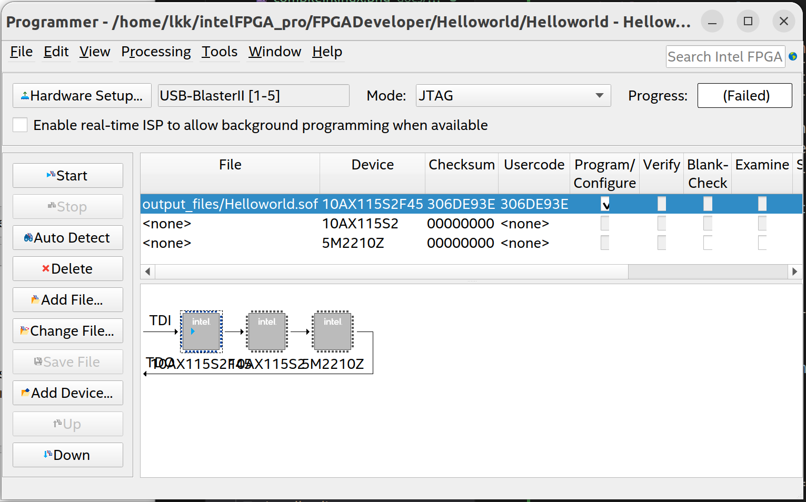

Intel FPGA Linux
===============================

Download Virtual Box
---------------------
Download virtual box from: https://www.virtualbox.org/wiki/Downloads. 
Download Ubuntu 20.04 64 bit image from: https://releases.ubuntu.com/20.04.6/?_ga=2.115044679.197158768.1685062692-141498123.1685062692

Install Quartus in Linux
-------------------------
Install Quartus in Linux based on: https://www.intel.com/content/www/us/en/docs/programmable/683472/23-1/installing-from-tar-files.html

Download "QuartusProSetup-23.1.0.115-linux.run", "QuartusProSetup-part2-23.1.0.115-linux.qdz", and "arria10-23.1.0.115.qdz" in the same folder. 

.. code-block:: console 
    
    (base) lkk@lkk-intel12:/media/lkk/Samsung_T3/QuartusLinux$ ./QuartusProSetup-23.1.0.115-linux.run 

The GUI installation guide will be popup, specify the installation path: "/home/lkk/intelFPGA_pro/23.1" and "arria10" device, click Install

Create "quartus_env.sh" to setup quartus environment:

.. code-block:: console 

    #!/bin/sh
    export QUARTUS_ROOTDIR="/home/lkk/intelFPGA_pro/23.1/quartus"
    export QSYS_ROOTDIR="/home/lkk/intelFPGA_pro/23.1/qsys/bin"
    #export ALTERAOCLSDKROOT=<some_specific_release>
    #export INTELFPGAOCLSDKROOT=<some_specific_release>”
    export PATH="$QUARTUS_ROOTDIR/bin:$QSYS_ROOTDIR:$PATH" 
    export PATH=/home/lkk/intelFPGA_pro/23.1/nios2eds/bin/:$PATH
    export PATH=/home/lkk/intelFPGA_pro/23.1/nios2eds/bin/gnu/H-x86_64-pc-linux-gnu/bin/:$PATH
    # Adding  any /bin under __^S^__ALTERAOCLSDKROOT or __^S^__INTELFPGAOCLSDKROOT >
    export LM_LICENSE_FILE="/home/lkk/intelFPGA_pro/LR-123798_License.dat"

.. code-block:: console 

    (base) lkk@lkk-intel12:~/intelFPGA_pro$ chmod +x quartus_env.sh
    (base) lkk@lkk-intel12:~/intelFPGA_pro$ source ./quartus_env.sh 
    (base) lkk@lkk-intel12:~/intelFPGA_pro$ echo $QUARTUS_ROOTDIR
    /home/lkk/intelFPGA_pro/23.1/quartus
    (base) lkk@lkk-intel12:~/intelFPGA_pro$ echo $PATH
    /home/lkk/intelFPGA_pro/23.1/quartus/bin:/home/lkk/intelFPGA_pro/23.1/qsys/bin:/home/lkk/miniconda3/bin:/home/lkk/miniconda3/condabin:/usr/local/sbin:/usr/local/bin:/usr/sbin:/usr/bin:/sbin:/bin:/usr/games:/usr/local/games:/snap/bin:/snap/bin

Start the quartus in command line

.. note::
    If there is error: quartus: error while loading shared libraries: libncurses.so.5: cannot open shared object file: No such file or directory. 
    Solution: sudo apt-get install libncurses5

If the quartus popup a window show license error, select the first option: go to license center. In the Quartus license center, create a new computer and enter the NIC ID (get the MAC address of the WiFi/Ethernet via ifconfig -a). 

.. image:: imgs/FPGA/creatcomputer.png
  :width: 600
  :alt: creatcomputer

Go the License, and edit the primary computer in the license. Click "generate license file", it will email the license file to you. 

After you got the license file, open quartus-tools-license setup to point to the new license file.

Setting Up the Intel FPGA Download Cable II Hardware
-----------------------------------------------------

Create a file named /etc/udev/rules.d/92-usbblaster.rules

.. code-block:: console 

    /etc/udev/rules.d$ sudo nano 92-usbblaster.rules
    SUBSYSTEMS=="usb", ATTRS{idVendor}=="09fb", ATTRS{idProduct}=="6010", MODE="0666"
    SUBSYSTEMS=="usb", ATTRS{idVendor}=="09fb", ATTRS{idProduct}=="6810", MODE="0666"					

Re-plugin the USB cable to the computer. Start the Intel Quartus software. From the Tools menu, click Programmer. Click Hardware Setup. Click the Hardware Settings tab. From the Currently selected hardware list, select Intel FPGA Download Cable II. Click Close.

In the Programmer window, click Auto Detect and select "10AX115S2". In the Mode list, choose an appropriate programming mode. 

In the command line, you can type jtagconfig to see the output
$ jtagconfig
1) USB-BlasterII [1-5]
  02E660DD   10AX115H(1|2|3|4|4E3)/..
  020A40DD   5M(1270ZF324|2210Z)/EPM2210

Helloworld
-----------
Open the Helloworld project for Arria10 GX development board, compile the code.

Open programmer window, click "Auto Detect" and select "10AX115S2". Add the sof file from output_files. Click "Up" button to move the sof file to the top.

You can see there are duplication 10AX115S2, delete the second one, click "Start" to program the FPGA. After programming, you can see the LED in Arria10 GX board is blinking.

You can also compile the project via tcl in the command line

.. code-block:: console 

    lkk@lkk-intel12:~/intelFPGA_pro/FPGADeveloper/Helloworld$ quartus_sh -t Helloworld_compile.tcl

ADRV9009+Arria10 GX
--------------------

Follow the ADRV9009+Arria10 GX example: https://wiki.analog.com/resources/eval/user-guides/adrv9009/quickstart/a10gx. Download the Pre-build Images for Intel Arria 10 GX in this page, select "adrv9009_a10gx_2019_r2.zip" 

.. code-block:: console 

    lkk@lkk-intel12:~/intelFPGA_pro/FPGADeveloper/adrv9009_a10gx$ ls
    adrv9009_a10gx_program.bat  adrv9009_a10gx.sof
    adrv9009_a10gx_program.sh   zImage
    lkk@lkk-intel12:~/intelFPGA_pro/FPGADeveloper/adrv9009_a10gx$ nios2-configure-sof adrv9009_a10gx.sof
    Info: *******************************************************************
    Info: Running Quartus Prime Programmer
    Info: Command: quartus_pgm --no_banner --mode=jtag -o p;./adrv9009_a10gx.sof
    Info (213045): Using programming cable "USB-BlasterII [1-5]"
    Info (213011): Using programming file ./adrv9009_a10gx.sof with checksum 0x30E72CA2 for device 10AX115S2F45@1
    Info (209060): Started Programmer operation at Fri May 26 10:28:33 2023
    Info (209016): Configuring device index 1
    Info (209017): Device 1 contains JTAG ID code 0x02E660DD
    Info (209007): Configuration succeeded -- 1 device(s) configured
    Info (209011): Successfully performed operation(s)
    Info (209061): Ended Programmer operation at Fri May 26 10:28:48 2023
    Info: Quartus Prime Programmer was successful. 0 errors, 0 warnings
        Info: Peak virtual memory: 2539 megabytes
        Info: Processing ended: Fri May 26 10:28:48 2023
        Info: Elapsed time: 00:00:18
        Info: System process ID: 13825
    (base) lkk@lkk-intel12:~/intelFPGA_pro/FPGADeveloper/adrv9009_a10gx$ nios2-download -g zImage
    Using cable "USB-BlasterII [1-5]", device 1, instance 0x00
    Pausing target processor: not responding.
    Resetting and trying again: OK
    Initializing CPU cache (if present)
    OK
    Downloaded 5471KB in 0.5s (10942.0KB/s)
    Verified OK                         
    Starting processor at address 0xC4000000
    (base) lkk@lkk-intel12:~/intelFPGA_pro/FPGADeveloper/adrv9009_a10gx$ nios2-terminal
    nios2-terminal: connected to hardware target using JTAG UART on cable
    nios2-terminal: "USB-BlasterII [1-5]", device 1, instance 0
    nios2-terminal: (Use the IDE stop button or Ctrl-C to terminate)

The default user is the “analog” user, the password for this user is “analog”. The password for the “root” account is “analog” as well.

Nios II Command Shell login using root and password analog. 

by running the iio_info command

Build ADI HDL
--------------------
Ref HDL build: https://wiki.analog.com/resources/fpga/docs/build

.. code-block:: console 

   (base) lkk@lkk-intel12:~/intelFPGA_pro/FPGADeveloper/adi$ git clone https://github.com/analogdevicesinc/hdl.git
   (base) lkk@lkk-intel12:~/intelFPGA_pro/FPGADeveloper/adi$ cd hdl/
   (base) lkk@lkk-intel12:~/intelFPGA_pro/FPGADeveloper/adi/hdl$ git status
   On branch master
   Your branch is up to date with 'origin/master'.

   nothing to commit, working tree clean
   (base) lkk@lkk-intel12:~/intelFPGA_pro/FPGADeveloper/adi/hdl$ git checkout hdl_2021_r1
   Branch 'hdl_2021_r1' set up to track remote branch 'hdl_2021_r1' from 'origin'.
   Switched to a new branch 'hdl_2021_r1'
   (base) lkk@lkk-intel12:~/intelFPGA_pro/FPGADeveloper/adi/hdl/projects/adrv9009/a10gx$ export ADI_IGNORE_VERSION_CHECK=1
   (base) lkk@lkk-intel12:~/intelFPGA_pro/FPGADeveloper/adi/hdl/projects/adrv9009/a10gx$ make

   (base) lkk@lkk-intel12:~/intelFPGA_pro/FPGADeveloper/hdl/projects/adrv9009/a10soc$ make
   Building adrv9009_a10soc [/home/lkk/intelFPGA_pro/FPGADeveloper/hdl/projects/adrv9009/a10soc/adrv9009_a10soc_quartus.log] ... OK

   (base) lkk@lkk-intel12:~/intelFPGA_pro/FPGADeveloper/hdl/projects/adrv9009/a10gx$ quartus_sh -t system_project.tcl
   Info (16678): Successfully loaded final database: elapsed time is 00:00:03.
   Info (115017): Design contains a time-limited core -- only a single, time-limited programming file can be generated
       Info (21726): Time Limited Core Name: Nios II Embedded Processor Encrypted output (6AF7 00A2)
       Info (21726): Time Limited Core Name: Triple-Speed Ethernet (6AF7 00BD)
   Info: Quartus Prime Assembler was successful. 0 errors, 0 warnings
       Info: Peak virtual memory: 7335 megabytes
       Info: Processing ended: Fri May 26 16:35:14 2023
       Info: Elapsed time: 00:00:38
       Info: System process ID: 30895
   Info (21793): Quartus Prime Full Compilation was successful. 0 errors, 2282 warnings
   Info (23030): Evaluation of Tcl script system_project.tcl was successful
   Info: Quartus Prime Shell was successful. 0 errors, 2282 warnings
       Info: Peak virtual memory: 1076 megabytes
       Info: Processing ended: Fri May 26 16:35:20 2023
       Info: Elapsed time: 00:14:37
       Info: System process ID: 28456

   (base) lkk@lkk-intel12:~/intelFPGA_pro/FPGADeveloper/hdl/projects/adrv9009/a10gx$ make
   Building adrv9009_a10gx [/home/lkk/intelFPGA_pro/FPGADeveloper/hdl/projects/adrv9009/a10gx/adrv9009_a10gx_quartus.log] ... OK

Build nios2 Linux Image
------------------------
Ref nios2 linux build: https://wiki.analog.com/resources/tools-software/linux-build/generic/nios2 or https://wiki.analog.com/resources/tools-software/linux-drivers/platforms/nios2?s[]=nios2. 

Using the repo of https://github.com/analogdevicesinc/linux. Build linux success.

.. code-block:: console 
  #Get Linux Kernel Source (very slow)
  (base) lkk@lkk-intel12:~/intelFPGA_pro/FPGADeveloper$ git clone https://github.com/analogdevicesinc/linux.git
  #Get Root Filesystem
  (base) lkk@lkk-intel12:~/intelFPGA_pro/FPGADeveloper/linux$ wget https://swdownloads.analog.com/cse/nios2/rootfs/rootfs.cpio.gz -P arch/nios2/boot/rootfs.cpio.gz
  (base) lkk@lkk-intel12:~/intelFPGA_pro/FPGADeveloper/linux$ export ARCH=nios2
  (base) lkk@lkk-intel12:~/intelFPGA_pro/FPGADeveloper/linux$ export CROSS_COMPILE=/home/lkk/intelFPGA_pro/23.1/nios2eds/bin/gnu/H-x86_64-pc-linux-gnu/bin/nios2-elf-
  (base) lkk@lkk-intel12:~/intelFPGA_pro/FPGADeveloper/linux$ make adi_nios2_defconfig
  LEX     scripts/kconfig/lexer.lex.c
  YACC    scripts/kconfig/parser.tab.[ch]
  HOSTCC  scripts/kconfig/lexer.lex.o
  HOSTCC  scripts/kconfig/menu.o
  HOSTCC  scripts/kconfig/parser.tab.o
  HOSTCC  scripts/kconfig/preprocess.o
  HOSTCC  scripts/kconfig/symbol.o
  HOSTCC  scripts/kconfig/util.o
  HOSTLD  scripts/kconfig/conf
   #
   # configuration written to .config
   #

  (base) lkk@lkk-intel12:~/intelFPGA_pro/FPGADeveloper/linux$ ls arch/nios2/boot/dts
   10m50_devboard.dts  a10gx_adrv9009.dts  a10gx_daq2.dts
   3c120_devboard.dts  a10gx_adrv9371.dts  Makefile
  (base) lkk@lkk-intel12:~/intelFPGA_pro/FPGADeveloper/linux$ cp arch/nios2/boot/dts/a10gx_adrv9009.dts arch/nios2/boot/devicetree.dts
  (base) lkk@lkk-intel12:~/intelFPGA_pro/FPGADeveloper/linux$ make zImage
  cat: arch/nios2/boot/rootfs.cpio.gz: Is a directory
   make[1]: *** [usr/Makefile:85: usr/initramfs_inc_data] Error 1
   make[1]: *** Deleting file 'usr/initramfs_inc_data'
   make: *** [Makefile:1868: usr] Error 2

   (base) lkk@lkk-intel12:~/intelFPGA_pro/FPGADeveloper/linux/arch/nios2/boot$ ls
   compressed  devicetree.dts  dts  install.sh  Makefile  rootfs.cpio.gz
   (base) lkk@lkk-intel12:~/intelFPGA_pro/FPGADeveloper/linux/arch/nios2/boot$ mv rootfs.cpio.gz/ rootfs
   (base) lkk@lkk-intel12:~/intelFPGA_pro/FPGADeveloper/linux/arch/nios2/boot$ mv rootfs/rootfs.cpio.gz

   make[1]: *** No rule to make target 'arch/nios2/boot/dts/devicetree.dtb.o', needed by 'arch/nios2/boot/dts/built-in.a'.  Stop.
   make: *** [Makefile:1868: arch/nios2/boot/dts] Error 2
   (base) lkk@lkk-intel12:~/intelFPGA_pro/FPGADeveloper/linux$ make -j4 zImage
     OBJCOPY arch/nios2/boot/zImage
   Kernel: arch/nios2/boot/zImage is ready

(base) lkk@lkk-intel12:~/intelFPGA_pro/FPGADeveloper/linux$ sudo dpkg-reconfigure dash
(base) lkk@lkk-intel12:~/intelFPGA_pro/FPGADeveloper/linux$ git checkout altera_4.9

wget https://raw.githubusercontent.com/analogdevicesinc/wiki-scripts/master/linux/build_nios2_kernel_image.sh && chmod +x build_nios2_kernel_image.sh && ./build_nios2_kernel_image.sh /home/<user>/intelFPGA/<version>/nios2eds/bin/gnu/H-x86_64-pc-linux-gnu/bin/nios2-elf-

(base) lkk@lkk-intel12:~/intelFPGA_pro/FPGADeveloper$ wget https://raw.githubusercontent.com/analogdevicesinc/wiki-scripts/master/linux/build_nios2_kernel_image.sh
(base) lkk@lkk-intel12:~/intelFPGA_pro/FPGADeveloper$ chmod +x build_nios2_kernel_image.sh
./build_nios2_kernel_image.sh /home/lkk/intelFPGA_pro/23.1/nios2eds/bin/gnu/H-x86_64-pc-linux-gnu/bin/nios2-elf-

flex: not found: sudo apt-get install make build-essential libncurses-dev bison flex libssl-dev libelf-dev

Set CROSS_COMPILE to the common path prefix which your toolchain’s binaries have, e.g. the path to the directory containing the compiler binaries plus the target triplet and trailing dash.

(base) lkk@lkk-intel12:~/intelFPGA_pro/FPGADeveloper/linux$ sudo apt -y install gcc-9
(base) lkk@lkk-intel12:~/intelFPGA_pro/FPGADeveloper/linux$ sudo update-alternatives --config gcc
update-alternatives: error: no alternatives for gcc
(base) lkk@lkk-intel12:~/intelFPGA_pro/FPGADeveloper/linux$ ls /usr/bin/gcc*
/usr/bin/gcc     /usr/bin/gcc-ar     /usr/bin/gcc-nm     /usr/bin/gcc-ranlib
/usr/bin/gcc-11  /usr/bin/gcc-ar-11  /usr/bin/gcc-nm-11  /usr/bin/gcc-ranlib-11
/usr/bin/gcc-12  /usr/bin/gcc-ar-12  /usr/bin/gcc-nm-12  /usr/bin/gcc-ranlib-12
/usr/bin/gcc-9   /usr/bin/gcc-ar-9   /usr/bin/gcc-nm-9   /usr/bin/gcc-ranlib-9
(base) lkk@lkk-intel12:~/intelFPGA_pro/FPGADeveloper/linux$ sudo update-alternatives --install /usr/bin/gcc gcc /usr/bin/gcc-9 9
update-alternatives: using /usr/bin/gcc-9 to provide /usr/bin/gcc (gcc) in auto mode
(base) lkk@lkk-intel12:~/intelFPGA_pro/FPGADeveloper/linux$ sudo update-alternatives --install /usr/bin/gcc gcc /usr/bin/gcc-11 11
update-alternatives: using /usr/bin/gcc-11 to provide /usr/bin/gcc (gcc) in auto mode
(base) lkk@lkk-intel12:~/intelFPGA_pro/FPGADeveloper/linux$ sudo update-alternatives --config gcc
There are 2 choices for the alternative gcc (providing /usr/bin/gcc).

  Selection    Path             Priority   Status
------------------------------------------------------------
* 0            /usr/bin/gcc-11   11        auto mode
  1            /usr/bin/gcc-11   11        manual mode
  2            /usr/bin/gcc-9    9         manual mode

Press <enter> to keep the current choice[*], or type selection number: 2
update-alternatives: using /usr/bin/gcc-9 to provide /usr/bin/gcc (gcc) in manual mode
(base) lkk@lkk-intel12:~/intelFPGA_pro/FPGADeveloper/linux$ gcc --version
gcc (Ubuntu 9.5.0-1ubuntu1~22.04) 9.5.0
Copyright (C) 2019 Free Software Foundation, Inc.
This is free software; see the source for copying conditions.  There is NO
warranty; not even for MERCHANTABILITY or FITNESS FOR A PARTICULAR PURPOSE.
