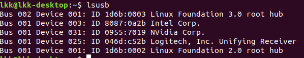
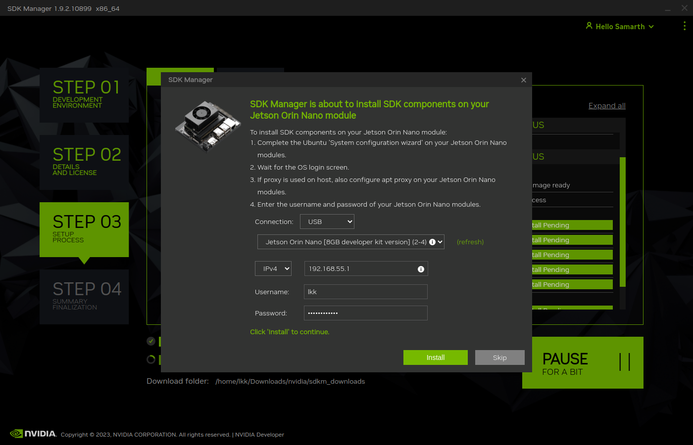
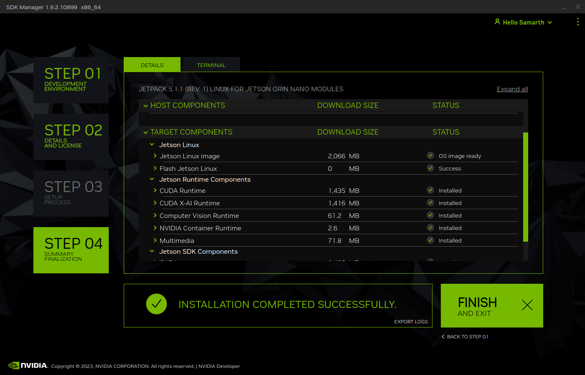

NVIDIA Jetson
=============

Quick Start
--------------
The working directory in SSD (Samsung 970 EVO 1TB) in lkk@xavieragx:/ssd$
    * conda activate mycondapy310

Jetson Xavier AGX Setup
-----------------------
Detailed steps see my Google doc: https://docs.google.com/document/d/1OAvlxpsP6h7YDicX29Bo7IWV_irWsoOyeB0_lujoHME/edit#heading=h.l55ml9jogv02

Jetpack page: https://developer.nvidia.com/embedded/jetpack

Show Jetpack version: 

.. code-block:: console

    sudo apt show nvidia-jetpack #show 5.0.2
    git clone https://github.com/jetsonhacks/jetsonUtilities.git #option2
    cd jetsonUtilities
    python jetsonInfo.py

(Not tried, list file not found) To upgrade from previous JetPack 5.x releases, first edit etc/apt/sources.list.d/nvidia-l4t-apt-source.list to point to the 35.3 repo (just change the version to r35.3 in both lines). Next, use the following commands, then physically reboot the system:

.. code-block:: console

    sudo apt update
    sudo apt dist-upgrade
    sudo apt install --fix-broken -o Dpkg::Options::="--force-overwrite"

Jetson Orin Nano
----------------
Jetson Orin Nano: Jetson Orin Nano 8GB with SD card slot (P3767-0005)
    * Jetson Orin Nano Developer Kit User Guide: https://developer.nvidia.com/embedded/learn/jetson-orin-nano-devkit-user-guide/index.html
    * Develop guide: https://docs.nvidia.com/jetson/archives/r35.3.1/DeveloperGuide/index.html
    * Software setup: https://developer.nvidia.com/embedded/learn/jetson-orin-nano-devkit-user-guide/software_setup.html
    * Howto: https://developer.nvidia.com/embedded/learn/jetson-orin-nano-devkit-user-guide/howto.html

The new version the NVIDIA SDK Manager supports various flash options, for example, the base L4T BSP can be flashed to any storage medium (microSD card, NVMe SSD, USB drive, or eMMC). We can direct flash the L4T to the NVMe SSD without the previous complicated steps of booting system in eMMC, then moving data to SSD.

Prepare the Host Machine with NVIDIA SDK Manager
~~~~~~~~~~~~~~~~~~~~~~~~~~~~~~~~~~~~~~~~~~~~~~~~
Install NVIDIA SDK manager, ref: https://developer.nvidia.com/nvidia-sdk-manager
    * On your x86-64 PC, download the Debian package file for the latest SDK Manager: https://developer.nvidia.com/embedded/downloads
    * Run the following command to install the Debian package: "sudo apt install ./sdkmanager_*-*_amd64.deb"
    * Installed SDK Manager on Intel NUC6 with Ubuntu20.04 (upgraded from Ubuntu18.04), the current version of SDK manager cannot be installed on Ubuntu22.04 (cannot flash the jetson)
    * Intel NUC6 (mini pc) is in ENG276, account name is “lkk”, password is: studenteng276

Flash L4T to Jetson via SDK Manager
~~~~~~~~~~~~~~~~~~~~~~~~~~~~~~~~~~~

Connect NVIDIA Jetson Orin Nano Developer Kit to the PC with a USB Type-C cable. Turn the Jetson dev kit in Force Recovery Mode:
    * For Jetson Orin Nano: prepare a jumper cable (any ribbon cable) to shortening the FC REC pin and GND pin of the 12-pin header under the module, then insert the power supply plug into the DC jack. While shortening the FC REC pin and GND pin of the 12-pin header under the module, insert the power supply plug into the DC jack. This will turn on the Jetson dev kit in Force Recovery Mode.
    * For Jetson AGX device with three buttons: Press and hold the FORCE RECOVERY button (middle button). While pressing the FORCE RECOVERY button, press and release the RESET button (third button).
    * In the host PC, you can type "lsusb" to see the USB device with "nvidia" name
    * 

Launch SDK Manger, it will popup a window show detected devices, select the device in the list. From the Product Category panel, select Jetson. From the Hardware Configuration panel, de-select "Host Machine" and select Jetson Orin Nano Developer Kit for Target Hardware.
Click " CONTINUE " button. Setup Process window shows the download progress.

After the download is finished, SDK Manager went to step3 and opens a dialog show "SDK Manager is about to flash your Jetson XXX". This prompt provides instructions for preparing your device to get it ready for flashing. On the flashing prompt
    * Select "Manual Setup - Jetson XX" for 1.
    * In OEM configuration (7), "Pre-Config" means you will create the username/password for the Orin before flashing; "Runtime" means the username/password creation will be prompted when you boot the Orin after the flash.
    * If choosing "Pre-Config", enter the user name and password you want to setup in the Jetson.
    * In (8), you can select storage device, i.e., eMMC, NVMe. We can select NVMe to flash the L4T in the SSD. Then, Click "Flash" button.

Jetson AGX Xavier can now support boot form NVMe SSD. The default boot is still eMMC, but you can select NVMe:

.. image:: imgs/ENVs/agxxavierboot.png
  :width: 600
  :alt: agxxavierboot

When flashing is done, the SDK Manager will popup another windows of "SDK Manager is about to Install SDK components on your Jetson".
    * In this step, plugin the displayport or HDMI to the Jetson and complete the Ubuntu system configuration wizard. If the Jetson did not boot, click the RESET button to restart. 
    * After the Jetson initial setup is finished, go back to the host PC with NVIDIA SDK manager. 
    * Select the "USB", enter Username and Password, then click "Install" BSP.

When you the SDK is installed, you can see the final success screen in SDK manager.

If you wish to customize your OS components before flashing, check these links 
    * Compiling Source Code: https://developer.ridgerun.com/wiki/index.php/NVIDIA_Jetson_Orin/JetPack_5.0.2/Compiling_Code
    * Flashing Board From Cmdline: https://developer.ridgerun.com/wiki/index.php/NVIDIA_Jetson_Orin/JetPack_5.0.2/Flashing_Board

Jetson Setup
------------
In Settings, click Sharing, enable Screen Sharing. VNC address is vnc://lkk-xavieragx.local, IP: 192.168.86.27

Install Miniconda for ARM
-------------------------
Ref: https://conda.io/projects/conda/en/stable/user-guide/install/linux.html

.. code-block:: console

    wget https://repo.anaconda.com/miniconda/Miniconda3-latest-Linux-aarch64.sh
    bash Miniconda3-latest-Linux-aarch64.sh #select the install location to /ssd/miniconda3, select conda init
    conda config --set auto_activate_base false # if do not want to activate base automatically
    conda list
    conda update conda
    conda --version
    conda info
    conda update -n base conda
    conda create --name mycondapy310
    conda env create -f environment.yml #Creating an environment from an environment.yml file
    conda activate mycondapy310 #activate environment
    conda env list
    conda info --envs #same to the previous one
    conda deactivate #deactivate environment

You can control where a conda environment lives by providing a path to a target directory when creating the environment.

.. code-block:: console

    conda create --prefix ./envs jupyterlab=3.2 matplotlib=3.5 numpy=1.21
    conda activate ./envs

To remove this long prefix in your shell prompt, modify the env_prompt setting in your .condarc file:

.. code-block:: console

    $ conda config --set env_prompt '({name})'

You may need to update your environment, you can update the contents of your environment.yml file accordingly and then run the following command:

.. code-block:: console

    conda env update --prefix ./env --file environment.yml  --prune

Install VSCode for ARM
-------------------------

.. code-block:: console

    VERSION=latest
    wget -N -O vscode-linux-deb.arm64.deb https://update.code.visualstudio.com/$VERSION/linux-deb-arm64/stable
    sudo apt install ./vscode-linux-deb.arm64.deb
    # Install a Python linter
    pip3 install pylint
    # Install a Python formatter
    pip3 install black

    # Install the Python extension for Visual Studio Code
    # Extension name is ms-python.python
    code --install-extension ms-python.python --force
