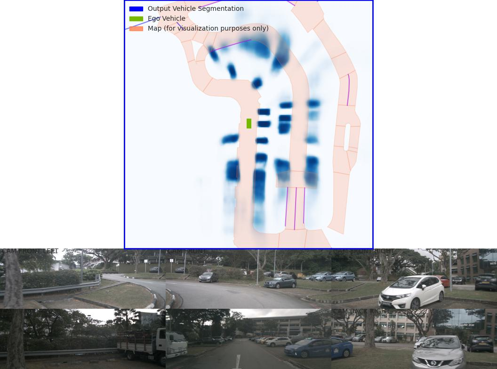
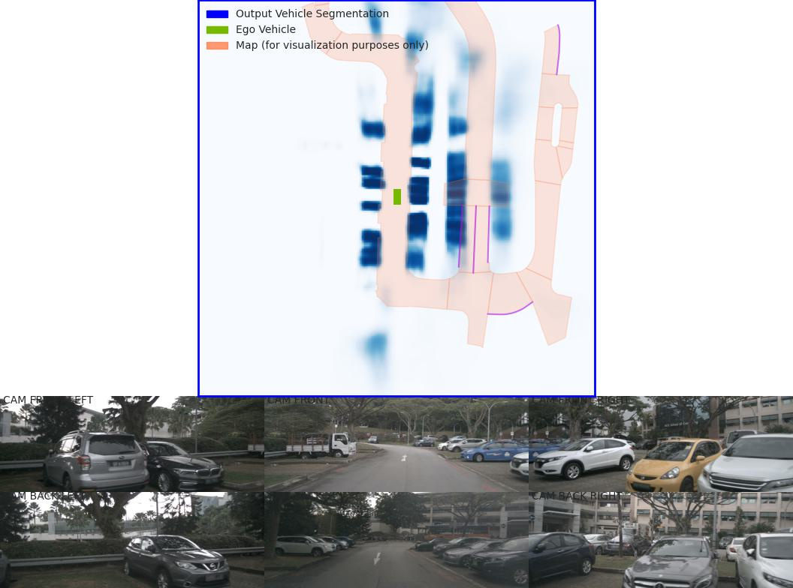
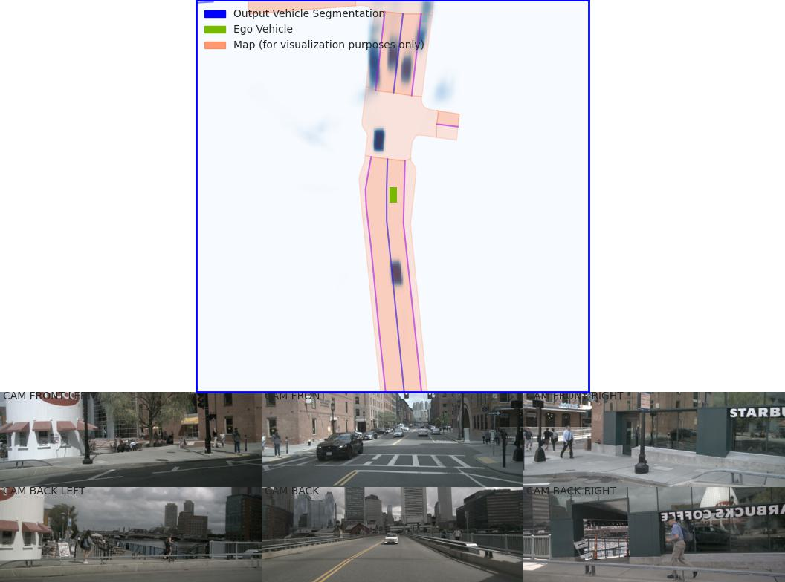
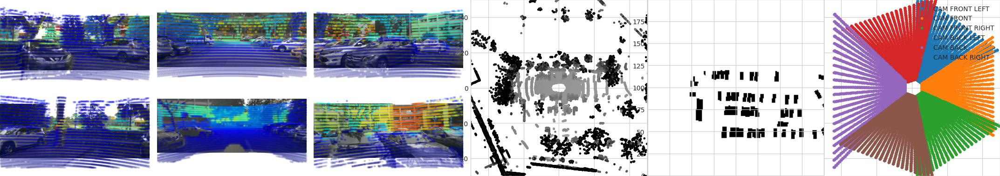
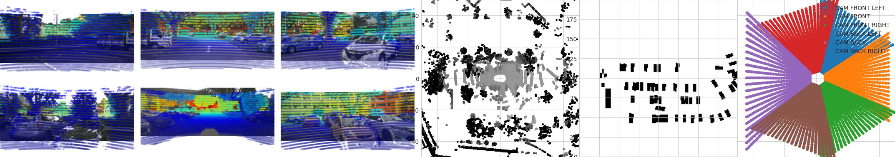

Nuscenes
=============

Nuscenes Data
---------------------
Full nuScenes dataset has 1,000 scenes (20s duration each) includes approximately 1.4M camera images, 390k LIDAR sweeps, 1.4M RADAR sweeps and 1.4M object bounding boxes in 40k keyframes. Annotation instruction: https://github.com/nutonomy/nuscenes-devkit/blob/master/docs/instructions_nuscenes.md. It provide data from the entire sensor suite of an autonomous vehicle
    * 6 cameras (Basler acA1600-60gc): 12Hz capture frequency, 1600x900 ROI, surround view, one camera facing back
    * 1 LIDAR: Velodyne HDL32E, 20Hz capture frequency, 32 beams, 1080 (+-10) points per ring, Usable returns up to 70 meters, ± 2 cm accuracy, Up to ~1.39 Million Points per Second
    * 5 RADAR (Continental ARS 408-21): 13Hz capture frequency, 77GHz, Up to 250m distance, Independently measures distance and velocity in one cycle using Frequency Modulated Continuous Wave
    * GPS and IMU (https://www.advancednavigation.com/inertial-navigation-systems/mems-gnss-ins/spatial/) Position accuracy of 20mm

Extrinsic coordinates are expressed relative to the **ego frame**, i.e. the midpoint of the rear vehicle axle. The cameras run at 12Hz while the LIDAR runs at 20Hz. The 12 camera exposures are spread as evenly as possible across the 20 LIDAR scans, so not all LIDAR scans have a corresponding camera frame. All annotations and meta data (including calibration, maps, vehicle coordinates etc.) are covered in a relational database.

In nuScenes-lidarseg, each lidar point from a keyframe in nuScenes with one of 32 possible semantic labels (i.e. lidar semantic segmentation). nuScenes-lidarseg contains 1.4 billion annotated points across 40,000 pointclouds and 1000 scenes (850 scenes for training and validation, and 150 scenes for testing).

Download Nuscenes data from https://www.nuscenes.org/nuscenes, untar the mini.tgz sample data, it will create four folders: "maps", "samples", "sweeps", and "v1.0-mini"

Install nuScenes development kit

.. code-block:: console

    tar zxvf .\v1.0-mini.tgz
    pip install nuscenes-devkit

Put nuscenes tutorial in mydetector3d/datasets/nuscenes/nuscenes_tutorial.ipynb

.. code-block:: console

    from nuscenes.nuscenes import NuScenes
    nusc = NuScenes(version='v1.0-mini', dataroot='/data/cmpe249-fa22/nuScenes/nuScenesv1.0-mini', verbose=True)
    nusc.scene[0] #each scene is 20s sequence with 'token', 'name', 'first_sample_token', 'last_sample_token'

Untar the full nuScenes dataset in HPC:

.. code-block:: console

    (mycondapy39) [010796032@coe-hpc2 nuScenes]$ tar zxvf v1.0-trainval01_blobs.tgz
    $ tar zxvf v1.0-trainval02_blobs.tgz
    $ tar zxvf v1.0-trainval03_blobs.tgz
    $ tar zxvf v1.0-trainval04_blobs.tgz
    $ tar zxvf v1.0-trainval05_blobs.tgz
    $ tar zxvf v1.0-trainval06_blobs.tgz
    $ tar zxvf v1.0-trainval07_blobs.tgz
    $ tar zxvf v1.0-trainval08_blobs.tgz
    $ tar zxvf v1.0-trainval09_blobs.tgz
    $ tar zxvf v1.0-trainval10_blobs.tgz
    (mycondapy39) [010796032@cs001 nuScenes]$ tar zxvf v1.0-trainval_meta.tgz
    (mycondapy39) [010796032@coe-hpc2 nuScenes]$ ls samples/
    CAM_BACK       CAM_BACK_RIGHT  CAM_FRONT_LEFT   LIDAR_TOP        RADAR_BACK_RIGHT  RADAR_FRONT_LEFT
    CAM_BACK_LEFT  CAM_FRONT       CAM_FRONT_RIGHT  RADAR_BACK_LEFT  RADAR_FRONT       RADAR_FRONT_RIGHT
    (mycondapy39) [010796032@coe-hpc2 nuScenes]$ ls sweeps
    CAM_BACK       CAM_BACK_RIGHT  CAM_FRONT_LEFT   LIDAR_TOP        RADAR_BACK_RIGHT  RADAR_FRONT_LEFT
    CAM_BACK_LEFT  CAM_FRONT       CAM_FRONT_RIGHT  RADAR_BACK_LEFT  RADAR_FRONT       RADAR_FRONT_RIGHT
    (mycondapy39) [010796032@cs001 nuScenes]$ ls maps/
    36092f0b03a857c6a3403e25b4b7aab3.png  53992ee3023e5494b90c316c183be829.png
    37819e65e09e5547b8a3ceaefba56bb2.png  93406b464a165eaba6d9de76ca09f5da.png
    (mycondapy39) [010796032@cs001 nuScenes]$ ls v1.0-trainval
    attribute.json          category.json  instance.json  map.json                sample_data.json  scene.json   visibility.json
    calibrated_sensor.json  ego_pose.json  log.json       sample_annotation.json  sample.json       sensor.json

    sweeps/RADAR_FRONT/n008-2018-08-01-15-52-19-0400__RADAR_FRONT__1533153432872720.pcd
    .v1.0-trainval02_blobs.txt

Put all folders inside the "v1.0-trainval"

.. code-block:: console

    nuScenes/v1.0-trainval$ ls
  attribute.json          category.json  instance.json  map.json                sample_data.json  scene.json   visibility.json
  calibrated_sensor.json  ego_pose.json  log.json       sample_annotation.json  sample.json       sensor.json
    nuScenes/v1.0-trainval$ mkdir v1.0-trainval
    nuScenes/v1.0-trainval$ mv *.json ./v1.0-trainval/
    nuScenes/v1.0-trainval$ mv ../maps .
    nuScenes/v1.0-trainval$ mv ../samples/ .
    nuScenes/v1.0-trainval$ mv ../sweeps/ .
    nuScenes/v1.0-trainval$ ls
    maps  samples  sweeps  v1.0-trainval
    
run **create_nuscenes_infos** in "/home/010796032/3DObject/3DDepth/mydetector3d/datasets/nuscenes/nuscenes_dataset.py" to generate info.pkl files

.. code-block:: console
  total scene num: 850
  exist scene num: 850
  v1.0-trainval: train scene(700), val scene(150)
  nuscenes_utils.fill_trainval_infos #for all samples, train_nusc_infos.append(info)
      info = {
                'lidar_path': Path(ref_lidar_path).relative_to(data_path).__str__(),
                'cam_front_path': Path(ref_cam_path).relative_to(data_path).__str__(),
                'cam_intrinsic': ref_cam_intrinsic,
                'token': sample['token'],
                'sweeps': [],
                'ref_from_car': ref_from_car,
                'car_from_global': car_from_global,
                'timestamp': ref_time,
            }
      camera_types = [
                    "CAM_FRONT",
                    "CAM_FRONT_RIGHT",
                    "CAM_FRONT_LEFT",
                    "CAM_BACK",
                    "CAM_BACK_LEFT",
                    "CAM_BACK_RIGHT",
                ]
      for cam in camera_types:
        info["cams"].update({cam: cam_info})
      info['sweeps'] = sweeps
      gt_boxes = np.concatenate([locs, dims, rots, velocity[:, :2]], axis=1) #dims is dxdydz (lwh)
      info['gt_boxes'] = gt_boxes[mask, :]
      info['gt_boxes_velocity'] = velocity[mask, :]
      info['gt_names'] = np.array([map_name_from_general_to_detection[name] for name in names])[mask]
      info['gt_boxes_token'] = tokens[mask]
      info['num_lidar_pts'] = num_lidar_pts[mask]
      info['num_radar_pts'] = num_radar_pts[mask]
      train_nusc_infos.append(info)

  train sample: 28130, val sample: 6019
  pickle.dump(train_nusc_infos, f)
  pickle.dump(val_nusc_infos, f)
  (mycondapy39) [010796032@cs001 nuScenes]$ ls v1.0-trainval
    maps  nuscenes_infos_10sweeps_train.pkl  nuscenes_infos_10sweeps_val.pkl  samples  sweeps  v1.0-trainval

Run "create_groundtruth" in "nuscenes_dataset.py" to generate groundtruth folder:

.. code-block:: console

  nuscenes_dataset = NuScenesDataset
    include_nuscenes_data #load nuscenes_infos_10sweeps_train.pkl
      self.infos.extend(nuscenes_infos)
    Total samples for NuScenes dataset: 28130
  nuscenes_dataset.create_groundtruth_database
    database_save_path=gt_database_{max_sweeps}sweeps_withvelo
    db_info_save_path=f'nuscenes_dbinfos_{max_sweeps}sweeps_withvelo.pkl'
    for each info
      points (259765, 5) last column is time
      gt_boxes (10, 9)
      gt_names (10,)
      save relative gt points as 0_traffic_cone_0.bin (sample_idx, gt_names[i], i)
      db_info = {'name': gt_names[i], 'path': db_path, 'image_idx': sample_idx, 'gt_idx': i,
                               'box3d_lidar': gt_boxes[i], 'num_points_in_gt': gt_points.shape[0]}
      save db_info to all_db_infos

.. code-block:: console

    3DDepth/mydetector3d/datasets/nuscenes/nuscenes_dataset.py 
    ======
    Loading NuScenes tables for version v1.0-trainval...
    23 category,
    8 attribute,
    4 visibility,
    64386 instance,
    12 sensor,
    10200 calibrated_sensor,
    2631083 ego_pose,
    68 log,
    850 scene,
    34149 sample,
    2631083 sample_data,
    1166187 sample_annotation,
    4 map,
    Done loading in 25.048 seconds.
    2023-05-21 08:46:41,467   INFO  Total samples for NuScenes dataset: 28130
    Database traffic_cone: 62964
    Database truck: 65262
    Database car: 339949
    Database pedestrian: 161928
    Database ignore: 26297
    Database construction_vehicle: 11050
    Database barrier: 107507
    Database motorcycle: 8846
    Database bicycle: 8185
    Database bus: 12286
    Database trailer: 19202

Each dbinfo is 

.. code-block:: console

    gt_points.tofile(f) #saved 
    db_info = {'name': gt_names[i], 'path': db_path, 'image_idx': sample_idx, 'gt_idx': i,
                                'box3d_lidar': gt_boxes[i], 'num_points_in_gt': gt_points.shape[0]}

After untar, "samples" folder is created for sensor data for keyframes (annotated images), "sweeps" folder is created for sensor data for intermediate frames (unannotated images), .v1.0-trainvalxx_blobs.txt (01-10) files are JSON tables that include all the meta data and annotation. 

Nuscenes Datasets
-----------------
Based on code "mydetector3d/datasets/nuscenes/nuscenes_dataset.py", run test_dataset

.. code-block:: console

  (mycondapy39) [010796032@cs002 3DDepth]$ python mydetector3d/datasets/nuscenes/nuscenes_dataset.py --func="test_dataset"
  2023-06-24 08:40:58,003   INFO  Loading NuScenes dataset
  2023-06-24 08:41:01,748   INFO  Total samples for NuScenes dataset: 28130
  2023-06-24 08:41:02,045   INFO  Total samples after balanced resampling: 123580
  Dataset infos len: 123580
  Info keys:
    lidar_path
    cam_front_path
    cam_intrinsic
    token
    sweeps
    ref_from_car
    car_from_global
    timestamp
    cams
    gt_boxes
    gt_boxes_velocity
    gt_names
    gt_boxes_token
    num_lidar_pts
    num_radar_pts

Training
---------------------
Starting the training of two models in HPC2 cs001 GPU2 and GPU3:

Model1: 'mydetector3d/tools/cfgs/nuscenes_models/bevfusion.yaml'
  * Trained model in '/data/cmpe249-fa22/Mymodels/nuscenes_models/bevfusion/0522/ckpt/checkpoint_epoch_56.pth'

Model2: 'mydetector3d/tools/cfgs/nuscenes_models/cbgs_pp_multihead.yaml'.
  * Trained model in '/data/cmpe249-fa22/Mymodels/nuscenes_models/cbgs_pp_multihead/0522/ckpt/checkpoint_epoch_128.pth'

.. code-block:: console

  (mycondapy39) [010796032@cs002 3DDepth]$ python mydetector3d/tools/myevaluatev2.py
  2023-06-24 01:53:41,721   INFO  Loading NuScenes dataset
  2023-06-24 01:53:42,790   INFO  Total samples for NuScenes dataset: 6019
  recall_roi_0.3: 0.000000
  recall_rcnn_0.3: 0.661513
  recall_roi_0.5: 0.000000
  recall_rcnn_0.5: 0.429482
  recall_roi_0.7: 0.000000
  recall_rcnn_0.7: 0.182539
  Average predicted number of objects(6019 samples): 126.934
  Finished detection: {'recall/roi_0.3': 0.0, 'recall/rcnn_0.3': 0.6615132459191865, 'recall/roi_0.5': 0.0, 'recall/rcnn_0.5': 0.4294822049772545, 'recall/roi_0.7': 0.0, 'recall/rcnn_0.7': 0.18253947016323255, 'infer_time': 171.54541744346238, 'total_pred_objects': 764018, 'total_annos': 6019}

  (mycondapy39) [010796032@cs002 3DDepth]$ python mydetector3d/tools/myevaluatev2_nuscenes.py 
  Saving metrics to: /data/cmpe249-fa22/Mymodels/eval/nuscenes_models_cbgs_pp_multihead_0624/txtresults
  mAP: 0.4103
  mATE: 0.3363
  mASE: 0.2597
  mAOE: 1.3475
  mAVE: 0.3272
  mAAE: 0.1999
  NDS: 0.4929
  Eval time: 71.6s

  Per-class results:
  Object Class	AP	ATE	ASE	AOE	AVE	AAE
  car	0.780	0.201	0.158	1.648	0.294	0.211
  truck	0.456	0.374	0.196	1.607	0.262	0.242
  bus	0.545	0.378	0.187	1.573	0.569	0.238
  trailer	0.289	0.541	0.197	1.494	0.271	0.152
  construction_vehicle	0.093	0.771	0.444	1.528	0.129	0.362
  pedestrian	0.701	0.169	0.281	1.358	0.260	0.088
  motorcycle	0.305	0.225	0.247	1.355	0.584	0.273
  bicycle	0.033	0.190	0.275	1.492	0.251	0.033
  traffic_cone	0.451	0.184	0.326	nan	nan	nan
  barrier	0.450	0.329	0.286	0.073	nan	nan
  Result is saved to /data/cmpe249-fa22/Mymodels/eval/nuscenes_models_cbgs_pp_multihead_0624/txtresults

BEVFusion
----------
Add bevfusion code to the mydetector3d folder

Model forward process includes the following major parts

MeanVFE
  * Input: voxel_features([600911, 10, 5]), voxel_num_points([600911]) = batch_dict['voxels'], batch_dict['voxel_num_points']
  * Output; batch_dict['voxel_features'] = points_mean.contiguous() #[600911, 5]

VoxelResBackBone8x
  * Input: voxel_features([600911, 5]), voxel_coords([600911, 4]) = batch_dict['voxel_features'], batch_dict['voxel_coords']
  * Output: batch_dict: 'encoded_spconv_tensor': out([2, 180, 180]), 'encoded_spconv_tensor_stride': 8, 'multi_scale_3d_features'

HeightCompression
  * Input: encoded_spconv_tensor = batch_dict['encoded_spconv_tensor'] #Sparse [2, 180, 180]
  * Output: batch_dict['spatial_features'] = spatial_features #[6, 256, 180, 180], batch_dict['spatial_features_stride']=8

SwinTransformer
  * Input: x = batch_dict['camera_imgs'] #[6, 6, 3, 256, 704]
  * Out: batch_dict['image_features'] = outs #3 items: [36, 192, 32, 88], [36, 384, 16, 44], [36, 768, 8, 22] 

GeneralizedLSSFPN
  * inputs = batch_dict['image_features']
  * Output: batch_dict['image_fpn'] = tuple(outs) #2 items: [36, 256, 32, 88], [36, 256, 16, 44]

DepthLSSTransform (lists images into 3D and then splats onto bev features, from https://github.com/mit-han-lab/bevfusion/)
  * x = batch_dict['image_fpn']  #img=[6, 6, 256, 32, 88] 
  * points = batch_dict['points'] # [1456967, 6]
  * Output: batch_dict['spatial_features_img'] = x #[6, 80, 180, 180]

ConvFuser
  * Input: img_bev = batch_dict['spatial_features_img']#[6, 80, 180, 180], lidar_bev = batch_dict['spatial_features']#[6, 256, 180, 180]
  * cat_bev = torch.cat([img_bev,lidar_bev],dim=1)
  * Output: batch_dict['spatial_features'] = mm_bev #[6, 256, 180, 180]

BaseBEVBackbone
  * Input: spatial_features = data_dict['spatial_features'] #[6, 256, 180, 180]
  * data_dict['spatial_features_2d'] = x #[6, 512, 180, 180]

TransFusionHead
  * Input: feats = batch_dict['spatial_features_2d'] #[6, 512, 180, 180]
  * res = self.predict(feats) #'center' [6, 2, 200]; 'height' [6, 1, 200]; 'dim' [6, 3, 200]; 'rot' [6, 2, 200]; 'vel' [6, 2, 200]; 'heatmap' [6, 10, 200]; 'query_heatmap_score' [6, 10, 200]; 'dense_heatmap' [6, 10, 180, 180]
  * loss, tb_dict = self.loss(gt_bboxes_3d [6, 51, 9], gt_labels_3d [6, 51], res)

Bird's-eye-view Conversion
--------------------------
add new folder (mydetector3d/datasets/nuscenes/lss) to test the Bird's-eye-view Conversion based on lss model (https://github.com/nv-tlabs/lift-splat-shoot/tree/master).

.. code-block:: console

    pip install nuscenes-devkit tensorboardX efficientnet_pytorch==0.7.0

Pretrained model is saved in "/data/cmpe249-fa22/Mymodels/lss_model525000.pt", use **eval_model_iou** "mydetector3d/datasets/nuscenes/lss/lssexplore.py" for inference, get results

.. code-block:: console

    {'loss': 0.09620507466204373, 'iou': 0.35671476137624863}

Run **viz_model_preds** need map, it shows: No such file or directory: '/data/cmpe249-fa22/nuScenes/nuScenesv1.0-mini/maps/maps/expansion/singapore-hollandvillage.json'. 

.. code-block:: console

    (mycondapy39) [010796032@cs001 nuScenes]$ unzip nuScenes-map-expansion-v1.3.zip
    Archive:  nuScenes-map-expansion-v1.3.zip
    creating: basemap/
    inflating: basemap/boston-seaport.png
    inflating: basemap/singapore-hollandvillage.png
    inflating: basemap/singapore-queenstown.png
    inflating: basemap/singapore-onenorth.png
    creating: expansion/
    inflating: expansion/boston-seaport.json
    inflating: expansion/singapore-onenorth.json
    inflating: expansion/singapore-queenstown.json
    inflating: expansion/singapore-hollandvillage.json
    creating: prediction/
    inflating: prediction/prediction_scenes.json
    (mycondapy39) [010796032@cs001 nuScenes]$ cp -r expansion/ nuScenesv1.0-mini/maps/

After fixing the map issue, the evaluation figures of **viz_model_preds** is

The **lidar_check** is used to run a visual check to make sure extrinsics/intrinsics are being parsed correctly. 
    * Left: input images with LiDAR scans projected using the extrinsics and intrinsics. 
    * Middle: the LiDAR scan that is projected. 
    * Right: X-Y projection of the point cloud generated by the lift-splat model. 

Finished training on the "/data/cmpe249-fa22/nuScenes/nuScenesv1.0-mini/" data via "mydetector3d/datasets/nuscenes/lss/lssmain.py", the model is saved in the output folder: "model1000.pt model8000.pt". Use model8000.pt for inference

.. code-block:: console

    {'loss': 0.23870943376311549, 'iou': 0.11804760577248166}